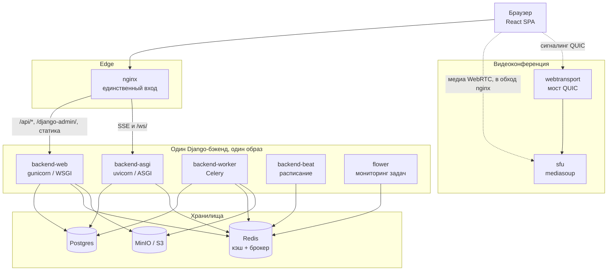

# Обзор платформы

HTQWeb — внутренняя корпоративная платформа Hi-Tech Group: кадры, задачи и
объёмы работ, корпоративная почта, мессенджер, видеоконференции, договоры и
согласования. Одно React-приложение перед одним Django-бэкендом.

---

## Из чего состоит

---

## Процессы

Все процессы бэкенда собраны из **одного образа** (`backend/Dockerfile`) и
различаются только командой запуска.

| Процесс | Команда | Отвечает за |
|---|---|---|
| `backend-web` | `gunicorn htqweb.wsgi:application` | Весь `/api/*`, `/django-admin/`, статика |
| `backend-asgi` | `uvicorn htqweb.asgi:application` | SSE `/api/requests/v1/stream` и все `/ws/` |
| `backend-worker` | `celery -A htqweb worker` | Фоновые задачи |
| `backend-beat` | `celery -A htqweb beat` (планировщик в БД) | Расписание |
| `flower` | `celery -A htqweb flower --port=5555` | Веб-панель по задачам |

Точные строки — `docker-compose.yml:268` и далее.

### Одна деталь, которая кусается

**Миграции и сид админа делает только `backend-web`**, под флагом
`RUN_MIGRATIONS` (`docker-compose.yml:264`, по умолчанию `1`). Остальные
процессы поднимаются на готовой схеме. Если запустить их без `backend-web`,
они встретят базу в неожиданном состоянии.

Сидовая учётка — `admin` / `admin12345`. На стенде, открытом наружу, пароль
надо менять.

---

## Почему два upstream, а не один

nginx (`infra/nginx/default.conf`) разводит трафик на `backend` (WSGI) и
`backend_asgi` (ASGI). Причина простая: WSGI синхронный и не умеет держать
долгоживущие соединения. Всё, что требует постоянно открытого канала —
Server-Sent Events и веб-сокеты, — уходит на uvicorn, остальное на gunicorn.

В разработке ту же развилку повторяет прокси Vite (`frontend/vite.config.ts`),
чтобы поведение стенда совпадало с боевым.

Медиа-поток конференции идёт **мимо nginx**: браузер соединяется с SFU
напрямую по UDP/TCP. Через прокси его провести нельзя.

---

## Домены

Одиннадцать Django-аппок в `backend/apps/`. Каждой будет посвящено отдельное
руководство в `domains/` (пишутся).

| Домен | О чём | Объём сервисов |
|---|---|---|
| `tasks` | Задачи, объёмы работ, ежедневные отчёты | 5647 строк |
| `hr` | Сотрудники, карточки Т-2, календарь, штатное расписание | 4680 |
| `mail` | Корпоративная почта, синхронизация IMAP | 3807 |
| `approvals` | Конструктор форм заявок | 2293 |
| `signoff` | Универсальный движок согласования | 2257 |
| `messenger` | Чаты | 2052 |
| `contracts` | Бюджеты, контрагенты, договоры | 1398 |
| `cms` | Наполнение публичного сайта | 980 |
| `users` | Учётки, выпуск JWT | 852 |
| `media_files` | Файлы и объектное хранилище | 830 |
| `core` | Общий фундамент: реестр сервисов, календарь | — |

Не перепутайте `approvals` и `signoff`: первый согласует **свои** заявки,
второй — строки **чужих** таблиц. Подробный разбор будет в
`domains/approvals.md` и `domains/signoff.md` (пишутся).

---

## Немного истории, без которой код выглядит странно

Платформа прошла полный круг:

1. Начиналась как монолит на Django.
2. Была растащена (Strangler Fig) на девять микросервисов FastAPI за шлюзом
   nginx, с MongoDB и PgBouncer в transaction-режиме.
3. Собрана обратно в один Django-бэкенд. FastAPI-сервисы, `libs/` и MongoDB
   удалены из репозитория.

Подробный журнал — [PLAN.md](../../PLAN.md), пересказывать его здесь незачем.

Знать историю нужно ради одного: **часть решений в коде объясняется только
ею.** Конверт ошибок `{"detail": ...}` — форма ответа FastAPI. Схемы Pydantic
живы, хотя это Django. Имена трёх сервисов не совпадают с именами аппок
(см. [01-conventions.md](01-conventions.md), раздел 6). Выпускающий токены
issuer до сих пор называется `htqweb-auth`, хотя отдельного сервиса авторизации
давно нет.

Всё это не ошибки и не мусор — это совместимость, купленная сознательно. Не
«чините» их, не выяснив цену.

Отдельно: комментарии вида «Поток A» / «Поток B» — след того, что обратную
миграцию делали два исполнителя параллельно. Разделение зон давно снято, эти
пометки говорят лишь о происхождении кода и ничего не запрещают.

---

## Куда идти дальше

- [01-conventions.md](01-conventions.md) — правила, общие для всех доменов.
  **Читать до первой правки.**
- [02-auth-rbac.md](02-auth-rbac.md) — кто такой пользователь и что ему можно.
- [03-data-layer.md](03-data-layer.md) — база, миграции, тестовая БД.
- `domains/` — разбор каждого домена.
- `flows/` — сквозные сценарии через несколько доменов.
