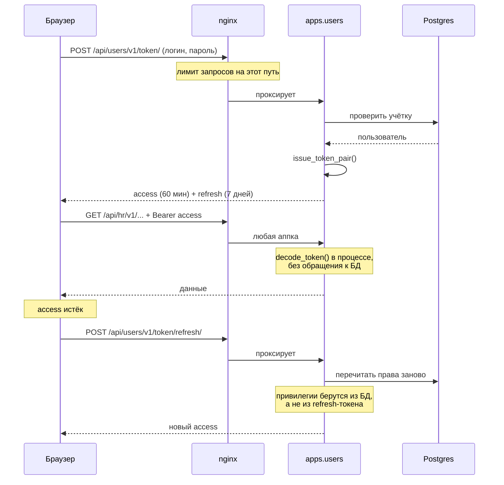

# Аутентификация и права

Кто такой пользователь, откуда берётся токен и кто что может. Общий контракт
токена продублирован в [API.md](../../API.md) со стороны клиента; здесь —
со стороны кода.

---

## 1. Токены выпускает `apps.users`

Отдельного сервиса авторизации не существует — он был в FastAPI-поколении и
удалён. Сейчас `apps.users` и выпускает токены
(`backend/htqweb/authn/jwt.py`), и каждая аппка их проверяет.

**Проверка идёт в процессе, без сетевого вызова.** Все процессы делят один
`JWT_SECRET`, алгоритм HS256, поэтому `decode_token` — чистая криптография над
строкой, без похода в БД или к соседу.

Issuer до сих пор `htqweb-auth` (`backend/htqweb/settings/base.py:142`). Имя
осталось от удалённого сервиса и менять его нельзя: оно проверяется при
разборе каждого токена (`decode_token` передаёт `issuer=` в `jwt.decode`), и
смена имени разом обессмыслит все выданные токены.

### Настройки

| Параметр | Значение | Где |
|---|---|---|
| `JWT_SECRET` | из окружения, дефолт `change-me` | `backend/htqweb/settings/base.py:140` |
| `JWT_ALGORITHM` | `HS256` | `backend/htqweb/settings/base.py:141` |
| `JWT_ISSUER` | `htqweb-auth` | `backend/htqweb/settings/base.py:142` |
| Время жизни access | 60 минут | `backend/htqweb/settings/base.py:143` |
| Время жизни refresh | 7 дней | `backend/htqweb/settings/base.py:144` |

Дефолт `change-me` в проде — дыра: секретом подписываются все токены, и его
знание позволяет выписать себе администратора. Задавайте `JWT_SECRET` явно.

---

## 2. Два токена, и они разной формы

Это неочевидно и важно.

**Access-токен** несёт полный набор claims:

```
sub, user_id, username, email,
is_staff, is_superuser, is_admin,
iss, token_type="access", iat, exp
```

**Refresh-токен несёт только три:** `sub`, `user_id`, `iss` (плюс служебные
`token_type`, `iat`, `exp`). Ни имени, ни почты, ни флагов привилегий
(`backend/htqweb/authn/jwt.py:26`).

Так сделано намеренно. Refresh живёт неделю; если бы он нёс `is_staff`, то
пользователь, у которого отобрали права, продолжал бы обновлять себе
привилегированный access-токен до истечения недели. Вместо этого права
**заново читаются из БД при каждом обновлении** — устаревшую привилегию
раздать невозможно.

Вывод для разработчика: **не полагайтесь на claims refresh-токена.** Их там
нет.

---

## 3. Как проверка попадает во вью

`api_view(auth="jwt")` разбирает заголовок `Authorization: Bearer <token>` и
кладёт разобранный `TokenPayload` в `request.token`
(`backend/htqweb/http.py:89-93`).

Отказ — 401 `{"detail": "Not authenticated"}` — во всех трёх случаях:
заголовка нет или он не `Bearer`; токен не разобрался; **токен разобрался, но
это refresh** (`backend/htqweb/http.py:68`). Последнее легко упустить: подсунуть
refresh вместо access не выйдет.

При `auth=None` в `request.token` кладётся `None`, а не остаётся пустым
атрибутом — чтобы публичные вью не падали на `AttributeError`.

### `TokenPayload`

`backend/htqweb/authn/payload.py:14`. Модель Pydantic с
`extra="ignore"` — новые claims не ломают старый код.

Ключевое свойство — `is_elevated`: истинно при любом из `is_staff`,
`is_superuser`, `is_admin`. Именно оно, а не отдельные флаги, отвечает на
вопрос «это администратор».

---

## 4. Администратор

Единственная точка проверки — `require_admin`
(`backend/htqweb/authn/rbac.py`), одна строка: `return user.is_elevated`.

Подключается флагом декоратора:

```python
@api_view(methods=("POST",), admin=True)
```

Смысл конструкции — в том, что она **одна на всю платформу**. Раньше каждая
аппка держала собственную копию `_require_admin`, и копии разъезжались. Не
заводите свою: если нужна проверка администратора, ставьте `admin=True`.

Напоминание из [01-conventions.md](01-conventions.md): `admin=True` при
`auth=None` — `ValueError` при импорте, а не тихий отказ.

---

## 5. Сессия Django — только в `/django-admin/`

Разделение простое: `/api/*` для SPA — JWT; `/django-admin/` — обычная
сессионная аутентификация Django, встроенная, мимо `api_view`.

> **Осторожно с CLAUDE.md.** Там сказано, что у `api_view` есть режим
> `auth="admin_session"`. **Такого режима нет.** Список аутентификаторов —
> `_AUTHENTICATORS = {"jwt": _authenticate_jwt}` (`backend/htqweb/http.py:71`),
> и другого ключа в нём не появляется нигде в коде. Попытка написать
> `auth="admin_session"` даст `KeyError` на первом же запросе к такой ручке —
> не 401, а 500, потому что исключение улетит в общий `except`.
>
> Проверено поиском по всему `backend/`: строка `admin_session` не встречается
> ни разу. Допустимые значения ровно два: `"jwt"` и `None`.

---

## 6. Ролевая модель поверх флага администратора

Флаг `is_elevated` — грубый. Тонкие права живут в доменах, прежде всего в
`hr`: уровни доступа кадровика и посекционные права на карточку Т-2 вида
`hr.card.financial.view` / `hr.card.financial.edit`.

Разбор — в `domains/hr.md` (пишется). Здесь важно правило: **право на
просмотр и право на правку разделены, и одного без другого недостаточно.**
Секция, на которую есть `edit`, но нет `view`, не показывается вовсе —
иначе пользователю предложили бы затереть данные, которых он не видит.

---

## 7. Фронт проверяет права тоже — но это не защита

`frontend/src/lib/auth/roles.ts` содержит те же предикаты, что и бэкенд, и
навигация ими пользуется (`frontend/src/app/navigation/navItems.ts`).

**Это исключительно удобство интерфейса.** Фронтовая проверка прячет кнопку,
но не запрещает запрос. Любая проверка, существующая только на фронте, —
дефект безопасности: токен лежит в браузере, и запрос можно отправить руками.

Правило: добавили ограничение на фронте — убедитесь, что оно продублировано во
вью или сервисе.

---

## 8. Поток входа



Пути входа и обновления вынесены в nginx отдельными правилами с ограничением
частоты запросов (`infra/nginx/default.conf:171-176`) — защита от подбора
пароля. Обратите внимание: там зарегистрированы обе формы пути, со слэшем и
без, потому что `APPEND_SLASH = False`.

---

## Чек-лист

- Нужен администратор — `admin=True`, свою проверку не пишем.
- Читаете права — из access-токена; в refresh их нет.
- Ограничение добавлено на фронте — продублируйте на бэкенде.
- «Это админ?» — `is_elevated`, а не `is_staff` по отдельности.
