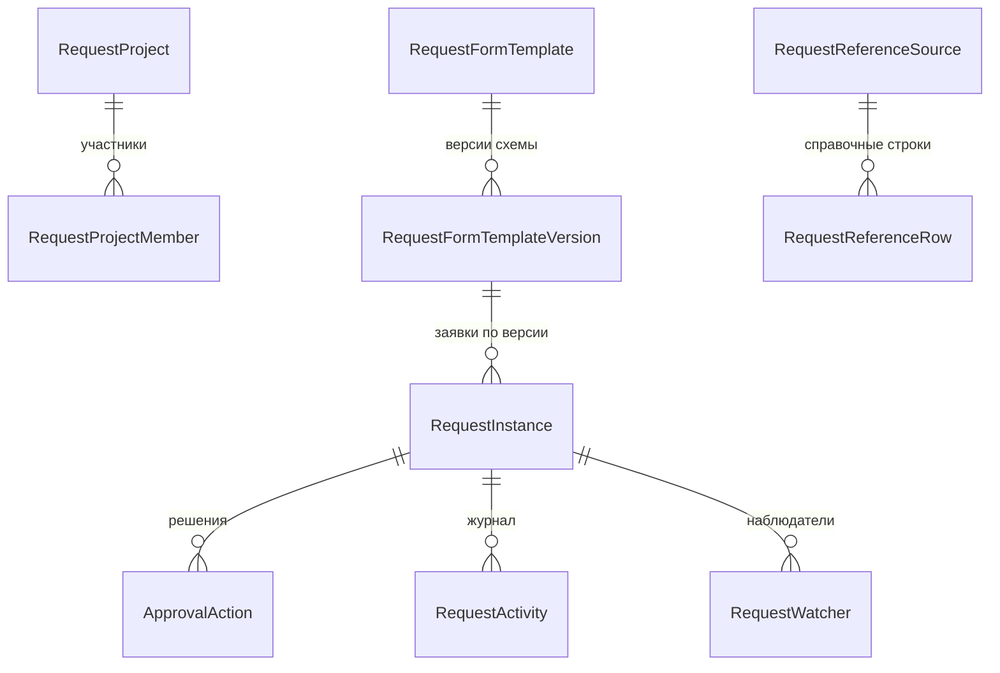

# Домен `approvals`

Конструктор форм заявок и движок их согласования. 13 моделей, 17 файлов
сервисов (2293 строки).

`/api/requests/v1/` · app_label `approvals` · сервис в реестре `approvals`

> ⚠️ **Имя не совпадает с префиксом.** Аппка называется `approvals`, URL —
> `/api/requests/v1/`. В FastAPI-поколении сервис назывался `requests`.
> См. [01-conventions.md](../01-conventions.md), раздел 6.

---

## 🔴 Сначала: `approvals` — это не `signoff`

| | `approvals` | `signoff` |
|---|---|---|
| Что согласует | **Собственную** заявку `RequestInstance` | Строку **чужой** таблицы |
| Откуда объект | Создаётся самой формой | Уже существует в другой аппке |
| Форма | Конструктор, схема и значения в JSONB | Формы нет |
| URL | `/api/requests/v1/` | `/api/signoff/v1/` |

Правило различения: **объект создаётся формой согласования → `approvals`;
объект уже есть в чужой таблице → `signoff`.**

Разбор второго — [signoff.md](signoff.md).

---

## 1. Назначение и границы

Домен даёт две вещи:

1. **Конструктор форм** — администратор описывает форму заявки (какие поля,
   какие условия), не трогая код.
2. **Движок маршрута** — как заявка ходит по согласующим.

Схема формы и её значения хранятся в JSONB: `schema_json`, `workflow_json`,
`form_values_json`, `config_json`, `columns_json`, `data_json`, `payload`.
Это документы конструктора, и колонками их раскладывать нечего.

**Чего домен не делает:** не согласует чужие строки (это `signoff`), не
хранит сотрудников и отделы (берёт через `interface` соседей).

---

## 2. Модели

13 моделей и 5 перечислений в `backend/apps/approvals/models.py`.



| Модель | Роль |
|---|---|
| `RequestFormTemplate` / `...Version` | Шаблон формы и его версии |
| `RequestInstance` | Заявка — то, что согласуется |
| `ApprovalAction` | Решение согласующего |
| `RequestProject` / `RequestProjectMember` | Группировка заявок |
| `RequestActivity`, `AuditLog`, `NotificationsLog` | Журналы |
| `RequestStatsDaily` | Агрегаты |
| `RequestReferenceSource` / `RequestReferenceRow` | Справочники для полей формы |

**Версионирование шаблона существенно:** заявка привязана к версии схемы, по
которой заполнялась. Правка шаблона не переписывает уже поданные заявки.

### Особенности схемы

Как и в `tasks`, **междоменных FK нет**: `initiator_id`, `approver_id`,
`owner_id`, `user_id` — плоские целые, разрешаются через
`apps.users.interface` и `apps.hr.interface`. Две таблицы-реплики
(`request_users`, `request_departments`) удалены вместе с шиной Redis.

Три составных первичных ключа оригинала (`request_watchers`,
`request_project_members`, `request_stats_daily`) заменены суррогатным `id`
плюс `UniqueConstraint` на исходный ключ. Для клиента это невидимо:
наблюдатели адресуются по `user_id` внутри заявки, участники — по `user_id`
внутри проекта, а строки статистики только агрегируются.

---

## 3. Публичный контракт `interface.py`

**Функций нет.** `backend/apps/approvals/interface.py` — заглушка.

Домен намеренно **не производит** межаппный интерфейс: соседи его не
вызывают. Направление обратное — `approvals` сам потребляет `apps.users`,
`apps.hr` и `apps.messenger`.

Модуль оставлен как готовая точка расширения: появится потребитель — функции
добавляются сюда (каждая с `require_service("approvals")` первой строкой), а
прямой импорт `apps.approvals.*` из другой аппки останется запрещён.

---

## 4. Ключевые сценарии

| Файл | О чём |
|---|---|
| `request_runtime.py` (439) | Жизненный цикл заявки — главный файл домена |
| `form_schema.py` (243) | Схема формы конструктора |
| `template_data_table.py` (190) | Табличные данные шаблона |
| `sse.py` (168) | Поток событий в браузер |
| `condition_eval.py` (168) | Вычисление условий формы |
| `workflow_engine.py` (137) / `workflow_schema.py` (110) | Маршрут согласования |
| `assignee_resolver.py` (139) | Кто согласует — разрешается через `apps.hr.interface` |
| `instance_service.py` (147) | Заявки |
| `dispatch.py` (146) | Рассылка |

### SSE — единственный ASGI-маршрут домена

`/api/requests/v1/stream` обслуживается **не gunicorn, а uvicorn**: это
Server-Sent Events, долгоживущее соединение, синхронный WSGI его не держит.
nginx разводит этот путь на отдельный upstream — см.
[00-overview.md](../00-overview.md).

Токен передаётся **параметром строки запроса**, а не заголовком: браузерный
`EventSource` не умеет ставить заголовки (`backend/apps/approvals/urls.py:37`).

Как обычно из-за `APPEND_SLASH = False`, зарегистрированы обе формы пути —
`stream` и `stream/`.

---

## 5. HTTP-эндпоинты

[API.md](../../../API.md), раздел `apps.approvals`. Не дублируется.

---

## 6. Фоновые задачи

`backend/apps/approvals/tasks.py` существует; задач в домене минимум —
основная работа синхронная, а доставка событий идёт через SSE.

---

## 7. Права и гейты

- `require_service("approvals")`; снаружи — префикс `/api/requests/`.
- Согласующие разрешаются `assignee_resolver.py` через оргструктуру `hr`.
- Конструктор форм — административная часть.

---

## 8. Инварианты и подводные камни

**Не путайте с `signoff`.** См. врезку вверху.

**Версии шаблона не переписывать.** Заявка заполнена по конкретной версии
схемы; правка шаблона обязана создавать новую версию, а не менять старую.

**SSE идёт мимо gunicorn.** Если поток не работает, проверяйте `backend-asgi`
и правило nginx, а не WSGI-процесс.

**Токен в query-параметре — вынужденно.** Это не небрежность, а ограничение
`EventSource`.

**JSONB не раскладывать по колонкам.** Это документы конструктора, их форма
задаётся администратором во время работы системы.

---

## 9. Тесты

`backend/apps/approvals/tests/`.

```bash
cd backend
./.venv/Scripts/python.exe -m pytest apps/approvals/tests/ -q
```
