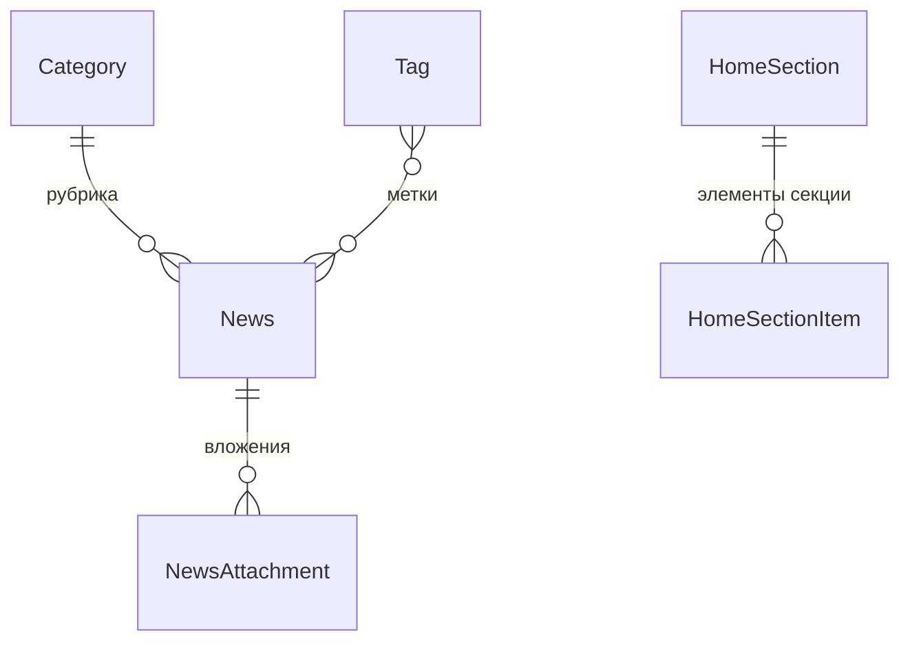

# Домен `cms`

Наполнение публичного сайта: новости, заявки с формы контактов, редактируемые
секции главной страницы, конфигурация конференции. 8 моделей, 7 файлов
сервисов (980 строк).

`/api/cms/v1/` · app_label `cms` · сервис `cms`

---

## 1. Назначение и границы

Всё, что показывает публичная часть сайта неавторизованному посетителю, плюс
редакторские инструменты.

Отдельно и не вполне по теме: **конфигурация конференции** отдаётся тоже
отсюда (`GET /api/cms/v1/conference/config`) — так сложилось исторически, от
FastAPI-сервиса cms.

**Чего домен не делает:** не хранит файлы (через `media_files`), не сам
переводит новости (через внешний сервис в Celery-задаче).

---

## 2. Модели

| Модель | Роль |
|---|---|
| `News`, `Category`, `Tag`, `NewsAttachment` | Новости |
| `ContactRequest` | Заявка с формы контактов |
| `HomeSection`, `HomeSectionItem` | Редактируемые секции главной |
| `AuditLog` | Журнал |

`HomeSection` — то, что позволяет менять тексты и цифры на главной без
правки кода. На фронте их читает хук `useHomeSection`
(`frontend/src/hooks/useHomeContent.ts`), с фолбэком на статические переводы,
если редактор ничего не завёл.

---

## 3. Публичный контракт `interface.py`

Одна функция: `get_published_news(limit=10)`.

---

## 4. Ключевые сценарии

| Файл | О чём |
|---|---|
| `news_service.py` | Новости |
| `home_service.py` | Секции главной |
| `contact_requests_service.py` | Заявки с формы |
| `conference_service.py` | Конфиг конференции |
| `taxonomy_service.py` | Рубрики и метки |
| `news_snapshot.py` | Снимки новостей |
| `audit.py` | Журнал |

### Конфиг конференции

`conference_service.py` **не читает базу** — собирает статическую конфигурацию
WebRTC/SFU из настроек Django и **нормализует адрес сигналинга относительно
текущего хоста запроса**. Без этого браузер получил бы внутренний адрес
контейнера или `localhost` при заходе с публичного адреса.

Дополнительно отдаёт `enabled` — статус сервиса `conference` из реестра
`apps.core`, чтобы фронт узнавал состояние из того же запроса, а не отдельным
обращением к `/api/core/v1/services/`.

Здесь же приезжают адрес WebTransport-моста и отпечатки его самоподписанного
сертификата (`wt_signaling_url`, `wt_certificate_hashes`).

---

## 5. HTTP-эндпоинты

[API.md](../../../API.md), раздел `apps.cms`. Не дублируется.

---

## 6. Фоновые задачи

Три в `backend/apps/cms/tasks.py`:

| Задача | Что делает |
|---|---|
| `translate_news` | Перевод новости на другой язык |
| `notify_admins_on_contact_request` | Уведомление админов о заявке |
| `publish_scheduled_news` | Публикация отложенных новостей |

`notify_admins_on_contact_request` в тестах выполняется синхронно
(`CELERY_TASK_ALWAYS_EAGER`), прямо из вью, обрабатывающей заявку.

---

## 7. Права и гейты

`require_service("cms")`; снаружи — префикс `/api/cms/`.

Публичные ручки (новости для сайта, отправка формы контактов) идут с
`auth=None`. Редакторские — требуют роли редактора.

---

## 8. Инварианты и подводные камни

**Конфиг конференции нормализуется по хосту запроса.** Не подставляйте адрес
из настроек напрямую — гость получит недостижимый адрес.

**`enabled` в конфиге и реестр — один источник.** Не заводите второй способ
узнать, включена ли конференция.

**Секции главной имеют фолбэк.** Если редактор ничего не завёл, фронт берёт
статический перевод. Пустая секция в БД не должна ломать страницу.

---

## 9. Тесты

`backend/apps/cms/tests/`, в том числе `test_home_sections_api.py`.
