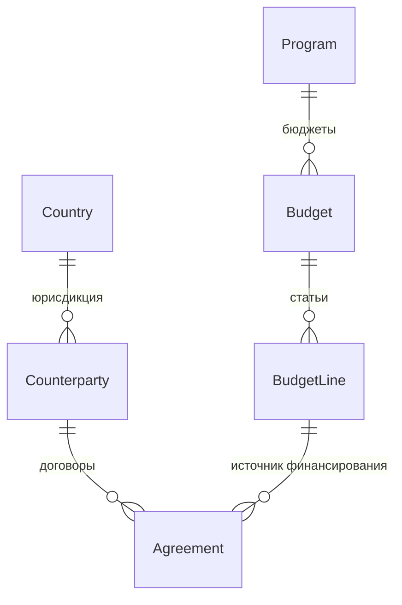

# Домен `contracts`

Бюджеты, реестр контрагентов, договоры. 7 моделей, 5 файлов сервисов
(1398 строк).

`/api/contracts/v1/` · app_label `contracts` · сервис `contracts`

---

## 1. Назначение и границы

Домен **не имеет предка в FastAPI-поколении** — появился уже после обратной
миграции. Поэтому он чище остальных: без наследия шины, реплик и старых
контрактов.

Главный потребитель `signoff`: договоры и бюджеты — это те самые «строки чужих
таблиц», которые согласует универсальный движок.

**Чего домен не делает:** не реализует согласование (это `signoff`, и
зависимость строго односторонняя).

---

## 2. Модели

| Модель | Роль |
|---|---|
| `Budget` / `BudgetLine` | Бюджет и его статьи |
| `Counterparty` | Контрагент |
| `Agreement` | Договор |
| `Program` | Программа |
| `Country`, `Administrator` | Справочники |

Перечисления: `BudgetStatus`, `CounterpartyStatus`, `PaymentType`,
`AgreementStatus`.

---

## 3. Публичный контракт `interface.py`

| Функция | Отдаёт |
|---|---|
| `get_budget_summary(budget_id)` | Сводка по бюджету |
| `get_budget_line_remaining(budget_line_id)` | Остаток по статье, `Decimal` |
| `get_agreement_brief(agreement_id)` | Карточка договора |

Остаток возвращается как `Decimal`, а не `float` — деньги.

---

## 4. Ключевые сценарии

### Регистрация в `signoff`

`backend/apps/contracts/approval_hooks.py` регистрирует согласуемые типы в
движке `signoff` и передаёт колбэки доменных последствий.

Зависимость **односторонняя**: `contracts` знает про `signoff`, `signoff` про
`contracts` — никогда. Поле `approval_state` ведёт сам `signoff`, а не
предметная аппка.

### Class-based вью

`contracts` — **первая аппка на `htqweb.http.ApiView`** вместо функционального
диспетчера. `View.dispatch` сам разводит запрос по методам, и «маленькие
диспетчеры с 405 в конце» не нужны.

`api_view` при этом навешивается **пометодно** через `method_decorator`:
режим авторизации у GET и POST одного URL разный. См.
[01-conventions.md](../01-conventions.md), раздел 2.

### Сервисы

| Файл | О чём |
|---|---|
| `budget_service.py` / `budget_calc.py` | Бюджеты и расчёты |
| `agreement_service.py` | Договоры |
| `counterparty_service.py` | Контрагенты |
| `reference_service.py` | Справочники |

---

## 5. HTTP-эндпоинты

[API.md](../../../API.md), раздел `apps.contracts`. Не дублируется.

---

## 6. Фоновые задачи

**Нет.**

---

## 7. Права и гейты

`require_service("contracts")`; снаружи — `/api/contracts/`. Запись требует
администратора (`api_view(admin=True)`): тонкой роли «финансист» в платформе
нет.

---

## 8. Инварианты и подводные камни

**Зависимость с `signoff` односторонняя.** Импорт `apps.signoff.models` из
`contracts` допустим только через `interface`; обратный импорт запрещён
абсолютно.

**`approval_state` пишет `signoff`, не вы.**

**Деньги — `Decimal`.** Не приводите к `float`.

---

## 9. Тесты

`backend/apps/contracts/tests/`.
