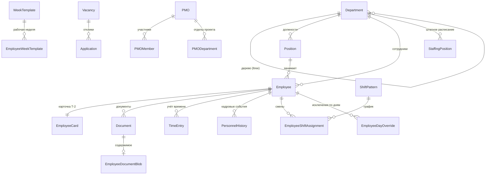

# Домен `hr`

Кадры: сотрудники, оргструктура, карточка Т-2, штатное расписание, календарь
и графики смен, документы, вакансии, PMO, публичные ссылки. Второй по величине
домен: 31 модель и 13 перечислений, 17 файлов сервисов (4680 строк).

`/api/hr/v1/` · app_label `hr` · сервис в реестре `hr`

---

## 1. Назначение и границы

`hr` — поставщик оргструктуры для всей платформы. Отделы и сотрудники нужны
`tasks` (кому назначена работа), `approvals` (кто согласует), `users` (кому
заводить учётку) — все они ходят сюда через `interface`.

**Чего домен не делает:**

- Не хранит учётные записи и не выпускает токены — это `users`. У сотрудника
  есть `user_id`, но сама учётка живёт в другом домене.
- Не согласует кадровые заявки — это `approvals` (конструктор форм).
- Не считает задачи и объёмы — это `tasks`.

---

## 2. Модели

31 модель и 13 перечислений в `backend/apps/hr/models.py` (1433 строки).
Большинство наследует абстрактный `HrBase` (`backend/apps/hr/models.py:15`), который даёт
`created_at` / `updated_at` с **серверными** значениями по умолчанию.

> `db_default` на этих полях обязателен, и это не украшение: без него вставка
> мимо ORM (ETL, прямой SQL) падает на `NOT NULL`. На таком уже теряли
> 19 серверных дефолтов при переносе.

### Ядро



| Группа | Модели |
|---|---|
| Оргструктура | `Department`, `Position`, `Employee`, `ReportingRelation`, `LevelThreshold`, `OrgSettings` |
| Карточка Т-2 | `EmployeeCard` |
| Документы | `Document`, `EmployeeDocumentBlob`, `DepartmentFileFolder`, `DepartmentFile` |
| Время и графики | `TimeEntry`, `WeekTemplate`, `CalendarDay`, `EmployeeWeekTemplate`, `ShiftPattern`, `EmployeeShiftAssignment`, `EmployeeDayOverride` |
| Штат и подбор | `StaffingPosition`, `Vacancy`, `Application` |
| История | `PersonnelHistory`, `AuditLog`, `PositionWeightAudit` |
| PMO | `PMO`, `PMODepartment`, `PMOPosition`, `PMOMember` |
| Публичные ссылки | `ShareableLink`, `ShareLinkAudit` |
| Группы | `EmployeeGroups` |

### Дерево отделов на `ltree`

`Department` хранит путь в колонке типа `ltree` (расширение Postgres, ставится
в `infra/db/init-ltree.sql`). Уровень вложенности считается как число сегментов
пути — см. `backend/apps/hr/services/org_service.py:254`.

Отсюда же берётся `org_ancestors` в `interface`: предки отдела достаются одним
запросом по пути, а не рекурсивным обходом.

---

## 3. Публичный контракт `interface.py`

Самый востребованный интерфейс платформы — его зовут `tasks`, `approvals` и
`users`.

| Функция | Отдаёт |
|---|---|
| `get_department_brief(id)` | Карточка отдела или `None` |
| `get_departments_brief(ids)` | То же пакетно |
| `get_employee_brief(user_id)` | Сотрудник по `user_id` из JWT; мягко удалённые не отдаются |
| `list_departments_brief(limit=500)` | Все отделы разом — для выборок и админки |
| `list_employees_brief(limit=500)` | Действующие сотрудники: кто, в каком отделе, есть ли учётка |
| `link_employee_user(employee_id, user_id)` | Привязать учётку к карточке |
| `org_ancestors(department_id)` | Предки отдела от корня к родителю, себя не включая |

Обратите внимание на `get_employee_brief`: ключ — **`user_id`**, не
`employee_id`. Это сделано под самый частый вопрос («кто этот человек из
токена»), и перепутать легко.

`link_employee_user` — единственная функция интерфейса, которая **пишет**.
Остальные только читают.

### Кто чем пользуется

```bash
grep -rn "apps\.hr\.interface" backend/apps --include=*.py | grep -v '^backend/apps/hr/'
```

Основные потребители: `tasks` (подстановка отделов в `hydration.py`,
видимость по отделу в `task_service.py`), `approvals` (разрешение
согласующих в `assignee_resolver.py`), `users` (сид учёток сотрудникам).

---

## 4. Ключевые сценарии

### Карточка Т-2 и посекционные права

Главный по нетривиальности сценарий:
`backend/apps/hr/services/employee_card_t2_service.py`.

Гейтинг **посекционный, а не по каждому полю**. Карта секций — `_SECTIONS`
(`backend/apps/hr/services/employee_card_t2_service.py:21`):

| Секция | Поля | Права |
|---|---|---|
| `financial` | `salary`, `bonus`, `bank_account` | `hr.card.financial.view` / `.edit` |
| `personal` | `passport_data`, `inn`, `birth_date`, `birth_place`, `citizenship` | `hr.card.personal.view` / `.edit` |

Правило, которое легко нарушить: **`view` и `edit` разделены, и `edit` без
`view` не работает**. Секция, на которую есть право правки, но нет права
просмотра, не показывается вовсе — иначе пользователю предложили бы форму,
сохранение которой затрёт данные, которых он не видит, значениями `null`.

Патч применяется целыми секциями: в тело запроса попадают только те секции,
которые действительно менялись. Иначе «открыл и сохранил» затирало бы чужие
данные.

### Оргструктура и веса должностей

`org_service.py` (722 строки) и `position_service.py` (711) — самые крупные.
Должности упорядочиваются парой «уровень, вес»; изменения весов пишутся в
`PositionWeightAudit`, потому что перестановка должности меняет вид всей
оргструктуры и должна быть объяснима задним числом.

### Публичные ссылки

`share_link_service.py` (391) выдаёт ссылку на карточку или оргструктуру,
которую можно показать снаружи. Каждое обращение пишется в `ShareLinkAudit` —
это персональные данные, и след обязателен.

### Графики смен

`calendar_service.py` (358) плюс модели `ShiftPattern`,
`EmployeeShiftAssignment`, `EmployeeDayOverride`, `WeekTemplate`. Слоистая
модель: шаблон недели задаёт базу, циклический график накладывается сверху,
исключение по конкретному дню перекрывает оба.

### Остальные сервисы

| Файл | О чём |
|---|---|
| `pmo_service.py` (389) | Проектные офисы |
| `department_file_service.py` (310) | Файлы отделов |
| `department_service.py` (265) | Дерево отделов |
| `document_service.py` (250) | Документы сотрудников |
| `recruitment_service.py` (225) | Вакансии и отклики |
| `employee_service.py` (222) | Сотрудники |
| `employee_card_service.py` (172) | Карточка целиком |
| `staffing_service.py` (168) | Штатное расписание |
| `time_service.py` (165) | Учёт времени |
| `personnel_history_service.py` (125) | Кадровые события |
| `audit_service.py` (73) | Журнал |

---

## 5. HTTP-эндпоинты

Полная таблица — [API.md](../../../API.md), раздел `apps.hr`. Не дублируется.

---

## 6. Фоновые задачи

**Нет.** `backend/apps/hr/tasks.py` — файл из двух строк комментария:
задачи домена «появятся в его фазе». На момент написания не появились.

Если будете добавлять — первой строкой `require_service("hr")`, иначе упадёт
мета-тест `backend/apps/core/tests/test_invariants.py`.

---

## 7. Права и гейты

Три уровня, вложенные друг в друга:

1. **Гейт домена** — `require_service("hr")` в каждой функции `interface`,
   `ServiceGateMiddleware` на `/api/hr/`.
2. **Уровень доступа кадровика** — грубое разделение «есть доступ к HR / нет».
   На фронте зеркалится хуком `useHRLevel`.
3. **Посекционные права карточки** — `hr.card.<секция>.view` / `.edit`,
   см. раздел 4.

Напоминание из [02-auth-rbac.md](../02-auth-rbac.md): фронтовые проверки —
удобство, а не защита.

---

## 8. Инварианты и подводные камни

**Секция «Сертификаты/СРО» удалена из бэкенда, но фронт её всё ещё рисует.**
Это незакрытое расхождение, а не проектное решение.

Миграция `backend/apps/hr/migrations/0016_remove_employeecard_certs.py` сняла
четыре колонки (`sro_permit_number`, `sro_permit_expiry`,
`safety_cert_number`, `safety_cert_expiry`), вместе с ними ушли секция `certs`
из `_SECTIONS`, схема `CardCerts` и права `hr.card.certs.*`. Миграция
**необратима по данным**: откат вернёт колонки, но не содержимое.

При этом `frontend/src/components/hr/cardT2Fields.ts:24` по-прежнему объявляет
`T2_SECTIONS = ['financial', 'personal', 'certs']` и описывает четыре поля
сертификатов. Проверено на ветке `sanzhar` 13.08.2026.

Следствия:

- Тесты Т-2 на фронте и в бэкенде падают на полях сертификатов.
- Интерфейс показывает секцию, сохранить которую бэкенд не может.

Прежде чем «чинить» одну из сторон, выясните, какое решение действующее:
удаление секции выглядит намеренным (миграция снабжена объяснением), тогда
чинить надо фронт.

**`get_employee_brief` принимает `user_id`, а не `employee_id`.** Перепутать
легко, а ошибка тихая: вернётся `None` или чужая карточка.

**`db_default` на `created_at`/`updated_at` не убирать.** Без него любая
вставка мимо ORM падает на `NOT NULL`.

**Мягкое удаление.** Сотрудники не удаляются физически; `interface` их не
отдаёт, но строки остаются, и прямые запросы к моделям их увидят.

---

## 9. Тесты

`backend/apps/hr/tests/`.

| Файл | Что стережёт |
|---|---|
| `test_employees_api.py` | Сотрудники и карточка Т-2, включая создание одним запросом |
| `test_calendar_service.py` | Календарь, шаблоны недели, смены |
| `test_org_*.py` | Оргструктура и веса должностей |

Запуск точечно:

```bash
cd backend
./.venv/Scripts/python.exe -m pytest apps/hr/tests/test_employees_api.py -q
```

⚠️ Два теста в `test_employees_api.py`
(`test_create_employee_with_card_t2_writes_card`,
`test_update_employee_with_card_t2_applies_both`) **падают** — они ждут поля
сертификатов, удалённые миграцией `0016`. См. раздел 8.
