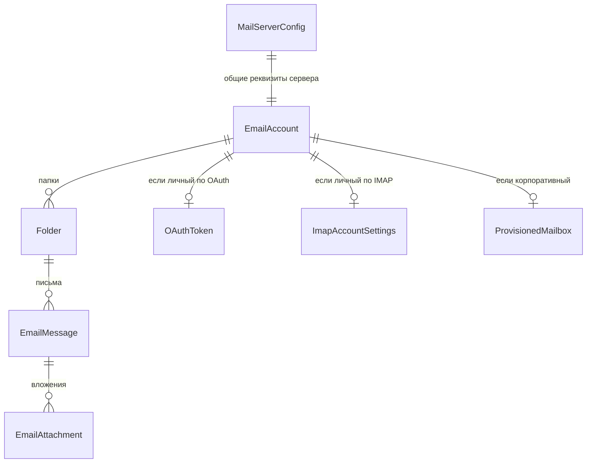

# Домен `mail`

Корпоративная почта: заведение ящиков, синхронизация с IMAP, отправка,
вложения, OAuth к внешним провайдерам. Третий по величине домен: 9 моделей,
16 файлов сервисов (3807 строк) и самый нагруженный набор Celery-задач.

`/api/email/v1/` · app_label `mail` · сервис в реестре `mail`

> ⚠️ **Имя не совпадает с префиксом.** Аппка называется `mail`, URL —
> `/api/email/v1/`. Наследство FastAPI-поколения, см.
> [01-conventions.md](../01-conventions.md), раздел 6.

---

## 1. Назначение и границы

Домен закрывает корпоративную почту целиком: от заведения ящика на почтовом
сервере до показа письма в интерфейсе.

Две принципиально разные роли ящика:

- **Корпоративный** — заводится платформой на своём почтовом сервере
  (провижининг через Mailcow), пароль хранится у нас в зашифрованном виде.
- **Личный** — внешний ящик пользователя, подключённый по OAuth или по IMAP.

**Чего домен не делает:**

- Не заводит пользователей — их даёт `users`, и именно `users` зовёт
  `mail.interface`, а не наоборот.
- Не кладёт уведомления в колокольчик. Такой замысел был (см.
  [tasks.md](tasks.md), раздел 3), но реализован не был.

---

## 2. Модели

9 моделей и 5 перечислений в `backend/apps/mail/models.py` (656 строк).



| Модель | Роль |
|---|---|
| `EmailAccount` | Подключённый ящик; тип и провайдер задают, какая из трёх боковых таблиц заполнена |
| `ProvisionedMailbox` | Ящик, заведённый платформой на своём сервере |
| `ImapAccountSettings` | Реквизиты личного ящика по IMAP |
| `OAuthToken` | Токены личного ящика по OAuth |
| `MailServerConfig` | **Одна строка** с реквизитами почтового сервера |
| `Folder`, `EmailMessage`, `EmailAttachment` | Собственно почта |
| `AuditLog` | След действий |

Целостность связки «тип ↔ провайдер ↔ боковая таблица» держится проверочными
ограничениями в БД (`ck_email_accounts_type`, `ck_email_accounts_provider`,
`ck_email_accounts_type_consistency`). Они реально срабатывают — в логах
Postgres при прогоне тестов эти нарушения видны, потому что тесты их проверяют
намеренно.

---

## 3. Публичный контракт `interface.py`

Три функции. Потребитель ровно один — `users`.

| Функция | Смысл |
|---|---|
| `provision_mailbox(...)` | Завести корпоративный ящик новому пользователю |
| `get_user_mailbox(user_id)` | Узнать ящик пользователя |
| `archive_user_mailboxes(user_id)` | Заархивировать ящики при отключении пользователя |

Направление вызова важно: **`users` зовёт `mail`**, не наоборот. Заведение
учётки тянет за собой заведение ящика, и точка входа — в домене учёток
(`backend/apps/users/services/admin_service.py`, `backend/apps/users/views.py`).

---

## 4. Ключевые сценарии

### Реквизиты сервера: БД поверх env

Самая важная особенность домена, и нарушить её проще всего.

Настройки подключения берутся **только** через
`backend/apps/mail/services/mail_config.py`. Правило слияния одно:

> **Пустое поле в строке `MailServerConfig` = «берём значение из env».**

Следствия, ради которых так сделано:

- окружение, где через интерфейс ничего не заводили, ведёт себя ровно как
  раньше;
- env остаётся способом первоначальной раскатки и аварийного восстановления,
  его не нужно чистить, чтобы что-то поправить из интерфейса;
- чтобы вернуть поле к значению из env, достаточно очистить его в форме.

**Никогда не читайте `settings.IMAP_HOST` (и любые `MAILCOW_*` / `IMAP_*` /
`SMTP_*`) напрямую из кода домена.** Значение, заданное через интерфейс, будет
молча проигнорировано. Только `mail_config.get_config()`.

Две детали реализации, которые стоит знать:

- Булевы поля в БД — `BooleanField(null=True)`, а не обычный булев: иначе
  «выключено» было бы неотличимо от «не задано», и `imap_ssl=False` не смог бы
  перекрыть `IMAP_SSL=true` из env.
- Кэшируется **только чтение строки из БД** (5 секунд, fail-open), а слияние с
  `settings` выполняется на каждом вызове. Если закэшировать готовый
  результат, `override_settings` перестанет действовать до истечения TTL — то
  есть тесты и любой код, временно подменяющий настройки, молча получат
  устаревшие значения.

### Синхронизация писем

`incremental_sync_account` (`backend/apps/mail/tasks.py:175`) — основной путь.
Задача берёт **advisory-lock на аккаунт** (`_try_advisory_lock`), чтобы две
синхронизации одного ящика не пошли параллельно.

`imap_poll_fallback` — опрос по расписанию для случаев, когда push-уведомлений
от сервера нет.

`reconcile_service.py` (388 строк) сверяет состояние ящиков с почтовым
сервером и чинит расхождения.

### Отправка

`deliver_email` (`backend/apps/mail/tasks.py:85`) — с повторами
(`max_retries=5`).

### Остальные сервисы

| Файл | О чём |
|---|---|
| `mailbox_service.py` (539) | Жизненный цикл ящика |
| `reconcile_service.py` (388) | Сверка с почтовым сервером |
| `imap_client.py` (366) | Клиент IMAP |
| `connection_check.py` (342) | Диагностика связи, см. ниже |
| `imap_account_service.py` (309) | Личные ящики по IMAP |
| `oauth_clients.py` (284) / `oauth_service.py` (244) | OAuth к внешним провайдерам |
| `mailcow_client.py` (221) | Провижининг на своём сервере |
| `email_service.py` (222) | Письма |
| `self_service.py` (147) | Действия пользователя над своим ящиком |

---

## 5. HTTP-эндпоинты

Полная таблица — [API.md](../../../API.md), раздел `apps.mail`. Не дублируется.

---

## 6. Фоновые задачи

Самый большой набор в платформе — восемь задач в
`backend/apps/mail/tasks.py`:

| Задача | Что делает | Повторы |
|---|---|---|
| `deliver_email` | Отправка письма | 5 |
| `incremental_sync_account` | Инкрементальная синхронизация ящика | 5 |
| `dlp_scan_attachment` | Проверка вложения | 3 |
| `final_purge_archived_mailboxes` | Окончательное удаление архивных ящиков | — |
| `audit_log_compaction` | Сжатие журнала | — |
| `imap_poll_fallback` | Опрос IMAP, когда push недоступен | — |
| `reconcile_mailboxes` | Сверка с почтовым сервером | — |
| `oauth_token_refresh` | Обновление токенов OAuth | — |

Каждая начинается с `require_service("mail")` — проверяется мета-тестом по AST.

Отдельно от Celery живёт `manage.py run_imap_idle` — долгоживущий процесс,
слушающий IMAP IDLE.

---

## 7. Права и гейты

- Гейт домена: `require_service("mail")`, снаружи — префикс `/api/email/`.
- Пароли ящиков хранятся зашифрованными и **никогда не попадают в вывод** —
  это отдельно соблюдается в диагностической команде (раздел 8).
- Свой ящик пользователь настраивает через `self_service.py`; чужие ящики —
  административные ручки.

---

## 8. Инварианты и подводные камни

**`mail_config.get_config()` — единственная дверь к настройкам.** Прямое
чтение `settings.*` из кода домена — дефект: настройки, заданные из интерфейса,
будут проигнорированы.

**Не кэшируйте результат слияния.** Кэшируется только строка из БД. Иначе
ломается `override_settings` в тестах.

**Папки называются по-разному на разных серверах.** Классическая ловушка —
`Sent` против `Sent Items`. Если `MAIL_SYNC_FOLDERS` перечисляет папку,
которой на сервере нет, синхронизация её молча не найдёт.

**Начинайте диагностику с `mail_check`.** Команда
`backend/apps/mail/management/commands/mail_check.py` печатает разрешённую
конфигурацию и проверяет связь **по порядку зависимостей**: доступность порта
→ подключение IMAP → вход → папки (включая проверку, что папки из
`MAIL_SYNC_FOLDERS` реально существуют) → подключение SMTP → вход SMTP.

Первый отказ останавливает цепочку, поэтому вы получаете одну настоящую
причину, а не десяток производных ошибок. Каждая ошибка снабжена конкретным
способом починки.

```bash
cd backend
./.venv/Scripts/python.exe manage.py mail_check
./.venv/Scripts/python.exe manage.py mail_check --mailbox user@corp.example.com
```

Без `--mailbox` секреты не нужны вовсе. Пароли в выводе не появляются никогда.
Код возврата ненулевой при любой ошибке — команда годится для скриптов.

**Advisory-lock на синхронизацию не убирать.** Две параллельные синхронизации
одного ящика создадут дубли писем.

---

## 9. Тесты

`backend/apps/mail/tests/`.

Запуск точечно:

```bash
cd backend
./.venv/Scripts/python.exe -m pytest apps/mail/tests/ -q
```

Ошибки нарушения ограничений (`ck_email_accounts_*`) в логах Postgres во время
прогона — **нормально**: это тесты, проверяющие, что ограничения работают.
