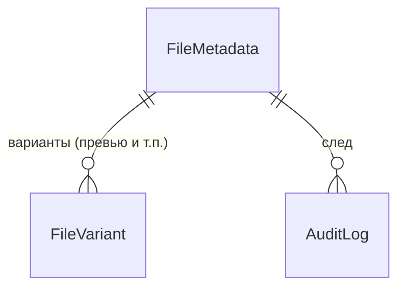

# Домен `media_files`

Файлы и объектное хранилище: загрузка, варианты изображений, выдача ссылок.
3 модели, 6 файлов сервисов (830 строк).

`/api/media/v1/` · app_label `media_files` · сервис в реестре **`media`**

> ⚠️ **Расходятся все три имени.** app_label `media_files`, сервис `media`,
> URL `/api/media/v1/`. Единственный домен, где расходятся именно все три.
> См. [01-conventions.md](../01-conventions.md), раздел 6.

---

## 1. Назначение и границы

Единая точка работы с файлами для всей платформы: аватары, вложения задач,
вложения чата, документы отделов. Хранилище — MinIO (S3-совместимое).

**Чего домен не делает:** не решает, кому файл виден — это задаёт вызывающий
через `scope`.

---

## 2. Модели

| Модель | Роль |
|---|---|
| `FileMetadata` | Запись о файле; содержимое — в S3 |
| `FileVariant` | Производные (превью, уменьшенные копии) |
| `AuditLog` | Журнал |

Перечисления: `FileKind`, `FileScope`, `StorageBackend`.

---

## 3. Публичный контракт `interface.py`

| Функция | Смысл |
|---|---|
| `store_file(data, filename, mime, scope, ...)` | Положить файл |
| `get_file_url(file_id, variant="original")` | Ссылка на файл или его вариант |
| `delete_file(file_id)` | Удалить |

Потребители — `tasks` (вложения задач) и другие домены. Это тот случай, когда
`interface` реально используется по назначению.

---

## 4. Ключевые сценарии

| Файл | О чём |
|---|---|
| `upload_service.py` | Загрузка |
| `url_service.py` | Выдача ссылок |
| `image_service.py` | Варианты изображений |
| `scope_policy.py` | Политика области видимости |
| `content_signature.py` | Подпись содержимого |
| `audit.py` | Журнал |

`content_signature.py` заслуживает внимания: проверка того, что содержимое
файла соответствует заявленному типу, а не только расширению.

---

## 5. HTTP-эндпоинты

[API.md](../../../API.md), раздел `apps.media_files`. Не дублируется.

---

## 6. Фоновые задачи

Три в `backend/apps/media_files/tasks.py` — обработка вариантов и уборка.
Каждая начинается с `require_service("media")` — **обратите внимание на имя
сервиса**, не `media_files`.

---

## 7. Права и гейты

`require_service("media")`; снаружи — префикс `/api/media/`.

Область видимости задаётся `scope` при сохранении и проверяется
`scope_policy.py`.

---

## 8. Инварианты и подводные камни

**Имя сервиса — `media`, а не `media_files`.** Ошибка в `require_service`
означает, что домен не гейтится вовсе (реестр вернёт «включено» для
несуществующего имени). Карта соответствия — `APP_LABEL_TO_SERVICE` в
`backend/htqweb/middleware/service_gate.py:38`.

**Ссылки на файлы в браузере гостя.** `S3_PUBLIC_ENDPOINT` указывает на
`localhost:9000`; при доступе снаружи (туннель, другой хост) картинки из MinIO
у гостя не загрузятся.

**Файл в S3, метаданные в БД.** Удаление одного без другого оставляет мусор.

---

## 9. Тесты

`backend/apps/media_files/tests/`.
