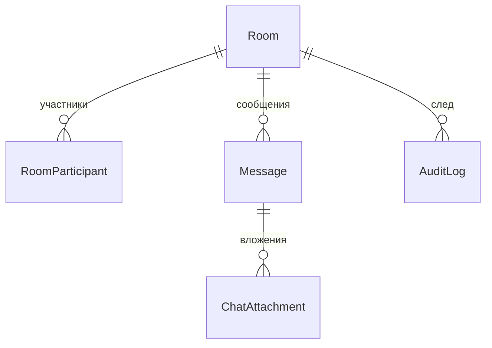

# Домен `messenger`

Чаты: комнаты, участники, сообщения, вложения, присутствие, боты.
6 моделей, 9 файлов сервисов (2052 строки).

`/api/messenger/v1/` · `/ws/messenger/` · app_label `messenger` · сервис
`messenger`

---

## 1. Назначение и границы

Обмен сообщениями в реальном времени. Единственный домен платформы, который
держит **постоянное соединение с браузером** через Socket.IO.

**Чего домен не делает:** не кладёт уведомления в колокольчик `tasks` (замысел
был, реализации нет — см. [tasks.md](tasks.md), раздел 3); не хранит файлы
сам (через `media_files`).

---

## 2. Модели

| Модель | Роль |
|---|---|
| `Room` | Комната; тип задаётся `RoomType` |
| `RoomParticipant` | Участие и роль (`RoomParticipantRole`) |
| `Message` | Сообщение |
| `ChatAttachment` | Вложение |
| `UserKey` | Ключи пользователя |
| `AuditLog` | Журнал |

`ltree` используется и здесь — см. `backend/apps/messenger/models.py`.

---

## 3. Публичный контракт `interface.py`

| Функция | Смысл |
|---|---|
| `dispatch_notification(user_ids, payload)` | Доставить событие пользователям во **все** процессы |
| `send_system_message(room_id, text)` | Системное сообщение в комнату |

`dispatch_notification` доставляет событие через Redis **во все процессы**
messenger, а не только в тот, что обрабатывает запрос. Это принципиально: при
нескольких воркерах пользователь подключён к одному из них, и прямая отправка
дошла бы не всем.

---

## 4. Ключевые сценарии

### Реальное время: Socket.IO поверх ASGI

Socket.IO монтируется в `backend/htqweb/asgi.py` по якорю
`messenger:socketio` — **только эта секция**, см.
`backend/apps/messenger/socket.py:5`.

Работает на `backend-asgi` (uvicorn), не на gunicorn: WSGI постоянное
соединение не держит.

Рассылка между процессами — `socketio.RedisManager(write_only=True)` в
`backend/apps/messenger/services/realtime.py`.

### Остальные сервисы

| Файл | О чём |
|---|---|
| `messenger_service.py` | Сообщения |
| `room_lifecycle.py` | Жизненный цикл комнаты |
| `membership_service.py` | Участники и роли |
| `presence.py` | Кто в сети |
| `realtime.py` | Рассылка событий |
| `attachment_service.py` | Вложения |
| `history_archive_service.py` | Архивация истории |
| `key_service.py` | Ключи |
| `system_bots_service.py` | Системные боты |

---

## 5. HTTP-эндпоинты

[API.md](../../../API.md), раздел `apps.messenger`. Не дублируется.

Помимо HTTP домен обслуживает `/ws/messenger/`, гейтуемый тем же реестром
сервисов по префиксу.

---

## 6. Фоновые задачи

Пять в `backend/apps/messenger/tasks.py`:

| Задача | Что делает |
|---|---|
| `archive_room_history` | Архивация истории комнаты |
| `archive_old_messages` | Архивация старых сообщений |
| `audit_log_compaction` | Сжатие журнала |
| `dispatch_bot_message` | Сообщение от бота |
| `dispatch_push_notification` | Push наружу |

⚠️ `dispatch_push_notification` — **не** колокольчик платформы. Это доставка
push во внешний сервис, и без настроенных ключей она ничего не делает
(no-op). Строки `Notification` домена `tasks` она не создаёт.

---

## 7. Права и гейты

- `require_service("messenger")`; снаружи — префиксы `/api/messenger/` и
  `/ws/messenger/`.
- Доступ к комнате — через `RoomParticipant`.

---

## 8. Инварианты и подводные камни

**Рассылать только через Redis-менеджер.** Прямая отправка из процесса дойдёт
лишь до подключённых к нему клиентов.

**Socket.IO живёт на ASGI.** Не работает realtime — проверяйте `backend-asgi`
и правило nginx для `/ws/`, а не gunicorn.

**`dispatch_push_notification` ≠ колокольчик.** Частая путаница; см. раздел 6.

**Якорь в `asgi.py` не трогать.** Монтирование Socket.IO завязано на конкретную
секцию файла.

---

## 9. Тесты

`backend/apps/messenger/tests/`, в том числе `test_tasks.py` — поведение задач
при выключенном домене и без ключей push.
