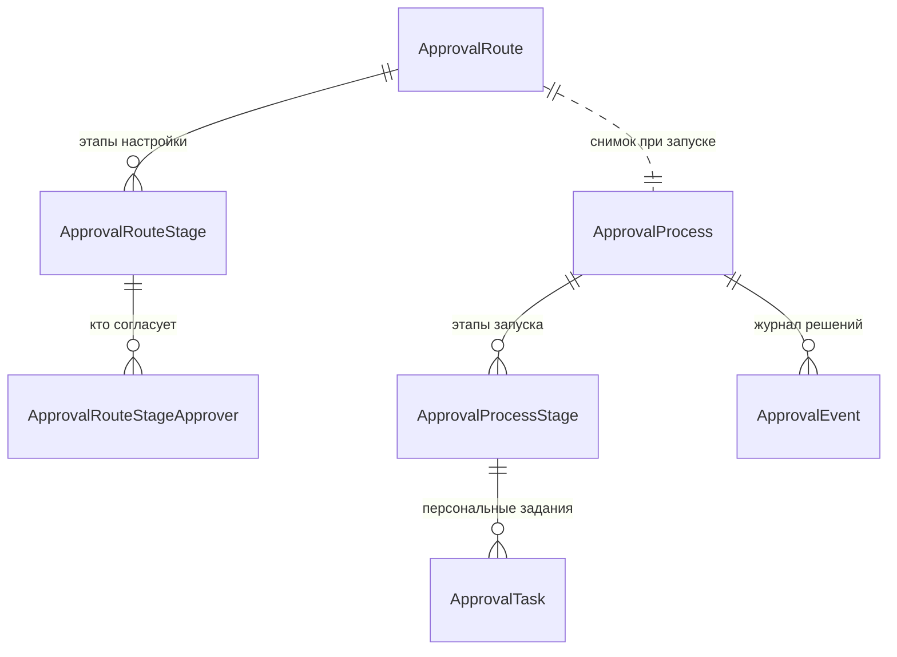

# Домен `signoff`

Универсальный движок многоступенчатого согласования над строками **чужих**
таблиц. 8 моделей и 6 перечислений, 6 файлов сервисов (2257 строк).

`/api/signoff/v1/` · app_label `signoff` · сервис в реестре `signoff`

---

## 🔴 Сначала: `signoff` — это не `approvals`

Два домена с похожими названиями, и путают их постоянно.

| | `signoff` | `approvals` |
|---|---|---|
| Что согласует | Строку **чужой** таблицы (бюджет, договор) | **Собственную** заявку `RequestInstance` |
| Как адресует объект | Пара `(subject_type, subject_id)` | Прямым FK на свою модель |
| Откуда берётся форма | Формы нет, объект уже существует | Конструктор форм, значения в JSONB |
| URL | `/api/signoff/v1/` | `/api/requests/v1/` |

Признак, по которому различить мгновенно: **если согласуемое уже существует
как строка в другой аппке — это `signoff`. Если объект создаётся самой формой
согласования — это `approvals`.**

Разбор второго — [approvals.md](approvals.md).

---

## 1. Назначение и границы

Движок **ничего не знает о предметных областях**. Ни про бюджеты, ни про
договоры. Объект адресуется парой:

- `subject_type` — строка вида `"contracts.budget"`;
- `subject_id` — id строки в чужой таблице.

**Зависимость строго односторонняя:** `contracts` знает про `signoff`,
`signoff` про `contracts` — никогда.

Почему не `ContentType`: правило изоляции аппок
(`backend/apps/core/tests/test_app_isolation.py`) запрещает `signoff`
импортировать `apps.contracts.models`, а `ContentType` дал бы обходной путь к
ровно тому же через `content_type.model_class()`. Поэтому — плоская строка.

**Чего домен не делает:** не создаёт согласуемые объекты, не хранит формы, не
знает, что означает согласование для предметной области. Последнее — забота
колбэков, которые регистрирует сама предметная аппка.

---

## 2. Модели

Три слоя, и различать их обязательно.

| Слой | Модели | Смысл |
|---|---|---|
| **Маршрут** | `ApprovalRoute`, `ApprovalRouteStage`, `ApprovalRouteStageApprover` | Настройка: какие этапы и кто согласует. Ведёт администратор, меняется редко |
| **Процесс** | `ApprovalProcess`, `ApprovalProcessStage`, `ApprovalTask` | Живой экземпляр согласования конкретного объекта |
| **Журнал** | `ApprovalEvent` | Кто что решил и когда |

Перечисления: `Quorum`, `ApproverKind`, `ProcessState`, `StageState`,
`TaskState`, `ApprovalState`.

`Approvable` — примесь, которую подмешивает предметная модель, чтобы стать
согласуемой.

### Ключевое: этапы процесса — снимок маршрута

`ApprovalProcessStage` создаётся **копированием** маршрута на момент запуска,
а не ссылкой на него. Иначе правка маршрута администратором задним числом
меняла бы правила уже идущих согласований.

### Параллельность выражена одним числом

Этапы с **одинаковым** `order` идут параллельно, с разным —
последовательно. Отдельной модели графа (узлы, рёбра, условия) нет намеренно:
задача — «2, 3 или 5 этапов, параллельно или друг за другом», и это ровно то,
что выражает одно число. Граф был бы сложностью без спроса.

---

## 3. Публичный контракт `interface.py`

`backend/apps/signoff/interface.py` (217 строк) — один из самых развитых
интерфейсов платформы, потому что через него предметные аппки и запускают
согласование, и спрашивают о его состоянии.

Регистрация типа — через `backend/apps/signoff/services/registry.py`, которую
предметная аппка вызывает из своего `AppConfig.ready()`, передавая колбэки.
Так движок узнаёт, что делать после согласования, не зная о предметной
области ничего.

---

## 4. Ключевые сценарии

Запуск согласования: предметная аппка зовёт `interface`, движок берёт
действующий маршрут, **копирует** его этапы в процесс, раскладывает
`ApprovalTask` по согласующим.

Решение согласующего: закрывается его задание, пересчитывается состояние
этапа по кворуму (`Quorum`), при закрытии всех этапов текущего `order`
открывается следующий. Каждое решение пишется в `ApprovalEvent`.

Завершение: движок дёргает колбэк, зарегистрированный предметной аппкой.

---

## 5. HTTP-эндпоинты

[API.md](../../../API.md), раздел `apps.signoff`. Не дублируется.

---

## 6. Фоновые задачи

**Нет** — файла `tasks.py` у домена нет.

---

## 7. Права и гейты

`require_service("signoff")` в каждой функции `interface`; снаружи — префикс
`/api/signoff/`.

Решение по заданию принимает **названный в маршруте человек**, а не
администратор. Настройка самих маршрутов — административная.

---

## 8. Инварианты и подводные камни

**Зависимость односторонняя.** `signoff` не имеет права импортировать
предметную аппку. Нужен доступ к данным объекта — через колбэк, который
предметная аппка сама зарегистрировала.

**`ContentType` использовать нельзя.** Это обход правила изоляции, а не
удобное решение.

**Снимок маршрута не заменять ссылкой.** Идущие согласования обязаны
доигрываться по правилам, действовавшим на момент запуска.

**`order` — единственный способ выразить параллельность.** Не заводите граф.

---

## 9. Тесты

`backend/apps/signoff/tests/`, включая `testapp` — минимальную предметную
аппку, подключённую **ровно так же, как настоящая** (примесь `Approvable` плюс
регистрация из `AppConfig.ready()`).

Она живёт только в тестах и объявлена в
`backend/htqweb/settings/test.py`. Пакета `migrations` у неё нет намеренно:
`migrate --run-syncdb`, который pytest-django выполняет при создании тестовой
базы, заводит таблицы именно для аппок без миграций.

Смысл такой аппки: движок универсален, и проверять его на конкретном домене
значило бы ловить в его тестах чужие регрессии.
