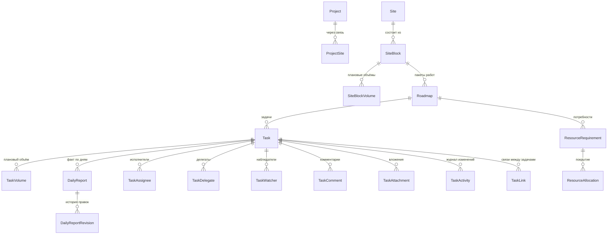

# Домен `tasks`

Задачи, иерархия работ, объёмы, ежедневная отчётность, план-факт, календарь и
колокольчик уведомлений. Крупнейший домен платформы: 35 моделей и 13 перечислений, 20 файлов
сервисов (5647 строк), 29 файлов тестов (8280 строк).

`/api/tasks/v1/` · app_label `tasks` · сервис в реестре `tasks`

---

## 1. Назначение и границы

Домен отвечает за пятиуровневую иерархию строительных работ и всё, что на неё
навешано:

```
проект → площадка → блок → роудмап (пакет работ) → задача
```

Плюс поперечные сущности: подрядчики и их работники, техника, виды объёмов,
ресурсные потребности и их покрытие, календарь, уведомления.

**Чего домен не делает:**

- Не хранит пользователей и отделы. Идентификаторы людей и подразделений —
  просто целые числа, разрешаются через `interface` соседей (см. раздел 8).
- Не рассылает push и письма. Колокольчик — это строки в своей таблице
  `Notification`; доставка наружу к домену не относится.
- Не согласует ничего. Согласование — `signoff` и `approvals`.

---

## 2. Модели

35 моделей в `backend/apps/tasks/models.py` (1690 строк). Ниже — костяк;
перечислять все справочники смысла нет, они однотипны.

### Иерархия работ



| Модель | Роль |
|---|---|
| `Project`, `Site`, `SiteBlock`, `Roadmap`, `Task` | Пять уровней иерархии |
| `TaskVolume` | Плановый объём задачи по виду работ |
| `DailyReport` | Факт за конкретный день; `DailyReportRevision` — история правок |
| `TaskAssignee` / `TaskDelegate` / `TaskWatcher` | Три разные роли участия, см. раздел 7 |
| `ResourceRequirement` / `ResourceAllocation` | Что нужно и чем закрыто |
| `Contractor`, `ContractorWorker`, `ContractorEngagement` | Подрядчики |
| `Equipment`, `EquipmentCategory` | Техника |
| `Notification` | Колокольчик |
| `TaskSequence` | Счётчик для ключей вида `TASK-123` |
| `ProductionDay` | Производственный календарь |
| `CalendarEvent`, `EventException`, `CalendarEventParticipant` | События календаря |

Перечисления (`Status`, `Priority`, `ProjectStatus`, `LinkType`,
`AssigneeRole`, `SiteStatus`, `BlockStatus`, `RoadmapStatus`,
`ContractorStatus`, `ContractorLevel`, `WorkVolumeUnit`, `ResourceKind`) — это
`TextChoices`; в FastAPI-поколении они были PG ENUM.

### Главное про схему: междоменных FK нет

Это записано в докстринге самого файла (`backend/apps/tasks/models.py:1-38`) и
объясняет форму половины кода.

`reporter_id`, `assignee_id`, `supervisor_id`, `owner_id`, `actor_id`,
`recipient_id`, `user_id`, `employee_id`, `department_id` — **обычные целые
поля без внешнего ключа**. Разрешаются через `apps.users.interface` и
`apps.hr.interface`.

Три следствия, о которых нужно помнить:

1. **Ничего не каскадится от удалённого пользователя.** Строка сохраняет
   осиротевший id, а подстановка имени просто даёт `None`.
2. **У моделей нет свойств `*_name` и `avatar_url`.** Это форма ответа, и
   считается она в слое сервисов, где вызовы к соседям батчатся. Свойство на
   модели означало бы N+1 через границу домена.
3. **Двух таблиц из оригинала нет вовсе** — `task_users` и `task_departments`
   были денормализованными репликами, которые синхронизировались через Redis
   pub/sub. В монолите реплицировать нечего.

---

## 3. Публичный контракт `interface.py`

Три функции (`backend/apps/tasks/interface.py`), каждая начинается с
`require_service("tasks")` и возвращает словари, никогда не ORM-объекты.

| Функция | Отдаёт |
|---|---|
| `get_task_brief(task_id)` | `{id, key, summary, status, assignee_id, department_id}` или `None` |
| `get_tasks_brief(task_ids)` | То же пакетно, одним запросом; неизвестные id просто отсутствуют |
| `push_notification(...)` | Создаёт строку колокольчика от имени соседа |

Мягко удалённые задачи не резолвятся — для соседа их не существует.

`push_notification` идемпотентна в окне **5 минут**
(`_DEDUPE_WINDOW`, `backend/apps/tasks/interface.py:40`): повторный вызов с той
же четвёркой «получатель, цель, актор, verb» возвращает `None` и второй строки
не пишет. Окно перенесено из подписчика `notify_sync`, где защищало от
повторной доставки сообщения Redis; здесь защищает от ретрая Celery-задачи
соседа и двойного сабмита формы.

`actor_avatar_url` сохраняется **снимком**: это запись о моменте времени, и
позднейшая смена аватара не должна переписывать историю. Имя актора при этом
подставляется живым.

### ⚠️ У этого интерфейса сейчас нет ни одного потребителя

Проверено поиском по всему `backend/apps` (13.08.2026): вне самого домена
`apps.tasks.interface` не вызывается **нигде**, кроме собственных тестов
домена.

Это расходится с замыслом. Докстринги `interface.py` и `tasks.py` описывают
`push_notification` как замену шине: messenger («вам написали») и mail («новое
письмо») должны звать её вместо публикации в Redis. Ни один из них не зовёт.

Практический вывод: **колокольчик наполняется только событиями самого домена
`tasks`** — дедлайны, напоминания о событиях календаря, изменения задач.
Сообщений чата и писем в нём нет.

Не перепутайте: `apps.messenger.tasks.dispatch_push_notification`
(`backend/apps/messenger/tasks.py:192`) — **другая вещь**, это доставка push
наружу, и она к строкам колокольчика отношения не имеет.

---

## 4. Ключевые сценарии

### Права на задачу: три разных вопроса

Логика прав — сердце домена, и в ней легко ошибиться, потому что вопросов три,
а не один (`backend/apps/tasks/services/task_service.py`):

| Вопрос | Функция | Кто проходит |
|---|---|---|
| Вижу ли я задачу? | `visibility_q`, `_employee_visibility_q` | участники + бесхозные открытые задачи своего отдела |
| Могу ли я править её целиком? | `can_edit`, `require_full_edit` | ограниченный круг |
| Могу ли я отчитаться о ходе? | `can_progress` / `soft_edit_q` | исполнитель, постановщик, руководитель, соисполнители, делегаты |

**`soft_edit_q` и `can_progress` — двойники**: одно правило, выраженное
запросом и проверкой. Первое нужно, чтобы получить список одной выборкой, а не
фильтровать построчно в Python. Если они разойдутся, экран покажет строки,
сохранение которых даст 403.

**Наблюдателей в `soft_edit_q` нет намеренно.** Следить за задачей и заявлять
о выполненном объёме — разные вещи.

В видимость сотрудника дополнительно попадает **бесхозная работа своего
отдела**, но только пока она без исполнителя и в статусе `BACKLOG` или `TODO` —
чтобы её можно было забрать.

### Ежедневная отчётность

`reporting_board` (`backend/apps/tasks/services/daily_report_service.py:317`) —
отдельный эндпоинт, а не «список задач плюс карточка каждой». Причина: объёмы
приходят только в детальном ответе задачи, и страница на 15 задач стоила бы 16
запросов.

Отбор идёт по `soft_edit_q`, то есть **по праву записи, а не по видимости**:
строка, которую нельзя сохранить, на этой странице не нужна.

Отсеиваются задачи без планового объёма (вид работ у отчёта берётся оттуда, без
него отчёт невозможен) и терминальные.

Факт считается **нарастающим итогом на дату**, а не «всего»: строка показывает,
сколько сделано к этому дню, и завтрашние отчёты её не меняют.

### Ключи задач

`sequence_service.py` выдаёт человекочитаемые ключи `TASK-123`. Файл маленький
(82 строки), но вокруг него есть тесты на гонки при параллельном создании —
`backend/apps/tasks/tests/test_sequence_service.py`.

### Остальные сервисы

| Файл | О чём |
|---|---|
| `task_service.py` (822) | Задачи: выборка, права, создание, обновление, участники |
| `plan_fact_service.py` (517) | Сопоставление плана и факта |
| `calendar_service.py` (497) | События, повторы, исключения |
| `daily_report_service.py` (400) | Ежедневные отчёты и доска |
| `roadmap_service.py` (361) | Пакеты работ |
| `contractor_service.py` (349) | Подрядчики и работники |
| `reference_service.py` (320) | Справочники |
| `resource_service.py` (301) | Потребности и покрытие |
| `task_response.py` (271) | Сборка формы ответа |
| `hydration.py` (147) | Батч-подстановка имён через `interface` соседей |

`hydration.py` стоит открыть раньше прочих: через него проходит всё
разрешение чужих идентификаторов, и он объясняет, почему на моделях нет
свойств с именами.

---

## 5. HTTP-эндпоинты

Полная таблица — [API.md, раздел `apps.tasks`](../../../API.md), строка 322.
Здесь не дублируется.

---

## 6. Фоновые задачи

Две, обе в `backend/apps/tasks/tasks.py`, обе с `require_service("tasks")`
первой строкой:

| Задача | Что делает |
|---|---|
| `task_deadline_reminder` | Напоминания о подходящих сроках |
| `calendar_event_reminder` | Напоминания о событиях календаря |

Расписание — строки `django_celery_beat` в БД, не код.

Проверку «первая строка — `require_service`» делает мета-тест
`backend/apps/core/tests/test_invariants.py` **разбором AST**, а не поиском по
строке: выключенный домен не должен продолжать фоновую работу только потому,
что закрыт его HTTP-вход.

### Чего не перенесли из FastAPI и почему

Записано в докстринге `backend/apps/tasks/tasks.py:1-25`. Пути ниже —
**удалённые** файлы FastAPI-поколения; в репозитории их нет, они названы
только чтобы вы не искали:

- `services/task/app/workers/replica_sync.py` — синхронизировал реплики
  пользователей и отделов.
  Реплик нет, писать нечего.
- `services/task/app/workers/notify_sync.py` — превращал события шины в строки
  `Notification`.
  Заменён прямым вызовом `interface.push_notification`… которого, как сказано
  в разделе 3, никто не делает.
- `services/task/app/workers/actors.py::notification_dispatch` — был заглушкой, которая только
  писала в лог «TODO». Запись теперь происходит по месту; воспроизводить
  никогда не работавший актор значило бы портировать баг.

---

## 7. Права и гейты

- Гейт домена: `require_service("tasks")` в начале каждой функции `interface` и
  каждой Celery-задачи; снаружи — `ServiceGateMiddleware` по префиксу
  `/api/tasks/`.
- Три роли участия различаются по смыслу: **исполнитель** (`TaskAssignee`)
  делает, **делегат** (`TaskDelegate`) вправе действовать за исполнителя,
  **наблюдатель** (`TaskWatcher`) только смотрит.
- Администратор (`is_elevated`) видит и правит всё, включая отчёт по любой
  задаче.
- Уведомление приватно получателю: «не ваше» и «не существует» отвечают
  одинаково 404, чтобы эндпоинт нельзя было использовать для разведки чужих
  лент (`backend/apps/tasks/services/notification_service.py:1-13`).

---

## 8. Инварианты и подводные камни

**Междоменные FK запрещены, и это не формальность.** Половина решений в
моделях вытекает отсюда: плоские целочисленные id, отсутствие каскадов,
подстановка имён в сервисном слое. Добавите FK в чужую аппку — упадёт
`backend/apps/core/tests/test_app_isolation.py`.

**`soft_edit_q` и `can_progress` обязаны совпадать.** Меняете одно — меняйте
второе. Расхождение проявится не ошибкой, а строками в интерфейсе, которые
нельзя сохранить.

**Подстановку имён не тащите в модели.** Соблазн добавить свойство
`assignee_name` велик, но каждое такое обращение — вызов через границу домена
на каждую строку. Батч-подстановка живёт в `hydration.py`.

**Колокольчик не получает событий от соседей** — см. раздел 3. Если вам нужно,
чтобы чат или почта клали уведомление, вызов `interface.push_notification`
придётся дописать: интерфейс готов и покрыт тестами, но не подключён.

**Есть тест, падающий по времени суток.**
`test_board_defaults_to_today` в `backend/apps/tasks/tests/test_daily_reports_api.py`
создаёт отчёт на `dt.date.today()` (локальная дата машины), а эндпоинт при
`TIME_ZONE = "UTC"` берёт `timezone.localdate()` — дату по UTC. В Алматы
(UTC+5) между полуночью и пятью утра это **разные даты**, и тест падает,
показывая пустую доску. Днём проходит. Это дефект теста, а не кода.

---

## 9. Тесты

29 файлов, 8280 строк — `backend/apps/tasks/tests/`.

Точки входа, полезные при разборе:

| Файл | Что стережёт |
|---|---|
| `test_permissions.py` | Правила видимости и правки |
| `test_daily_reports_api.py` | Ежедневная отчётность и доска |
| `test_sequence_service.py` | Ключи задач, включая гонки |
| `test_tasks_disableable.py` | Поведение при выключенном домене |
| `test_contract_parity.py` | Совпадение с контрактом API |
| `test_schema_introspection.py` | Соответствие схемы ожиданиям |
| `test_tasks_background.py` | Celery-задачи и `push_notification` |

Запуск точечно:

```bash
cd backend
./.venv/Scripts/python.exe -m pytest apps/tasks/tests/test_permissions.py -q
```

Про интерпретатор и порт тестовой БД — [03-data-layer.md](../03-data-layer.md).
