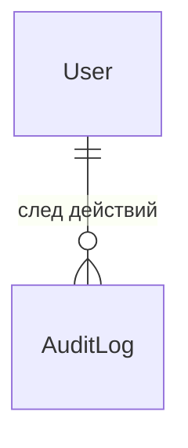
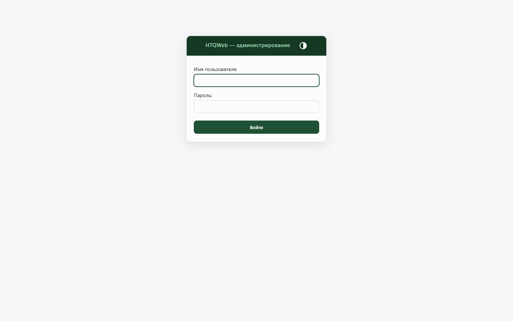

# Домен `users`

Учётные записи, вход, выпуск JWT, администрирование пользователей.
2 модели, 6 файлов сервисов (852 строки).

`/api/users/v1/` · app_label `users` · сервис в реестре `users`

---

## 1. Назначение и границы

Домен отвечает за **кто вы такой**: учётка, пароль, статус, флаги привилегий,
выпуск и обновление токенов.

Отдельного сервиса авторизации в платформе нет — он был в FastAPI-поколении и
удалён. Токены выпускает этот домен, а проверяет их каждая аппка сама, в
процессе (см. [02-auth-rbac.md](../02-auth-rbac.md)).

**Чего домен не делает:** не хранит кадровые данные (это `hr`; связь —
`user_id` в карточке сотрудника), не решает тонкие права доменов.

---

## 2. Модели



| Модель | Роль |
|---|---|
| `User` | Учётная запись |
| `AuditLog` | Журнал |

Плюс `UserStatus` (перечисление) и `UserManager`.

### Три решения в модели `User`, которые стоит знать

**Наследует `AbstractBaseUser`, а не `AbstractUser`, и `PermissionsMixin` не
подмешан.** Платформа пользуется собственными `is_staff` / `is_superuser` плюс
RBAC из `htqweb.authn`; группы и права Django не нужны. Минимальная замена
`has_perm` / `has_module_perms` оставлена только ради `django.contrib.admin`.

**Пароль лежит в колонке `password_hash`**, хотя поле называется `password`
(`db_column="password_hash"`). Форматов два, и оба живые:

- `pbkdf2_sha256$...` — родной Django;
- сырой bcrypt `$2b$...` — наследие FastAPI-периода.

Проверка обязана понимать оба. Об этом легко забыть при рефакторинге.

**`verbose_name` у `username` — не косметика.** Форма входа в `/django-admin/`
берёт подпись поля `USERNAME_FIELD`; без неё на русской странице стояло
«Username:» рядом с «Пароль:».



*Обе подписи по-русски — это и есть результат `verbose_name` на `username`.
Заголовок «HTQWeb — администрирование» даёт свой `HTQAdminSite`, поднятый
вместо стандартного `django.contrib.admin` через `htqweb.apps.HTQAdminConfig`.*

---

## 3. Публичный контракт `interface.py`

Второй по востребованности после `hr` — его зовут `tasks`, `approvals`,
`contracts`, `hr`, `core`.

| Функция | Отдаёт |
|---|---|
| `get_user_brief(user_id)` | Карточка пользователя или `None` |
| `get_users_brief(user_ids)` | Пакетно; неизвестные id **просто отсутствуют** в результате |
| `list_users_brief(search=None, limit=100)` | Поиск по пользователям |
| `verify_password(user_id, password)` | Проверка пароля |
| `create_user(...)` | Завести учётку |

Контракт «unknown → omitted» у `get_users_brief` — тот же, что у
`apps.tasks.interface.get_tasks_brief`. Не полагайтесь на порядок и полноту
результата: сопоставляйте по `id`.

Именно `get_users_brief` вызывается из `hydration.py` доменов `tasks` и
`approvals`, чтобы подставить имена **пакетно**. Поштучные вызовы через
границу домена дают N+1.

---

## 4. Ключевые сценарии

**Вход** — `POST /api/users/v1/token/`, ответ `issue_token_pair`. Путь
защищён ограничением частоты запросов в nginx.

**Обновление токена** — `POST /api/users/v1/token/refresh/`; права
перечитываются из БД, а не берутся из refresh-токена. Разбор —
[02-auth-rbac.md](../02-auth-rbac.md), раздел 2.

**Регистрация** — публичная регистрация создаёт пользователя в статусе
ожидания; войти им нельзя, пока администратор не одобрит.

**Заведение учётки администратором** тянет за собой заведение почтового
ящика: `backend/apps/users/services/admin_service.py` зовёт
`apps.mail.interface.provision_mailbox`. Направление важно — `users` зовёт
`mail`, не наоборот.

**Сид учёток сотрудникам** — `manage.py seed_employee_accounts`, читает
сотрудников через `apps.hr.interface`.

---

## 5. HTTP-эндпоинты

[API.md](../../../API.md), раздел `apps.users`. Не дублируется.

---

## 6. Фоновые задачи

**Нет.**

---

## 7. Права и гейты

- `require_service("users")`; снаружи — префикс `/api/users/`.
- Административные ручки — `admin=True`.
- «Это админ?» — `is_elevated`, объединяющий `is_staff`, `is_superuser`,
  `is_admin`.

---

## 8. Инварианты и подводные камни

**Два формата пароля.** Код проверки обязан понимать и pbkdf2, и сырой
bcrypt. Выкинете второй — часть пользователей перестанет входить.

**`PermissionsMixin` не подмешивать.** Отказ осознанный; добавление вернёт
группы и права Django, которыми платформа не пользуется.

**Имена подставлять пакетно.** `get_users_brief`, а не цикл из
`get_user_brief`.

**Учётка и сотрудник — разные вещи.** У `hr` есть `get_employee_brief`, и
ключ там `user_id`. Не перепутайте направление связи.

---

## 9. Тесты

`backend/apps/users/tests/`.

```bash
cd backend
./.venv/Scripts/python.exe -m pytest apps/users/tests/ -q
```
