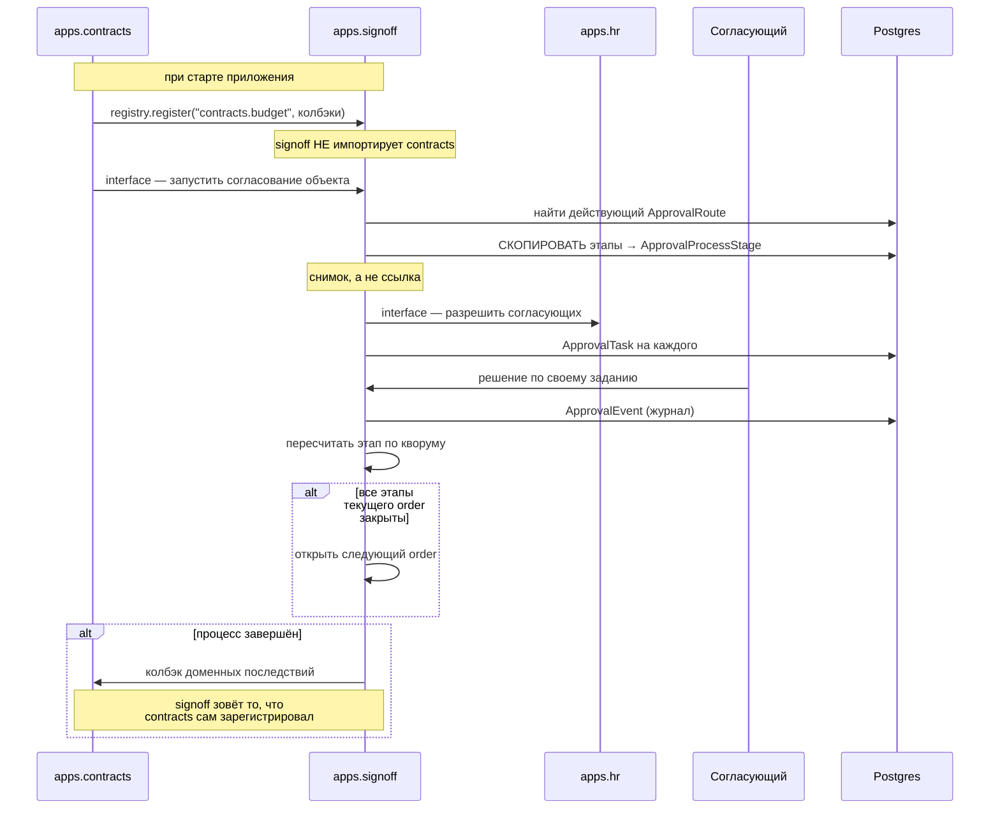

# Сквозной сценарий: согласование

Как строка чужой таблицы проходит многоступенчатое согласование. Затрагивает
`signoff` (движок), предметную аппку (`contracts`) и `hr` (кто согласует).

Смежное: [domains/signoff.md](../domains/signoff.md),
[domains/contracts.md](../domains/contracts.md).

> Речь про `signoff`. Если объект **создаётся самой формой** согласования —
> это другой домен, `approvals`, и другой сценарий. Разница разобрана во
> врезке [domains/approvals.md](../domains/approvals.md).

---

## Общая картина



---

## Шаг 0. Регистрация типа

Предметная аппка регистрирует свой тип **сама**, из `AppConfig.ready()`:
`backend/apps/contracts/approval_hooks.py`.

Зависимость строго односторонняя:

```
contracts  →  знает про signoff
signoff    →  про contracts не знает НИКОГДА
```

Объект адресуется парой `(subject_type, subject_id)`: строка вида
`"contracts.budget"` и id строки в чужой таблице.

**Почему не `ContentType`.** Правило изоляции
(`backend/apps/core/tests/test_app_isolation.py`) запрещает `signoff`
импортировать `apps.contracts.models`, а `ContentType` дал бы обходной путь к
ровно тому же через `content_type.model_class()`. Поэтому — плоская строка.

Поле `approval_state` на предметной модели ведёт **сам `signoff`**, не
предметная аппка.

---

## Шаг 1. Запуск

Движок находит действующий маршрут (`ApprovalRoute`) и **копирует** его этапы
в процесс.

**Снимок, а не ссылка** — и это принципиально. Иначе правка маршрута
администратором меняла бы правила уже идущих согласований задним числом.

---

## Шаг 2. Кто согласует

Согласующие разрешаются через оргструктуру: `apps.hr.interface`. Отсюда же
берётся `org_ancestors`, если маршрут говорит «руководитель отдела» вместо
конкретного человека.

На каждого согласующего создаётся `ApprovalTask` — персональное задание.

---

## Шаг 3. Порядок и параллельность

Выражены **одним числом** — `order`:

| Ситуация | Как записать |
|---|---|
| Этапы идут друг за другом | Разные `order` |
| Этапы идут одновременно | Одинаковый `order` |

Отдельной модели графа (узлы, рёбра, условия) нет **намеренно**. Задача —
«2, 3 или 5 этапов, параллельно или друг за другом», и это ровно то, что
выражает одно число. Граф был бы сложностью без спроса.

Внутри этапа решает **кворум** (`Quorum`): достаточно ли одного согласующего
или нужны все.

Каждое решение пишется в `ApprovalEvent` — журнал «кто что решил и когда».

---

## Шаг 4. Завершение

Когда процесс закрыт, движок дёргает **колбэк**, который предметная аппка
зарегистрировала на шаге 0. Так `signoff` вызывает доменные последствия, не
зная о предметной области ничего.

---

## Кто принимает решение

Названный в маршруте **человек**, а не администратор. Настройка самих
маршрутов — административная задача, но решение по заданию персонально.

---

## Что ломается чаще всего

**Попытка импортировать предметную аппку из `signoff`.** Упадёт тест изоляции.
Нужны данные объекта — через колбэк, который предметная аппка зарегистрировала
сама.

**Замена снимка ссылкой на маршрут.** Идущие согласования начнут доигрываться
по новым правилам. Это не оптимизация, а потеря корректности.

**Попытка выразить условия графом.** Не заводите узлы и рёбра — платформа
намеренно ограничена `order` плюс кворум.

**Правка `approval_state` из предметной аппки.** Его владелец — `signoff`.

**Путаница с `approvals`.** Самая частая ошибка вообще. Признак: если
согласуемое **уже существует** строкой в чужой таблице — это `signoff`; если
создаётся формой — `approvals`.
