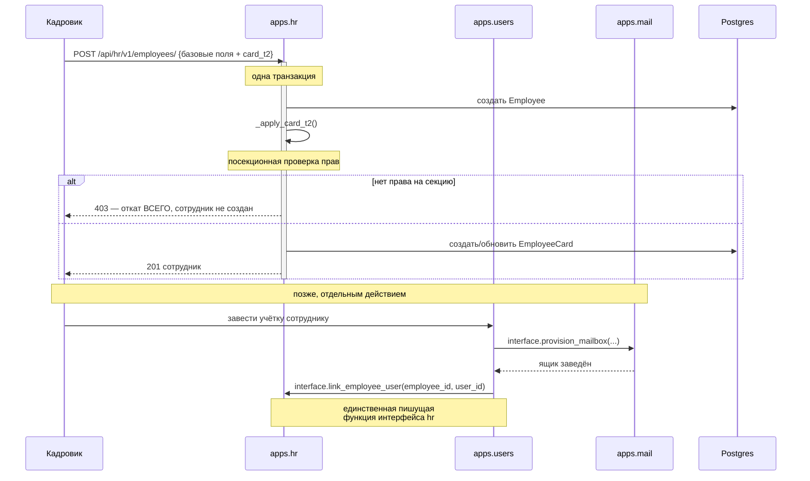

# Сквозной сценарий: жизненный цикл сотрудника

От заведения карточки до появления учётки и почтового ящика. Затрагивает
`hr`, `users`, `mail`.

Смежное: [domains/hr.md](../domains/hr.md),
[domains/users.md](../domains/users.md), [domains/mail.md](../domains/mail.md).

---

## Общая картина



---

## Шаг 1. Заведение сотрудника вместе с карточкой Т-2

Раньше это было пять переходов: создать сотрудника → закрыть модалку → найти
его в таблице → открыть карточку → открыть три отдельные модалки секций.
Сейчас — одна форма и **один запрос**.

Ключевое место — `backend/apps/hr/views.py:623`:

```python
core = schemas.EmployeeCreate.model_validate(data.model_dump(exclude={"card_t2"}))
with transaction.atomic():
    employee = ...                       # базовые поля
    _apply_card_t2(employee.id, data.card_t2, access)
```

**Атомарность здесь не украшение.** Если у пользователя не окажется права на
секцию «Финансы», `_apply_card_t2` бросит отказ, и `transaction.atomic()`
откатит **и создание сотрудника тоже**. Состояние всегда целостное: либо
сотрудник заведён со всеми секциями, либо не заведён вовсе.

Альтернатива — «фронт делает POST, потом PATCH» — была рассмотрена и
отвергнута: между двумя запросами есть щель, и 403 на второй половине
оставлял бы наполовину заведённого сотрудника без реквизитов.

### Посекционные права

`_apply_card_t2` (`backend/apps/hr/views.py:598`) делегирует в
`card_t2_svc.upsert` — **единственного владельца** карты «секция → поля»
(`backend/apps/hr/services/employee_card_t2_service.py:21`).

Две секции, не три:

| Секция | Поля |
|---|---|
| `financial` | `salary`, `bonus`, `bank_account` |
| `personal` | `passport_data`, `inn`, `birth_date`, `birth_place`, `citizenship` |

Правило: **`view` и `edit` разделены; `edit` без `view` не работает.** Секция,
которую пользователь может править, но не видит, не показывается вовсе — иначе
ему предложили бы форму, сохранение которой затрёт невидимые данные значениями
`null`.

В патч попадают **только изменённые секции**. Иначе «открыл и сохранил»
затирало бы чужие данные.

> ⚠️ Третья секция, «Сертификаты/СРО», удалена из бэкенда миграцией
> `backend/apps/hr/migrations/0016_remove_employeecard_certs.py`, но фронт её
> всё ещё рисует. См. [domains/hr.md](../domains/hr.md), раздел 8.

---

## Шаг 2. Учётка и почтовый ящик

Заведение учётной записи — **отдельное действие** и живёт в домене `users`, не
в `hr`.

Направление вызовов важно и легко перепутать:

```
users → mail   (provision_mailbox)
users → hr     (link_employee_user)
```

`hr` **не зовёт** ни `users`, ни `mail` для этого. Точка входа — админский
сервис учёток (`backend/apps/users/services/admin_service.py`).

`link_employee_user` — единственная функция `apps.hr.interface`, которая
пишет; остальные только читают.

### Массовое заведение

`manage.py seed_employee_accounts` читает сотрудников через
`apps.hr.interface.list_employees_brief` и заводит учётки пачкой.

---

## Шаг 3. Как сотрудника видят другие домены

После связки `employee.user_id ↔ User.id` сотрудник становится виден
платформе:

| Домен | Что делает |
|---|---|
| `tasks` | Назначает задачи, считает видимость по отделу через `apps.hr.interface` |
| `approvals` | Разрешает согласующих через оргструктуру |
| `signoff` | Адресует задания согласования |

**Междоменных внешних ключей при этом нет.** Везде плоский целочисленный
`user_id` или `department_id`, разрешаемый через `interface`. Разбор
последствий — [domains/tasks.md](../domains/tasks.md), раздел 2.

---

## Что ломается чаще всего

**Путаница `user_id` и `employee_id`.** `apps.hr.interface.get_employee_brief`
принимает **`user_id`** — тот, что в JWT. Передадите `employee_id` — тихо
получите `None` или чужую карточку.

**Ожидание, что `hr` заведёт учётку.** Не заведёт. Обратное направление.

**Правка секции Т-2 в обход `card_t2_svc.upsert`.** Сервис — единственный
владелец карты «секция → поля»; правка мимо него обойдёт проверку прав.

**Удаление сотрудника.** Мягкое: `interface` его больше не отдаёт, но строки
остаются, и прямые запросы к моделям их увидят. В `tasks` при этом ничего не
каскадится — осиротевший `assignee_id` останется, а подстановка имени даст
`None`.
