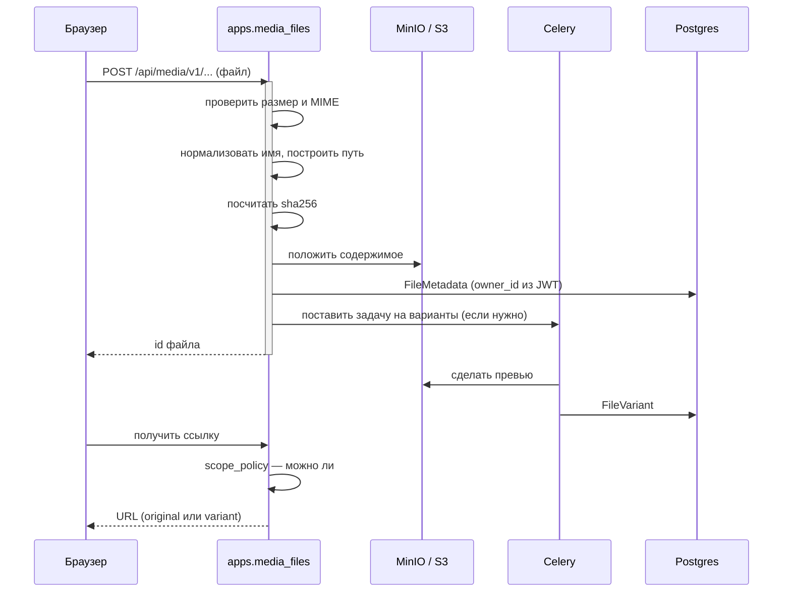

# Сквозной сценарий: загрузка файла

От выбора файла в браузере до ссылки на него. Домен `media_files` плюс
хранилище MinIO/S3.

Смежное: [domains/media-files.md](../domains/media-files.md).

---

## Общая картина



---

## Шаг 1. Приём

`upload_service.py` — конвейер из четырёх шагов:

```
проверить → нормализовать → сохранить → решить, нужны ли варианты
```

Проверяются **размер и MIME**. Отдельно стоит `content_signature.py`:
проверка, что содержимое соответствует заявленному типу, а не только
расширению.

`owner_id` — **всегда `user_id` из JWT вызывающего**. Пути «сервис за
пользователя» (заголовок `X-User-Id`) в этой реализации нет намеренно.

### Дедупликации нет

`sha256` считается и сохраняется на каждой строке, но **поиск дубликатов не
выполняется**. Это не упущение: в исходном сервисе дедупликация была за
флагом, который по умолчанию выключен и там. Поведение по умолчанию
воспроизведено точно.

Не удивляйтесь одинаковым файлам с разными id — так задумано.

---

## Шаг 2. Хранение

Содержимое — в MinIO (S3-совместимое). Метаданные — строкой `FileMetadata` в
Postgres.

**Две половины, и они могут разъехаться.** Удаление одной без другой оставляет
мусор: либо запись без файла, либо файл без записи.

---

## Шаг 3. Варианты

Производные (превью, уменьшенные копии) считаются **фоновой задачей** и
ложатся в `FileVariant`. Поэтому сразу после загрузки вариант может ещё не
существовать — запрашивайте `original`, если нужен гарантированный ответ.

---

## Шаг 4. Выдача ссылки

`get_file_url(file_id, variant="original")` из `interface`.

Право на файл определяет `scope_policy.py` по полю `scope`, заданному при
сохранении. **Домен не решает, кому файл виден** — это задаёт вызывающий.

---

## Кто пользуется

Через `apps.media_files.interface`:

| Домен | Зачем |
|---|---|
| `tasks` | Вложения задач |
| `messenger` | Вложения чата |
| `hr` | Документы сотрудников и файлы отделов |

Это один из немногих интерфейсов платформы, которым реально пользуются по
назначению.

---

## Что ломается чаще всего

**Имя сервиса — `media`, а не `media_files`.** `require_service("media_files")`
не сгейтит ничего: реестр для неизвестного имени возвращает «включено».
Карта соответствия — `APP_LABEL_TO_SERVICE`
(`backend/htqweb/middleware/service_gate.py:38`).

**У гостя не грузятся картинки.** `S3_PUBLIC_ENDPOINT` указывает на
`localhost:9000`. При доступе снаружи (туннель, другой хост) браузер гостя
этот адрес не разрешит. На конференцию не влияет, на аватары — влияет.

**Вариант запрошен слишком рано.** Он считается фоном; сразу после загрузки
его может не быть.

**Файл удалён из S3, метаданные остались** (или наоборот). Удаляйте через
`delete_file`, а не руками в консоли MinIO.
