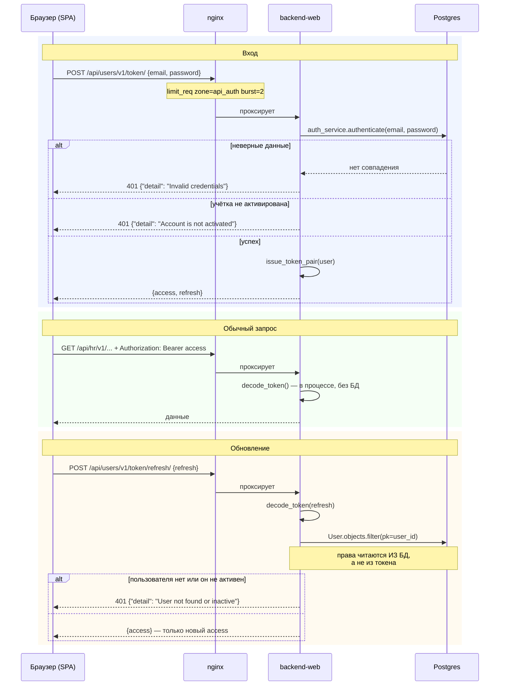

# Сквозной сценарий: вход и жизненный цикл токена

От формы входа до истечения access-токена. Затрагивает `users`, nginx и любую
аппку, которая потом принимает запрос.

Смежное: [02-auth-rbac.md](../02-auth-rbac.md) — контракт токена со стороны
кода; [domains/users.md](../domains/users.md) — сам домен.

---

## Полная картина

---

## Шаг 1. Вход

`POST /api/users/v1/token/` → `obtain_token`
(`backend/apps/users/views.py:41`).

Ручка объявлена `auth=None` — иначе для входа требовался бы токен, которого
ещё нет.

Тело валидируется схемой `TokenObtainRequest` до попадания в функцию: неверная
форма даёт 422, а не 500.

Два разных отказа, оба 401, но с разным текстом:

| Причина | `detail` |
|---|---|
| Неверная пара логин/пароль | `Invalid credentials` |
| Учётка есть, но не активирована | `Account is not activated` |

Второй случай — обычное состояние после публичной регистрации: пользователь
создаётся в статусе ожидания и входить не может, пока администратор не
одобрит.

### Ограничение частоты в nginx

Пути входа, обновления и регистрации вынесены в отдельные правила с
`limit_req zone=api_auth burst=2 nodelay`
(`infra/nginx/default.conf:171-176`) — защита от подбора пароля.

Обратите внимание: там зарегистрированы **обе формы** каждого пути, со слэшем
и без. Это следствие `APPEND_SLASH = False`
(см. [01-conventions.md](../01-conventions.md), раздел 3): Django редиректа не
дошлёт, поэтому оба написания должны вести в одно место.

---

## Шаг 2. Обычный запрос

Токен приезжает заголовком `Authorization: Bearer <access>`.

`api_view(auth="jwt")` разбирает его и кладёт `TokenPayload` в
`request.token`. **Ни обращения к БД, ни сетевого вызова здесь нет** — все
процессы делят `JWT_SECRET`, и проверка это чистая криптография.

Именно поэтому отзыв прав не мгновенен: выданный access-токен живёт свой час
независимо от того, что произошло с учёткой. Мгновенный отзыв потребовал бы
проверки в БД на каждом запросе — цена, которую платформа сознательно не
платит.

Три причины получить 401 на этом шаге:

1. Заголовка нет или он не начинается с `Bearer `.
2. Токен не разобрался: истёк, подписан другим секретом, чужой issuer.
3. Токен разобрался, но это **refresh** (`backend/htqweb/http.py:68`).

---

## Шаг 3. Обновление

`POST /api/users/v1/token/refresh/` → `refresh_token`
(`backend/apps/users/views.py:57`).

Порядок проверок в коде:

1. Токен разбирается — иначе 401.
2. `token_type` обязан быть `refresh` — подсунуть access не выйдет.
3. Пользователь ищется в БД по `user_id` из токена.
4. **Проверяется статус**: не найден или не активен → 401.
5. Выпускается новая пара, наружу отдаётся **только `access`**.

Шаги 3–4 — то, ради чего всё сделано. Refresh-токен не несёт флагов
привилегий (см. [02-auth-rbac.md](../02-auth-rbac.md), раздел 2), поэтому
права заново читаются из базы. Пользователь, у которого отобрали
администратора или которого деактивировали, **не сможет обновить себе
привилегированный токен**, хотя его refresh формально ещё жив.

---

## Что видит SPA

Фронт хранит токены и подставляет access в каждый запрос
(`frontend/src/api/client.ts`). При 401 он идёт на обновление, при отказе
обновления — на страницу входа.

Отдельная деталь: **SSE-поток** `approvals` не может передать токен
заголовком, потому что браузерный `EventSource` заголовки не поддерживает.
Там токен идёт **параметром строки запроса** — см.
[domains/approvals.md](../domains/approvals.md), раздел 4.

---

## Что ломается чаще всего

**`JWT_SECRET` разъехался между процессами.** Токен, выданный `backend-web`,
не примет `backend-asgi`. Симптом: HTTP работает, а SSE и веб-сокеты отдают
401.

**Дефолтный секрет в проде.** `JWT_SECRET` по умолчанию `change-me`
(`backend/htqweb/settings/base.py:140`). Кто знает секрет — выпишет себе
администратора.

**Смена `JWT_ISSUER`.** Проверяется при разборе каждого токена; смена разом
обессмысливает все выданные.

**Ожидание мгновенного отзыва прав.** Его нет — см. шаг 2.
