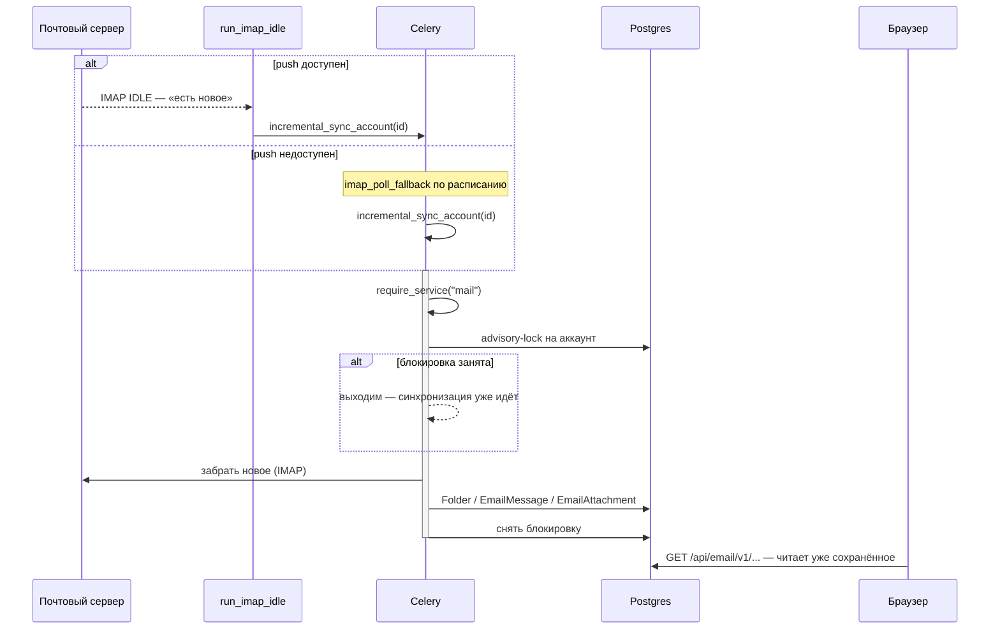

# Сквозной сценарий: письмо от IMAP до экрана

Как письмо с почтового сервера попадает в интерфейс, и как уходит обратно.
Домен `mail`, целиком.

Смежное: [domains/mail.md](../domains/mail.md).

---

## Общая картина



---

## Шаг 0. Откуда берутся реквизиты

**До всего остального.** Настройки подключения берутся **только** через
`mail_config.get_config()`
(`backend/apps/mail/services/mail_config.py`).

Правило слияния: **пустое поле в строке `MailServerConfig` = «берём из env»**.

Прямое чтение `settings.IMAP_HOST` (и любых `MAILCOW_*` / `IMAP_*` / `SMTP_*`)
из кода домена — дефект: значение, заданное администратором через интерфейс,
будет молча проигнорировано.

---

## Шаг 1. Триггер синхронизации

Два пути, и они дополняют друг друга:

| Путь | Когда |
|---|---|
| `manage.py run_imap_idle` | Долгоживущий процесс, слушает IMAP IDLE |
| `imap_poll_fallback` | Задача по расписанию, когда push недоступен |

Оба ведут в одну точку — `incremental_sync_account`
(`backend/apps/mail/tasks.py:175`).

---

## Шаг 2. Синхронизация

Первая строка задачи — `require_service("mail")`: выключенный домен не должен
продолжать фоновую работу только потому, что закрыт его HTTP-вход. Это
проверяет мета-тест разбором AST.

**Advisory-lock на аккаунт** (`_try_advisory_lock`) — ключевая деталь. Две
одновременные синхронизации одного ящика создали бы дубли писем. Если
блокировка занята, задача просто выходит.

Задача объявлена с `max_retries=5`: сеть и почтовые серверы ненадёжны.

Письма раскладываются по `Folder` → `EmailMessage` → `EmailAttachment`.

---

## Шаг 3. Чтение в интерфейсе

Браузер читает **уже сохранённое в БД**, а не ходит в IMAP синхронно. Поэтому
свежесть писем определяется тем, как часто отрабатывает синхронизация.

---

## Отправка

`deliver_email` (`backend/apps/mail/tasks.py:85`), тоже с `max_retries=5`.

---

## Сверка и уборка

| Задача | Что делает |
|---|---|
| `reconcile_mailboxes` | Сверяет состояние ящиков с сервером, чинит расхождения |
| `final_purge_archived_mailboxes` | Окончательно удаляет архивные ящики |
| `audit_log_compaction` | Сжимает журнал |
| `oauth_token_refresh` | Обновляет токены личных ящиков |
| `dlp_scan_attachment` | Проверяет вложение |

---

## Диагностика: начинайте с `mail_check`

```bash
cd backend
./.venv/Scripts/python.exe manage.py mail_check
```

Команда печатает разрешённую конфигурацию (режим провижининга, домен, адреса
IMAP/SMTP), затем проверяет связь **по порядку зависимостей**:

```
порт доступен → IMAP подключается → вход → папки → SMTP подключается → вход SMTP
```

**Первый отказ останавливает цепочку.** Это сделано намеренно: вы получаете
одну настоящую причину вместо десятка производных ошибок. Каждая ошибка
снабжена конкретным способом починки.

Без `--mailbox` секреты не нужны вовсе. Пароли в выводе не появляются
никогда. Код возврата ненулевой при любой ошибке — команда годится для
скриптов.

---

## Что ломается чаще всего

**Настройки из интерфейса игнорируются.** Где-то в коде читается `settings.*`
напрямую вместо `mail_config.get_config()`.

**Папка не синхронизируется.** Классика — `Sent` против `Sent Items`. Разные
серверы называют системные папки по-разному; если `MAIL_SYNC_FOLDERS`
перечисляет несуществующую, она молча не найдётся. `mail_check` проверяет
это явно.

**Дубли писем.** Скорее всего, обошли advisory-lock.

**`override_settings` в тестах не действует.** Признак того, что кто-то
закэшировал **результат слияния**, а не строку из БД. Кэшировать можно только
чтение из БД.
