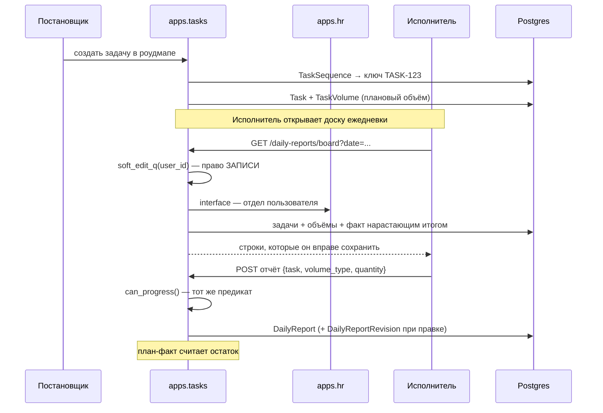

# Сквозной сценарий: задача от создания до ежедневного отчёта

Как работа проходит путь «поставлена → видна исполнителю → по ней отчитались →
факт лёг в план-факт». Целиком внутри `tasks`, но задевает `hr` и `users`.

Смежное: [domains/tasks.md](../domains/tasks.md).

---

## Общая картина

---

## Шаг 1. Постановка

Задача живёт в пятиуровневой иерархии: проект → площадка → блок → роудмап →
задача.

Ключ вида `TASK-123` выдаёт `sequence_service.py`. Файл маленький, но вокруг
него есть тесты на **гонки при параллельном создании**
(`backend/apps/tasks/tests/test_sequence_service.py`) — два одновременных
создания не должны получить один ключ.

**Плановый объём (`TaskVolume`) существенен**: без него задача не попадёт в
ежедневную отчётность вовсе. Вид работ у отчёта берётся именно оттуда.

---

## Шаг 2. Кто видит задачу

Три разных вопроса, и путать их нельзя:

| Вопрос | Предикат |
|---|---|
| Вижу? | `visibility_q` / `_employee_visibility_q` |
| Правлю целиком? | `can_edit` / `require_full_edit` |
| Отчитываюсь о ходе? | `can_progress` / `soft_edit_q` |

В видимость сотрудника попадают его задачи **плюс бесхозная работа своего
отдела** — но только пока она без исполнителя и в статусе `BACKLOG` или
`TODO`, чтобы её можно было забрать. Отдел берётся через `apps.hr.interface`.

---

## Шаг 3. Доска ежедневки

`GET .../daily-reports/board` → `reporting_board`
(`backend/apps/tasks/services/daily_report_service.py:317`).

**Отдельный эндпоинт, а не «список задач плюс карточка каждой».** Объёмы
приходят только в детальном ответе задачи, и страница на 15 задач стоила бы
16 запросов. Здесь — по одной выборке на сущность.

Три правила отбора:

1. **По праву записи, а не видимости.** Отбор идёт по `soft_edit_q`: строка,
   которую нельзя сохранить, на этой странице не нужна — иначе пользователь
   заполнит её и получит 403.
2. **Без планового объёма — не показываем.** Отчитаться не о чем.
3. **Терминальные — не показываем.** О закрытой работе отчитываться нечего.

Факт считается **нарастающим итогом на дату**, а не «всего»: строка
показывает, сколько сделано **к этому дню**, и завтрашние отчёты её не меняют.

### `soft_edit_q` и `can_progress` обязаны совпадать

Это один и тот же вопрос, выраженный дважды: запросом (чтобы получить список
одной выборкой) и проверкой (чтобы разрешить сохранение). Разойдутся —
интерфейс покажет строки, сохранение которых даст 403.

**Наблюдателей в `soft_edit_q` нет намеренно.** Следить за задачей и заявлять
о выполненном объёме — разные вещи.

---

## Шаг 4. Отчёт

`DailyReport` привязан к тройке «задача, вид объёма, дата». Правка пишет
`DailyReportRevision` — история изменений сохраняется.

Дальше факт участвует в план-факте (`plan_fact_service.py`, 517 строк) и в
расчёте остатков по блокам.

---

## Что ломается чаще всего

**Задача не появляется на доске.** Проверьте по порядку: есть ли `TaskVolume`;
не терминальный ли статус; проходит ли пользователь `soft_edit_q`.

**Строка есть, а сохранение даёт 403.** Разошлись `soft_edit_q` и
`can_progress`. Это баг, а не настройка.

**Тест `test_board_defaults_to_today` падает ночью.** Он создаёт отчёт на
`dt.date.today()` (локальная дата), а эндпоинт при `TIME_ZONE = "UTC"` берёт
`timezone.localdate()` — дату по UTC. В Алматы (UTC+5) с полуночи до пяти утра
это разные даты. Дефект теста, не кода. Разбор —
[domains/tasks.md](../domains/tasks.md), раздел 8.

**Имена исполнителей подставляются по одному.** N+1 через границу домена.
Пакетная подстановка — `hydration.py`.
