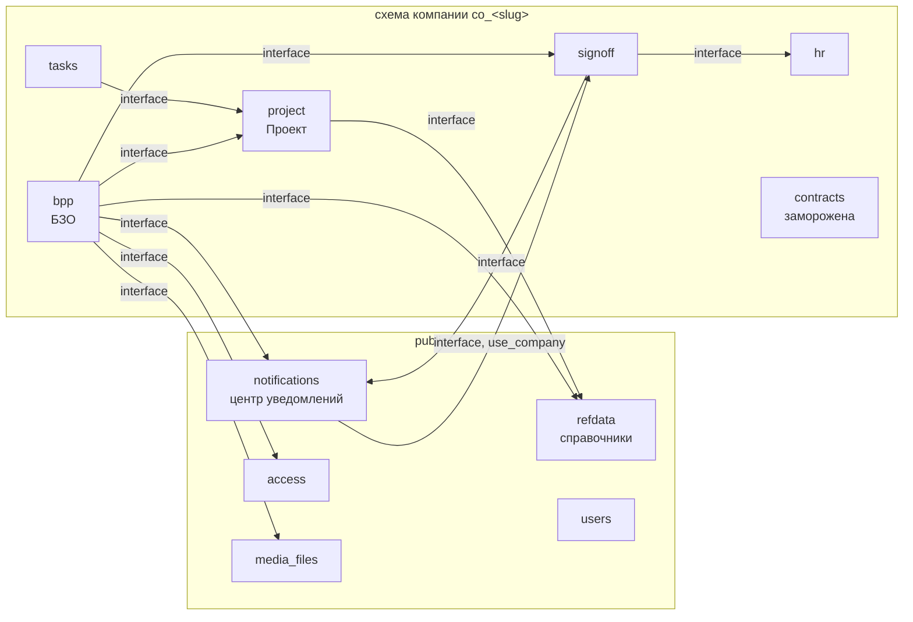

# Модуль БЗО (бюджет, закупки, оплаты) — мастер-план разработки

> **For agentic workers:** REQUIRED SUB-SKILL: Use superpowers:subagent-driven-development (recommended) or superpowers:executing-plans to implement this plan task-by-task. Steps use checkbox (`- [ ]`) syntax for tracking.
>
> **Как устроен этот план.** Это мастер-план: исполнители, ветки, решения, архитектура, контракты между исполнителями и **каталог всех задач** обоих исполнителей по этапам (цель, файлы, интерфейсы, тесты приёмки). Пошаговые планы с кодом пишутся **на этап**, перед его стартом, по этому каталогу (навык `superpowers:writing-plans`). Для этапа 0 они уже готовы:
> - исполнитель A — [2026-09-26-bpp-stage0-executor-a.md](2026-09-26-bpp-stage0-executor-a.md);
> - исполнитель B — [2026-09-26-bpp-stage0-executor-b.md](2026-09-26-bpp-stage0-executor-b.md).
>
> Детальные планы следующих этапов опираются на уже написанный код предыдущих — поэтому пишутся не заранее, а к старту этапа.

**Goal:** Реализовать модуль «Бюджет, закупки и оплаты по проектам» по ТЗ v1.0: лимиты по статьям бюджета проекта → заявки → план закупок → договоры и счета → решение ФД и оплата → сверка с банковской выпиской, плюс альтернативы снабженца и KPI. Двумя исполнителями, параллельно, без пересечения файлов.

**Architecture:** Новая тенантная аппка `apps.bpp` (вся транзакционная цепочка, UUID-ключи) поверх трёх новых платформенных аппок: `apps.project` («Проект», тенантная), `apps.refdata` (общие справочники, схема `public`), `apps.notifications` (хранимый центр уведомлений, `public`). Согласование — единственный движок `apps.signoff`, доработанный флагами маршрута. Права — только `apps.access` (8 системных ролей). `apps.contracts` замораживается: данные переносятся командой, затем режим только чтения.

**Tech Stack:** Django 5.2.7 (корневой `.venv`, Python 3.13), PostgreSQL (схема на компанию), Celery + Redis, MinIO (`apps.media_files`), Pydantic-схемы, `htqweb.http.api_view`, React + Vite + TanStack Query, pytest-django, vitest, Playwright (Edge), openpyxl, WeasyPrint.

**Spec:**
- ТЗ — [docs/tz/TZ-budget-procurement-payments-v1.0.md](../tz/TZ-budget-procurement-payments-v1.0.md);
- анализ и решения — [2026-09-25-bpp-tz-gap-analysis.md](2026-09-25-bpp-tz-gap-analysis.md) (§0);
- **ответы — [docs/tz/Answers-for-questions-from-Claude.md](../tz/Answers-for-questions-from-Claude.md)**: полный источник ответов на список вопросов, включая ответы Алгазы (подтверждено 26.09). Решения, которые Санжар дал 26.09 отдельным сообщением (аппка `project`, справочники в `public`, подмодули, UUID, должности в управляющей компании, типизированная заявка, НДС меняется во времени, лимит 300/мин), записаны строками «Ответ 26.09» в документе вопросов. Ответ стоит под вопросом с префиксом «Ответ:». Таблица «Топ-10» в начале файла хранит ранние ответы; где она расходится с телом вопроса, действует тело;
- вопросы с разбором ответов — [2026-09-25-bpp-open-questions.md](2026-09-25-bpp-open-questions.md);
- вопросы к финансовому директору и итог по каждому — [2026-09-25-bpp-questions-for-algazy.md](2026-09-25-bpp-questions-for-algazy.md).

---

## 0. Исполнители, ветки, правила совместной работы

| | Исполнитель A | Исполнитель B |
|---|---|---|
| Кто | **Санжар** | **Руслан (Rake887)** |
| Ветка | **`new-module-BPP-sanzhar`** | **`new-module-BPP-ruslan`** |
| Сильные стороны | access, companies/tenancy, hr, tasks, core, htqweb, инфраструктура, наблюдаемость | signoff, approvals, contracts (единый движок, заявки, договоры по ТЗ 9.2) |
| Владеет в модуле | платформенные аппки (`project`, `refdata`, `notifications`), каркас и ядро `bpp` (базовые модели, нумерация, аудит, файлы, ошибки, идемпотентность), права и роли, контрагенты, выписка и сверка, дашборд, альтернативы и KPI (доменная часть), фронт-каркас раздела, перенос связей в `tasks`, выкатка | `signoff` (**владелец движка**), `hr.ActingAssignment`, бюджет и версии, заявка, план закупок, договор, единый счёт, расчёт «задействовано», подотчёт, выбор альтернативы, перенос данных из `contracts`, импорт CashFlow, снятие шаблона закупа, экраны своих документов |

Финансовую логику решает **Алгазы** — тимлид модуля и финансовый директор. Он ответил на вопросы (26.09), ответы — в файле ответов (см. **Spec**). Реестр решений §1 собран из файла ответов и решений команды от 26.09. Новый вопрос по финансам, возникший в работе, — к нему же, отдельной строкой в `2026-09-25-bpp-open-questions.md`.

**Правила:**
1. **Ветки не создаём** (CLAUDE.md). Каждый работает только в своей ветке. Код соседа берём так: `git fetch origin && git merge origin/new-module-BPP-<сосед>`.
2. **Точки стыковки (handoff)** перечислены в каждом этапе. Выпускающий исполнитель пушит ветку и пишет соседу, какие интерфейсы готовы. Принимающий мерджит к себе до того, как начнёт зависимую задачу.
3. **Изменения signoff** делает B и присылает A на подтверждение до мерджа (ответ Q-A02). Изменения `access`/`htqweb`/`core` делает A и присылает B на ревью, если они меняют контракт, который B использует.
4. **Миграции:**
   - одна цепочка на аппку;
   - перед `makemigrations <app>` — `git merge` ветки соседа;
   - если оба создали миграцию с одним номером, исполнитель, мерджащий вторым, делает `manage.py makemigrations <app> --merge`;
   - миграции тенантных аппок (`bpp`, `project`, `signoff`, `hr`, `tasks`) применяются к схемам компаний через `manage.py migrate_companies`.
5. **Файлы не пересекаются** внутри волны: таблица владения — §2.7. Общие точки (`settings/base.py`, `core/models.py`, `service_gate.py`, `bpp/models/__init__.py`, `bpp/urls.py`) правит только A; B присылает строку для вставки или добавляет её отдельным маленьким коммитом после согласования.
6. **pytest — один прогон за раз на машине** (общая тестовая БД). Команды — из `backend/`: `../.venv/Scripts/python.exe -m pytest …`. Postgres: `docker compose -f docker-compose.test-local.yml up -d db` (порт 55432).
7. **Коммиты:** только файлы своей задачи (`git add <файлы>`), сообщение `feat(bpp): …` / `feat(signoff): …`. Строку соавторства (`Co-Authored-By: …`) добавляет агент, если коммит делает он.
8. **Интеграция в `pre-production`** — в конце каждого этапа, после взаимного мерджа веток и зелёного полного прогона на ветке, которая мерджит последней.
9. **Документация:** `STRUCTURE.md` и `CLAUDE.md` обновляются в той же задаче, что меняет структуру (ответ Q-A10), `API.md` — в задаче, что добавляет ручки.

---

## 1. Реестр решений

Источник решения обозначен так:
- **номер вопроса** — ответ из файла ответов (`docs/tz/Answers-for-questions-from-Claude.md`: Санжар, Руслан, Алгазы; окончательно — 26.09);
- **«решение 26.09»** — решение команды из сообщения Санжара от 26.09, в файле его нет;
- **«умолчание»** — прямого ответа нет, взят вариант «По умолчанию» из документа вопросов;
- **«решение плана»** — проектное решение там, где вопроса не было.

Умолчания перечислены после таблицы. Они не блокируют работу: поменять их можно, но по ним уже идём.

| # | Решение | Источник |
|---|---|---|
| D-01 | Модуль — новая тенантная аппка `bpp` (рабочее имя; переименование до этапа 0 — одной заменой). `apps.contracts` замораживается | Q-C01, Q-C02, Q-E22 |
| D-02 | «Проект» — аппка `project` (тенантная). `tasks.Project` ссылается на неё (`project_ref`). Страна — атрибут проекта. Заказчик — голой ссылкой на контрагента + подпись | Q-C04, Q-B08; решение 26.09 (Q-E24) |
| D-03 | Справочники (страны, валюты, курсы, МРП, НДС, ед. изм., статьи, группы статей) — аппка `refdata` в `public`; правят только роли управляющей компании (холдинг, Q-E03), читают все пользователи модуля. Файл (Q-C17) говорит «хранить в одной управляющей компании»; хранение в `public` с правкой только ролями управляющей компании — решение 26.09 (Q-E05) | Q-B03, Q-B04, Q-C17; решение 26.09 |
| D-04 | Подмодули с рубильниками: реестр `KNOWN_SUBMODULES` (подмодуль → родитель) рядом с `KNOWN_SERVICES`. В `KNOWN_SERVICES` и реестр прав подмодули не попадают, чтобы не плодить пустые модули в редакторе ролей | Q-C03; решение 26.09 (реестр `KNOWN_SUBMODULES` — решение плана) |
| D-05 | UUID-ключи у всех моделей новых аппок; `signoff.ApprovalProcess.subject_id` → строка для всех типов предметов | Q-C23; решение 26.09 (Q-E04) |
| D-06 | Бюджет — один на проект **на весь срок**, версии со снимками (черновик корректировки не влияет на остатки), годы при переносе суммируются в один лимит. Контроля остатка по годам и кварталам нет (умолчание). Лимиты — в KZT (умолчание; документы в валюте пересчитываются по курсу, D-15). В том же файле таблица «Топ-10» для Q-B01 говорит «проект × страна × год × валюта», а тело вопроса — «суммировать годы в один лимит, бюджет по проекту на весь срок». Оба места переписаны 26.09. Идём по телу: его подкрепляют В-04, Q-B08 и Q-D02. Бюджет общих расходов компании («открытый», Q-D02) — служебный проект вида `company_overhead` со своим бюджетом по тем же правилам (умолчание Q-E13) | Q-B01, Q-B02, В-04, Q-B08, Q-D02 |
| D-07 | Утверждение и корректировка бюджета — прямое действие ФД (без маршрута signoff: ФД и автор, и утверждающий — §06) | ТЗ §06.6 |
| D-08 | «Задействовано» (CALC-002) — формула ТЗ от позиций заявок, вычисляется на лету + ночная сверка-алерт. Подотчёт — отдельным слагаемым. Открытый договор сам ничего не занимает (D-09): бюджет занимают его счета, они уже входят в Σ строк счетов. Строки счёта считаются с «Отправить ФД», вместе с суммой сверх плана позиции — под блокировкой строки бюджета, чтобы не было гонки (В-07). В файле есть и ответ Q-D02 «счёт занимает бюджет только после согласования — да», но он описывает договорённость, по которой работает старый код; для нового модуля действует ответ Q-B06 | Q-B05, Q-B06, Q-B07, Q-B11, В-07 |
| D-09 | Открытый договор бюджет не занимает; его занимают заявки и счета по нему | Q-B11 |
| D-10 | Заявка на закупку — типизированная модель в `bpp`, маршрут ТД → ОД. Шаблон «Заявка на закуп» снимается, тестовые заявки удаляются, справочники форм сохраняются (Q-A04, вторая часть). В файле тело Q-A04 выбирает (в) «адаптировать шаблон без модели», а Q-C05 — типизированную модель; противоречие снято решением 26.09 (Q-E01) | Q-C05; решение 26.09 (Q-E01) |
| D-11 | Единый счёт — одна модель `Invoice` (умолчание Q-C07: следует из Q-B09 и новой аппки). Поля: основание (без договора / по договору), номер `СЧ-ГГГГ-NNNNNN`, строки по позициям заявки, признак «аванс (предоплата)». Частичная оплата и транши — несколько отметок оплаты БУХ по одному счёту (Q-B24), а не отдельный вид счёта. Разбить оплату на несколько счетов по договору по-прежнему можно. Графика траншей на договоре нет (умолчание). Ограничение старого кода «одна предоплата на договор» не переносится. Оплаты по договору и предоплаты переносятся в счета. Номер `СЧ-` выдаётся автоматически и внутренний (так выполняется Q-D02 «автоматически свой внутренний номер»), заявка видна в карточке и реестре (Q-E14) | Q-B09, Q-B24, В-10, Q-C27, Q-D02 |
| D-12 | Решение ФД по счёту — одноэтапный маршрут signoff (`approve` = «Оплатить» с плановой датой, `reject` = «Не к оплате», `rework` = «Вернуть»), массовые решения. Действия БУХ — доменные операции. Счёт согласует только ФД, как в ТЗ (умолчание Q-B39: в файле «уточнить у Алгазы»). Маршрут настраиваемый, его правят администратор и ФД — лишний этап добавляется настройкой, без кода | Q-C13, В-09 |
| D-13 | Закрывающие документы (АВР / накладная / счёт-фактура) — файлы на карточке счёта, принимаются **только после** оплаты: «Оплачено» → «Ждёт закрывающих документов» → «Документы предоставлены» → «Закрыт». Меняет BR-051 и AC-009, снимает E-INV-04. Если документы не пришли (умолчание): статус «Ждёт закрывающих» с числом дней — фильтр в реестре БУХ и метрика на дашборде (A3.2). В ежедневную сводку автора счёта добавляется раздел «ждут от вас закрывающих документов» — это явное расширение сводки, а не часть Q-B21. Запрета новых счетов контрагенту нет | В-11, Q-B10 |
| D-14 | НДС: ставка — поле документа, редактируется везде, где запрашивается; по умолчанию 16%. Ставка меняется во времени (сообщение Санжара 26.09), поэтому подставляется из справочника «страна × дата» (для РК 12% до 01.01.2026, 16% с 01.01.2026). Нет ставки в справочнике — 16% с предупреждением. Правка пишется в аудит и подсвечивается ФД (подстановка из справочника и подсветка — умолчание Q-E08). Меняет BR-031 и AC-006 | Q-B13, Q-D08 |
| D-15 | Валюта: курс НБРК по API на каждый день + фактический курс транзакции, редактируемый (у счёта и отметки оплаты). База — KZT | В-06 |
| D-16 | Порог 1000 МРП: сумма счёта в KZT с НДС, МРП на дату счёта контрагента | Q-B23, BR-040 |
| D-17 | Дробление — только значок «Возможное дробление» для ФД, запрета нет (BR-047, вариант (а)). Окно подсчёта: сумма счетов без договора одному контрагенту по одной заявке (ТЗ) **или** за 30 дней (расширение ТЗ — умолчание R4) больше порога | В-14 |
| D-18 | Допсоглашение — договор с `parent_agreement`, создаётся в той же форме, полного круга согласования нет. У допсоглашения свой настраиваемый маршрут (область «supplementary», правят администратор и ФД). Стартовая настройка (умолчание Q-E06): без изменения суммы — без этапов; с изменением — этап ФД и проверка остатка статьи под блокировкой (лимиты идут на общие суммы договоров, В-05) | В-15, В-09, В-05 |
| D-19 | В договоре минимум одна позиция | Q-D06 |
| D-20 | Контрагент без согласования. Метка «Проверенный» ставится контрагентам, с которыми удачно оформлено несколько договоров или счетов. Когда автор отправляет документ с непроверенным контрагентом, он подтверждает контрагента в окне; у проверенного окна нет (Q-B14). Детали — умолчание Q-E23: метка ставится автоматически по порогу — настройка модуля, по умолчанию 3 удачных документа (договор «Действует»/«Исполнен» или счёт «Оплачено»); подтверждение автора пишется в аудит документа и метку не ставит; ФД ставит и снимает метку вручную. Статусы по ТЗ (Активен / Заблокирован / Архив); уникальность (страна, рег. номер); тип ЮЛ/ИП/ФЛ/нерезидент; свидетельство НДС; банковские счета | Q-B14, Q-B38 |
| D-21 | Signoff: флаги маршрута. Выключены по умолчанию, включены у маршрутов БЗО. Кадровые `hr.*` не затрагиваются. Флаги:<br>• запрет самосогласования;<br>• комментарий ≥ N символов при отказе и возврате;<br>• ленивое разрешение исполнителя при активации этапа;<br>• «Нет исполнителя» — документ ждёт, АДМ и ГД уведомлены | Q-C09, Q-C10, Q-B22, BR-060, BR-061 |
| D-22 | Замещение — одна сущность «временный исполнитель должности на период» (`hr.ActingAssignment`: должность, сотрудник, с/по, основание; назначают АДМ и HR вручную, без матрицы `hr.Substitution`). Она закрывает оба ответа (объединение — умолчание Q-E17):<br>• должность пуста — этапы получает временный исполнитель, иначе этап ждёт «Нет исполнителя» (В-16);<br>• держатель отсутствует — «заместитель пользователя на период» (Q-B19 (б)) оформляется временным исполнителем его должности на тот же период.<br><br>Самосогласование: этап уходит временному исполнителю должности, назначенному на эту дату, иначе ГД; автор — ГД → этап пропускается с записью и уведомлением ФД. В файле ответ Q-B20 («По умолчанию») называет подменяющим «заместителя по матрице замещения», а ответ Q-B19 (б) отказывается от связи с матрицей HR. План идёт по Q-B19, источник подменяющего — умолчание Q-E25 | В-16, Q-B19, Q-B20 |
| D-23 | Сроков согласования сейчас нет («по сроку пока говорить рано», Q-B21). Вместо них — ежедневная сводка ожидающих решения документов одним сообщением со ссылками. Движок signoff проектируется так, чтобы срок этапа можно было добавить позже флагом маршрута без переделки | В-16, Q-B21, Q-B30 |
| D-24 | Центр уведомлений — отдельная аппка `notifications` в `public`: колокольчик, e-mail, Telegram. Каналы выбирает пользователь, минимум один. Доставка через outbox с повтором (решение плана: в файле по Q-C19 выбрано только хранение, способ доставки не выбран). Отдельный бот (умолчание Q-E20) | Q-C19, Q-B30 |
| D-25 | Альтернативы. Выбирают:<br>• по договору — ФД и ГД (решающий голос ГД при расхождении);<br>• по счёту без договора — ФД.<br><br>Возможны на часть позиций, в АП указано, по каким (В-22). Что с исходным документом — умолчание Q-E09: он получает «Заменён альтернативой», создаются два черновика — по альтернативе и по остатку. Сколько АП (прочтение Q-B28 — умолчание Q-E10): лимит на документ — поле документа, по умолчанию 3 (ТЗ); СН может его поднять; от одного СН — одна АП (ТЗ); ПМ подаёт до 3 своих. Автор нового документа — автор заявки (СН и/или ПМ, В-23). KPI — экономия (В-20), подтверждается по «Оплачен» (В-21, Q-B29); прочие показатели R-01 — справочно (умолчание Q-E11). Запись KPI заводится на автора выбранной АП, роль (СН/ПМ) в отчёте — отдельной колонкой; засчитывать ли её ПМ — решение заказчика (вопрос №18 к Алгазы, ответа нет) | В-19…В-23, Q-B28, Q-B29 |
| D-26 | Голос за вариант — гибрид: доменная запись голоса + общая возможность signoff «выбор варианта» (Q-C12). Предсогласованные этапы нового договора по АП — только этапы тех, кто выбирал вариант: ГД предсогласован, ФД проверяет новый договор своим этапом, ТД и ОД согласуют обычным порядком — они за вариант не голосовали (решение плана; меняет ТЗ §12.4 п.5) | Q-C12, В-19 |
| D-27 | Сверка: 1CClientBankExchange + xlsx/csv по шаблону маппинга; допуск кандидатов ±10%; несколько номеров в платеже — распределение по остаткам в порядке номеров; асинхронно (Celery + опрос) | В-13, Q-B26, Q-B27, Q-B40, Q-C26 |
| D-28 | Формат ошибки `{"detail": "<текст из ТЗ §26.1>", "code": "E-…", "fields": […]}` | Q-C21 |
| D-29 | Idempotency-Key (Redis, 24 ч) и оптимистическая блокировка `version` → 409 E-CON-01 | Q-C18 |
| D-30 | Аудит append-only: триггер БД + запрет в коде; журнал скачиваний; хранение 5 лет | Q-C20, Q-B32 |
| D-31 | Файлы документа — таблица версий поверх `media_files`; xml разрешён (отдаётся вложением); задел под ClamAV (интерфейс сканера, по умолчанию без проверки) | Q-C28, Q-B25 |
| D-32 | Экспорт xlsx: синхронно до 10 000 строк, больше — фоном со ссылкой в уведомлении. Печать — HTML + WeasyPrint, бланк из `docs` (колонтитулы пришлют) | Q-C24, Q-C25, Q-B31 |
| D-33 | Пилот — управляющая компания (холдинг). Директора и документы — в её схеме. Должность «Руководитель проекта» (ПМ) завести в структуре холдинга. Кросс-компанейское согласование — отдельный этап после пилота | Q-A08, Q-B15; решение 26.09 (Q-E02) |
| D-34 | Навигация — новый раздел «Закупки и оплаты» (`/bpp`). «Мои согласования» — фильтр общего инбокса signoff по типам БЗО | Q-A06 |
| D-35 | Перенос: дамп прода → копия → команда переноса с отчётом. Все заполненные справочники + открытые документы. Закрытые документы остаются в `contracts` в старом виде только на чтение (Q-B36). Поэтому `apps.contracts` после переноса **замораживается, но не удаляется**: удалить её можно только отдельным решением, перенеся закрытое со статусом «Архив» (предложение Q-E15; без ответа). Импорт CashFlow переписывается под `bpp`. Маршруты signoff — дамп и ручная адаптация | Q-A05, Q-B36, Q-D01, Q-D03, Q-D05 |
| D-36 | Миграции модуля — все разом, когда модуль готов целиком (Q-C22). Выкатывать ли вместе с ещё не выкаченным рефакторингом платформы одним окном (Q-D07 это допускает: «можно будет все разом применить») или двумя — решают Санжар и тимлид до этапа 6 (Q-E18). В обоих вариантах обязательны репетиция на дампе прода, чек-лист и план отката из бэкапа (Q-A05, Q-D01) | Q-C22, Q-D07, Q-A05 |
| D-37 | Безопасность: блокировка входа после 5 неудач + лимит 300 запросов/мин (Q-C31). Детали — умолчание Q-E21: блокировка по логину на 15 минут, платформенная; лимит — на пользователя для всей платформы, в Django через Redis (Q-B33 допускает и дополнительную защиту только модуля). Лимиты nginx по IP остаются | Q-C31, Q-B33 |
| D-38 | Календарь — отдельная аппка (Q-C11), вне критического пути: БЗО он не нужен (решение плана). Заготовки 1С (OData, `ext_1c_ref`) — поля с первого дня, клиент — после запуска | Q-C11, Q-E19, В-17, Q-B34 |
| D-39 | Переводы новых строк не делаем, но пишем через `t('bpp.<ключ>', 'Русский текст')` | Q-B37 |
| D-40 | Главный бухгалтер и бухгалтер — одна роль `bpp-buh` на обеих должностях холдинга. Это предложение в матрице ролей, которую Алгазы утверждает при создании ролей (Q-C14, задача A1.4); в файле ответа нет (Q-E27) | Q-B15, Q-C14 |

**Решения по умолчанию — где в файле ответов прямого ответа нет.** В файле по Q-B39, Q-C07 и деталям В-10 по-прежнему стоит «уточнить у Алгазы»; на вопросы раздела E и документа для Алгазы новых ответов нет. По ним план идёт так:

| Вопрос | Решение | Где в реестре |
|---|---|---|
| Q-B39 — кто согласует счёт кроме ФД | только ФД (ТЗ); маршрут настраиваемый | D-12 |
| Q-C07 — одна модель счёта | одна модель `Invoice` | D-11 |
| В-10 (детали), вопрос №9 — график траншей | графика траншей на договоре нет (частичная оплата и транши отметками по одному счёту — ответ Q-B24; предоплата признаком «аванс» — ответ Q-B09) | D-11 |
| Q-E06 — допсоглашение с изменением суммы | этап ФД + проверка остатка | D-18 |
| Q-E07 — документы не пришли | статус с днями, фильтр и метрика, раздел в сводке автора, без запретов | D-13 |
| Q-E08 — источник ставки НДС | справочник «страна × дата», правка в аудит | D-14 |
| Q-E09 — исходный документ при частичной альтернативе | «Заменён», два черновика | D-25 |
| Q-E10 — сколько АП | лимит 3 на документ, СН поднимает; ПМ — до 3 | D-25 |
| Q-E11 — прочие показатели KPI | справочно | D-25 |
| Q-E13 — «открытый» бюджет компании | служебный проект вида «Общие расходы компании» со своим бюджетом по тем же правилам | D-06, A1.3 |
| Q-E15 — закрытые документы | остаются в `contracts`, она не удаляется | D-35 |
| Q-E17, Q-E25 — замещение и самосогласование | временный исполнитель должности, иначе ГД | D-22 |
| Q-E18 — одно окно выкатки или два | решают Санжар и тимлид до этапа 6 | D-36 |
| Q-E21 — область лимита и длительность блокировки | платформа, по пользователю; 15 минут | D-37 |
| Q-E23 — порог метки «Проверенный» | 3 удачных документа (договор «Действует»/«Исполнен» или счёт «Оплачено»), настройка модуля. Отличается от первоначального предложения «3 оплаченных счёта или 1 действующий договор»: подогнано под ответ Q-B14 «несколько договоров или счетов» | D-20 |
| Q-E27 — главный бухгалтер и БУХ | одна роль, в матрице на утверждение | D-40 |
| R1 — контроль по годам | нет | D-06 |
| R4 — окно дробления | заявка или 30 дней | D-17 |
| Q-E03, Q-E14, Q-E20, Q-E22, Q-E26 | холдинг; `СЧ-` вместо буквального «номер по заявке» из Q-D02; отдельный бот; `bpp`; руководитель — участник автоматически | D-03, D-11, D-24, D-01, A1.3 |

**Противоречия внутри файла ответов** (решены так, как описано в строке реестра): Q-B01 — «Топ-10» против тела (D-06); Q-A04 (в) против Q-C05 (D-10); Q-D02 «счёт после согласования» против Q-B06 (D-08); Q-B20 «матрица замещения» против Q-B19 (б) (D-22).

**Ждём:**
- от команды — примеры банковских выписок (В-13, Q-B26 — положат в `docs`, нужны к задаче A4.1) и колонтитулы бланка (Q-B31 — к задаче A2.2);
- от Алгазы — утверждение матрицы ролей (Q-C14, к задаче A1.4) и ответ, засчитывать ли KPI проектному менеджеру, если выбрана его альтернатива (вопрос №18; к задаче A5.2). До ответа запись KPI заводится на автора АП, роль (СН/ПМ) видна в отчёте отдельной колонкой, итог R-01 считается по всем.

---

## 2. Архитектура

### 2.1 Аппки и зависимости



Все стрелки — только через `apps.<x>.interface` (`apps/core/tests/test_app_isolation.py`).

| Аппка | Схема | `KNOWN_SERVICES` | `CORE_MODULES` | API | Рубильники подмодулей |
|---|---|---|---|---|---|
| `project` | компании (`TENANT_APPS`) | `project` | да | `/api/project/v1/` | — |
| `refdata` | `public` | `refdata` | да | `/api/refdata/v1/` | — |
| `notifications` | `public` | `notifications` | да | `/api/notifications/v1/` | — |
| `bpp` | компании (`TENANT_APPS`) | `bpp` | нет | `/api/bpp/v1/` | `bpp_budget` (`/api/bpp/v1/budgets`), `bpp_requests` (`…/requests`, `…/plan`), `bpp_agreements` (`…/agreements`), `bpp_invoices` (`…/invoices`), `bpp_bank` (`…/bank`), `bpp_alternatives` (`…/alternatives`, `…/kpi`), `bpp_accountable` (`…/accountable`) |

Тенантная аппка попадает в `TENANT_APPS` вместе с **первой** миграцией: `migrate_company` прогоняет все аппки из списка, и аппка без миграций уронит прогон.

### 2.2 Раскладка `apps/bpp`

```
backend/apps/bpp/
  apps.py                 # BppConfig: API_PREFIX="api/bpp/v1/", ready() → approval_hooks.register()
  interface.py            # для соседей (tasks, notifications): require_service("bpp") первой строкой
  access_functions.py     # узлы bpp.* (§2.4)
  holding.py              # HOLDING_MODELS (сначала пусто, наполняют задачи моделей)
  metrics.py              # collect() по своим моделям
  approval_hooks.py       # регистрация предметов в signoff (B)
  admin.py                # ModelAdmin с ServiceGatedAdminMixin
  models/__init__.py      # импорт всех подмодулей моделей (правит A по заявкам B)
  models/core.py          # A: BppModel, NumberSequence, AuditLog, DocumentFile
  models/counterparties.py# A: Counterparty, CounterpartyBankAccount, OrgBankAccount, StatementTemplate
  models/budget.py        # B: Budget, BudgetVersion, BudgetLine
  models/requests.py      # B: PurchaseRequest, PurchaseRequestItem
  models/agreements.py    # B: Agreement, AgreementItem
  models/invoices.py      # B: Invoice, InvoiceLine, PaymentMark
  models/accountable.py   # B: AccountableFundsRequest, AdvanceReport
  models/bank.py          # A: BankImport, BankStatementLine, PaymentMatch
  models/alternatives.py  # A: AlternativeOffer, AlternativeOfferLine, KpiRecord
  schemas/<подмодуль>.py
  services/core/          # A: numbering.py, audit.py, files.py, errors.py, permissions.py
  services/budget/ services/requests/ services/agreements/ services/invoices/ services/accountable/   # B
  services/counterparties/ services/bank/ services/alternatives/ services/dashboard/                  # A
  views.py                # A: общие ручки (история изменений, файлы)
  views_<подмодуль>.py    # владелец подмодуля
  urls.py                 # A: include(urls_<подмодуль>)
  urls_<подмодуль>.py     # владелец подмодуля
  management/commands/    # bpp_migrate_contracts, bpp_import_cashflow, seed_bpp_demo (B); bpp_assign_roles (A)
  tests/<подмодуль>/
```

Вьюхи и URL — модулями `views_*.py`/`urls_*.py` на верхнем уровне аппки: сторожа прав (`apps/access/tests/test_gate.py`) после задачи A0.3 читают именно `views*.py`/`urls*.py` любой аппки.

### 2.3 Реестр подмодулей

`apps/core/models.py` получает `KNOWN_SUBMODULES: dict[str, str]` (подмодуль → родительский сервис; вложенность одна — родитель обязан быть в `KNOWN_SERVICES`). Кто его использует:
- `apps.core.services.service_status(name)` — подмодуль выключен, если выключен родитель или он сам (глобально или у компании);
- `apps.core.services.disabled_layer(name)` — какой именно слой выключен (родитель проверяется раньше подмодуля): его имя уходит в поле `service` ответа 503 и в `ServiceDisabled.service`, чтобы оператор видел, что включать;
- `manage.py service <имя>` и экран модулей компании (`module_service`) принимают имена подмодулей;
- `ServiceGateMiddleware` гейтит префиксы подмодулей, объявленные **выше** префикса родителя;
- `apps.access.registry` подмодули **не видит**: права — на модуль `bpp`, подмодуль — только выключатель.

### 2.4 Права: узлы и роли

Узлы реестра — `apps/bpp/access_functions.py`; флаги `view/create/edit/delete`:

| Узел | Смысл |
|---|---|
| `bpp.budgets` | бюджеты (строки своих групп для СН/ПМ — фильтр в сервисе) |
| `bpp.budgets.approve` | утвердить, корректировать, закрыть, открыть (`edit`) |
| `bpp.requests` | заявки (свои — фильтр в сервисе) |
| `bpp.requests.cancel_approved` | отмена утверждённой без документов (ФД, `edit`) |
| `bpp.plan` / `bpp.plan.all` | план закупок: свой / все (ФД, просмотр) |
| `bpp.agreements` / `bpp.agreements.terminate` | договоры / расторжение и «Исполнен» (ФД) |
| `bpp.invoices` | счета |
| `bpp.invoices.decision` | решение ФД, массовые действия |
| `bpp.invoices.payment` | БУХ: документы, отметки оплаты, очередь |
| `bpp.invoices.closing_docs` | вложение закрывающих документов (автор; ФД — от имени автора) |
| `bpp.bank` | выписки и сверка (ФД — полный, БУХ — просмотр) |
| `bpp.dashboard` | D-01 |
| `bpp.counterparties` / `bpp.counterparties.block` | контрагенты / блокировка (ФД) |
| `bpp.alternatives` / `bpp.alternatives.select` | подача АП / выбор (ФД, ГД) |
| `bpp.kpi` | отчёт R-01 (свои строки у СН — фильтр в сервисе); аннулирование — `edit` у ФД |
| `bpp.accountable` / `bpp.accountable.payment` | подотчёт / проведение бухгалтером |
| `bpp.articles.supply`, `bpp.articles.pm` | доступ к группам статей «Снабжение» / «Проектное управление» (BR-010); ключ узла хранится в группе статей (`refdata.ArticleGroup.node_key`) |
| `bpp.settings` | счета организации, шаблоны выписок, параметры модуля (АДМ) |

Плюс `project.projects`, `project.members`, `refdata.*` (правка — только в управляющей компании).

Узлы из трёх сегментов (`bpp.invoices.decision` и соседи) реестр считает «полями»: наследуют глубину от функции-родителя. Поэтому каждая системная роль получает по ним **явные строки** — разрешение или пустой набор флагов (запрет). Без этого автор счёта с `edit` на `bpp.invoices` унаследовал бы решение ФД (предупреждение CLAUDE.md о под-узлах, образец — `access/0008`).

**Восемь системных ролей** (миграция `access/0014_seed_bpp_roles.py`; `0013` занимает этап 0 — полный доступ `platform-admin` на новые модули; матрица — ТЗ §17; утверждает Алгазы до мерджа, Q-C14): `bpp-fd`, `bpp-td`, `bpp-od`, `bpp-gd`, `bpp-buh`, `bpp-sn`, `bpp-pm`, `bpp-adm`.

Выдача должностям холдинга:

| Должность холдинга | Роль |
|---|---|
| Финансовый директор | `bpp-fd` |
| Технический директор | `bpp-td` |
| Операционный директор | `bpp-od` |
| Генеральный директор | `bpp-gd` |
| Главный бухгалтер, Бухгалтер | `bpp-buh` |
| Менеджер по закупкам | `bpp-sn` |
| Руководитель проекта (новая должность в структуре холдинга) | `bpp-pm` |

`bpp-adm` выдаётся лично (`RoleAssignment`). Выдача — командой `bpp_assign_roles` и через UI.

### 2.5 Ключевые правила предметной области

**«Задействовано» по строке бюджета (CALC-002, D-08).** Сумма по позициям заявок на статью проекта со статусом заявки «На согласовании», «Утверждена» или «Закрыта»:
- **открытая или частично закрытая позиция** — `max(план; Σ позиций договоров «На согласовании»/«Действует»; Σ строк счетов в статусах от «На рассмотрении ФД», кроме «Отменён» и «Не к оплате»)`;
- **закрытая или аннулированная позиция** — `Σ строк счетов` в тех же статусах.

Позиции открытых договоров в Σ договоров не входят (D-09): открытый договор занимает бюджет только своими счетами. К этому прибавляется подотчёт (статусы как сейчас в `contracts.budget_calc.ACCOUNTABLE_FUNDS_COMMITTING_STATUSES`).

Контроль остатка под блокировкой строки бюджета выполняется в четырёх местах: «Отправить на согласование» заявки (BR-011), «Отправить ФД» (превышение над планом, BR-043), «Оплатить» у ФД и сохранение договора, если его сумма превышает план (BR-034).

**Статусы.** Две оси: `status` — жизненный цикл, `approval_state` — signoff (Q-C08). Видимый статус вычисляет сервис:
- **заявка:** Черновик → На согласовании → Утверждена / На доработке / Отклонена / Отменена / Закрыта. Позиция: Открыта / Частично закрыта / Закрыта / Аннулирована;
- **договор:** Черновик → На согласовании → Действует / На доработке / Отклонён / Исполнен / Расторгнут / Заменён альтернативой;
- **счёт:** Черновик → На рассмотрении ФД → К оплате / Не к оплате / Возвращён на доработку → Оплачено частично → Оплачено → Ждёт закрывающих → Документы предоставлены → Закрыт. Кроме того: «Отменён» и «Заменён альтернативой». Статус сверки с банком — отдельное поле.

**Нумерация.** Годовой счётчик в схеме компании (`bpp.NumberSequence`):
- `ЗЗ-ГГГГ-000001`, `ДГ-ГГГГ-000001`, `СЧ-ГГГГ-000001`, `ВП-ГГГГ-0001`, `АП-ГГГГ-000001`;
- позиция заявки — `<номер заявки>-NN`;
- бюджет — `БДЖ-<код проекта>`.

**Деньги.** `Decimal(18,2)`, количество `Decimal(15,3)`, ставка `Decimal(5,2)`, курс `Decimal(18,6)`, округление `ROUND_HALF_UP` до 0,01. НДС внутри суммы: `round(сумма × ставка / (100 + ставка), 2)`.

### 2.6 Интерфейсы между аппками (контракты A ↔ B)

Сигнатуры фиксируются здесь. Задача, которая их выпускает, обязана соблюсти их буквально, а изменение согласуется с соседом.

```python
# apps/refdata/interface.py  (A1.2)
def vat_rate(country_code: str, on_date: date) -> Decimal | None: ...
def mrp(on_date: date) -> Decimal: ...                       # RefdataMissing, если значения нет
def contract_threshold(on_date: date) -> Decimal: ...        # 1000 × МРП
def exchange_rate(currency: str, on_date: date) -> Decimal | None: ...  # KZT → Decimal("1")
def article_brief(ids: list[str]) -> dict[str, dict]: ...    # {id: {id, code, name, group_id, node_key, is_active}}
def article_groups() -> list[dict]: ...                      # [{id, code, name, node_key, is_active}]
def uom_brief(ids: list[str]) -> dict[str, dict]: ...        # {id: {id, code, short_name, is_active}}
def country_brief(codes: list[str]) -> dict[str, dict]: ...  # {code: {code, name, is_active}}
def can_edit(user, company_slug: str | None) -> bool: ...    # роль управляющей компании

# apps/project/interface.py  (A1.3)
def project_brief(ids: list[str]) -> dict[str, dict]: ...    # {id: {id, code, name, kind, status, country_code, manager_user_id, customer_name, customer_counterparty_id}}
def is_member(project_id: str, user_id: int) -> bool: ...
def member_project_ids(user_id: int) -> list[str]: ...
def search_projects(query: str, *, user_id: int, only_member: bool, limit: int = 20) -> list[dict]: ...

# apps/notifications/interface.py  (A1.5)
def notify(*, recipients: list[int], event: str, title: str, text: str, url: str,
           company_slug: str | None, target_type: str, target_id: str,
           actor_id: int | None = None) -> None: ...          # запись + outbox после коммита

# apps/hr/interface.py  (B1.1)
def resolve_position_users(position_ids, *, on_date: date | None = None) -> dict[int, list[int]]: ...  # + временные исполнители
def acting_holders(position_id: int, on_date: date) -> list[int]: ...

# apps/signoff/interface.py  (B0.1, B1.2, B1.3)
def start_process(*, subject_type: str, subject_id: str | int, initiator_id: int | None = None,
                  preapproved: list[dict] | None = None) -> dict: ...
def decide_many(*, actor_id: int, items: list[dict]) -> list[dict]: ...   # [{task_id, decision, comment, option_key?}] → [{task_id, ok, error?}]
def current_holders(subject_type: str, subject_ids: list[str]) -> dict[str, dict]: ...  # {sid: {stage, users:[{id,name}], position, since}}
def pending_for_user(user_id: int) -> list[dict]: ...        # [{task_id, subject_type, subject_id, title, url, since}]
# register_subject(..., options=fn(subject_id)->list[{key,label}], on_option=fn(subject_id, stage_order, user_id, option_key))

# apps/bpp — внутри аппки, между подмодулями A и B
# services/core/numbering.py (A1.1): next_number(prefix: str, *, width: int = 6, year: int | None = None) -> str
# services/core/audit.py     (A1.1): record(obj, action: str, *, actor_id: int | None, changes: dict | None = None, comment: str = "") -> None
# services/core/files.py     (A1.1): attach(owner, file_type: str, *, data: bytes, filename: str, actor_id: int) -> dict; list_files(owner) -> list[dict]
# services/core/errors.py    (A1.1): DomainError(code: str, message: str, *, fields: list[dict] | None = None, status: int = 422)
# services/core/permissions.py(A1.4): allowed_actions(request, obj) -> list[str]; article_groups_for(request) -> list[str]
# services/budget/balance.py (B2.1): balance(project_id: str, article_id: str, *, exclude_request_id: str | None = None) -> dict  # {limit, committed, available, as_of}
# services/bank/recon.py     (A4.2): recalc_invoice(invoice_id: str) -> None   # пишет Invoice.paid_bank_amount / recon_status
# services/invoices/lookup.py(B3.2): find_by_number(number: str) -> Invoice | None

# apps/bpp/interface.py  (B3.2) — для раздела ежедневной сводки (A3.2)
def closing_docs_pending_for_user(user_id: int) -> list[dict]: ...  # [{invoice_id, number, title, url, since}] — счета автора в «Ждёт закрывающих документов»
```

### 2.7 Владение файлами

| Область | A | B |
|---|---|---|
| `backend/apps/project/**`, `refdata/**`, `notifications/**` | ✔ | |
| `backend/apps/core/**`, `htqweb/**`, `settings/*`, `access/**` | ✔ | |
| `backend/apps/tasks/**` (связь с проектом, уведомления, контрагент партнёра) | ✔ | |
| `backend/apps/signoff/**` | | ✔ (подтверждение A) |
| `backend/apps/hr/**` — `ActingAssignment` и `resolve_position_users` | | ✔ |
| `backend/apps/hr/**` — должность «Руководитель проекта» в структуре холдинга | ✔ | |
| `backend/apps/approvals/**` (снятие шаблона закупа) | | ✔ |
| `backend/apps/contracts/**` (заморозка, только чтение) | ✔ (A6.2) | ✔ (перенос, B6.1) |
| `backend/apps/bpp/` — ядро, контрагенты, выписка, альтернативы, дашборд, общие `views.py`/`urls.py`/`models/__init__.py` | ✔ | |
| `backend/apps/bpp/` — бюджет, заявки, план, договоры, счета, подотчёт, `approval_hooks.py`, команды переноса | | ✔ |
| `frontend/src/features/bpp/` — оболочка, каркас реестров и форм, справочники, контрагенты, выписка, дашборд, альтернативы, KPI; `frontend/src/features/projects/`, уведомления | ✔ | |
| `frontend/src/features/bpp/` — бюджет, заявки, план, договоры, счета, подотчёт; `frontend/src/pages/signoff/*` | | ✔ |

---

## 3. Global Constraints

- Интерпретатор — корневой `.venv` (Python 3.13.10, Django 5.2.7); команды из `backend/`: `../.venv/Scripts/python.exe …`.
- Межаппочный доступ — только `apps.<x>.interface`; FK между аппками запрещён. Первая строка каждой функции `interface.py` и каждой Celery-задачи — `require_service("<сервис>")`. Задачи тенантных аппок — `@company_task` / `@company_dispatch_task`.
- Каждая ручка новых аппок — `api_view(module="<модуль>", level="read"|"write"|"admin")` с явным уровнем. Исключения — только записью в `apps/access/self_service.py` с причиной `self`/`open`/`scoped`.
- Ошибки — `{"detail": "<готовый текст>", "code": "<E-код>", "fields": [...]}`. Тексты сообщений — дословно из ТЗ §26.1 и примеров правил BR.
- Модели новых аппок: `id = UUIDField(primary_key=True, default=uuid.uuid4, editable=False)`, `created_at/created_by/updated_at/updated_by`, у документов — `version`.
- Физически удаляются только черновики (BR-080); остальное — статус или архив + запись в аудит.
- Комментарий при «Отклонить», «Вернуть», «Не оплачивать», «Отменить» — не короче 10 символов (BR-060).
- Суммы в UI — `1 250 000,00 KZT`; даты — `ДД.ММ.ГГГГ`, дата-время — `ДД.ММ.ГГГГ ЧЧ:ММ` по Asia/Almaty; хранение — UTC.
- Новые строки фронта — `t('bpp.<ключ>', 'Русский текст')`, переводы не добавлять.
- Метрика попадает в код только вместе с панелью дашборда или правилом алерта (`apps/core/tests/test_metrics_are_observed.py`).
- Тенантная аппка обязана иметь `holding.py` с `HOLDING_MODELS`; в `TENANT_APPS` — вместе с первой миграцией.
- Подмены значений — только через `htqweb/fallback.py`.
- Ветки не создавать; коммитить только файлы своей задачи.

## 4. Review Focus

Пять ситуаций, которые тесты задач легко упускают:

1. **Повтор запроса** — двойной клик или повтор после таймаута с тем же `Idempotency-Key` на «Отправить», «Оплатить», «Оплачено». Ожидается один переход статуса, одна запись аудита, одно уведомление (AC-013). Тесты — A1.1 (механизм), B2.2 и B3.2 (предметные ручки).
2. **Гонка за остаток** — две заявки или два счёта одновременно исчерпывают остаток статьи. Одна проходит, вторая получает E-BUD-01 с актуальными цифрами (AC-004). Тесты с двумя транзакциями в потоках — B2.2, B3.2.
3. **Грязная выписка** — номер счёта в назначении с латинскими C/X, пробелами, дефисами, в нижнем регистре, несколько номеров в одном платеже, повторная загрузка той же выписки. Ожидается сопоставление по BR-070 и отсутствие двойной оплаты (BR-075, AC-010). Тесты — A4.2.
4. **Граница порога** — 4 325 000,00 можно, 4 325 000,01 нельзя. Счёт в валюте сравнивается в KZT по курсу на дату. Черновик с датой прошлого года сохраняет старый МРП (AC-005, §26.2). Тесты — B3.2.
5. **Совмещение ролей и архив** — пользователь одновременно СН и ПМ; архивные статья и проект. Список статей — объединение групп, но заявка привязана к одной роли инициатора. Архивное не предлагается в новых документах, но видно в старых с меткой «Архив» (AC-002, §26.2). Тесты — B2.2, A1.2.

---

## 5. Этапы и задачи

Формат задачи:
- **ID и владелец**;
- **Файлы** — главные; полный список уточняет детальный план этапа;
- **Интерфейсы** — выпускает / потребляет;
- **ТЗ** — разделы и правила;
- **Тесты приёмки** — что обязано быть проверено;
- **Зависит от**.

Решения, помеченные в §1 как «умолчание», в задачах записаны как решения; менять их — правкой строки реестра и задачи.

### Этап 0 — Каркас (параллельно, файлы не пересекаются)

Детальные планы: [A](2026-09-26-bpp-stage0-executor-a.md), [B](2026-09-26-bpp-stage0-executor-b.md).

| ID | Владелец | Задача | Тесты приёмки |
|---|---|---|---|
| A0.1 | A | Реестр подмодулей `KNOWN_SUBMODULES`: `service_status`, `manage.py service`, `module_service` | подмодуль выключен, если выключен родитель; свой рубильник; команда принимает подмодуль; модуль компании ставится на подмодуль |
| A0.2 | A | Регистрация аппок `project`, `refdata`, `notifications`, `bpp` (каркас без моделей): `INSTALLED_APPS`, `KNOWN_SERVICES`, `KNOWN_SUBMODULES`, `CORE_MODULES`, `PREFIX_TO_SERVICE`, `access_functions.py` (все узлы §2.4), `self_service`, `holding.py`; миграция `access/0013` — полный доступ `platform-admin` на четыре новых модуля. `metrics.py` — не здесь: метрики приходят вместе с моделями и панелями | 503 на префиксах выключенной аппки и выключенного подмодуля; узлы `bpp.*` в реестре прав; сторожа `test_invariants`, `test_app_isolation`, `test_gate`, `test_bootstrap` зелёные |
| A0.3 | A | Сторожа `test_gate.py` читают `views*.py`/`urls*.py` и определяют аппку по первому сегменту пути | вьюха в `apps/<app>/views_x.py` видна сторожам; тестовые и миграционные файлы — нет |
| B0.1 | B | Signoff: `subject_id` строкой на всех слоях бэкенда (модель + миграция, интерфейс, движок, реестр, схемы, вьюхи, колбэки contracts/approvals/hr) | объект с UUID-ключом проходит согласование; старые целочисленные предметы работают; все тесты signoff/contracts/approvals/hr зелёные |
| B0.2 | B | Signoff фронт: `subject_id: string` в типах, API и компонентах | `tsc` без новых ошибок; vitest зелёный |

**Handoff этапа 0:**
- A → B: A0.2 (аппка `bpp` зарегистрирована) и A0.3 (сторожа);
- B → A: B0.1 (строковый `subject_id`).

Оба мерджат ветку соседа. Затем интеграция в `pre-production`.

### Этап 1 — Фундамент платформы и движка

| ID | Владелец | Задача | Интерфейсы | ТЗ | Тесты приёмки | Зависит от |
|---|---|---|---|---|---|---|
| A1.1 | A | **Ядро `bpp`**: абстрактная `BppModel` (UUID, created/updated, `version`); `NumberSequence` + `next_number`; `AuditLog` (append-only: триггер `BEFORE UPDATE OR DELETE` → исключение) + `record`/`history` + ручка `GET history/<type>/<id>`; `DocumentFile` (владелец, тип, версия, «заменён», SHA-256, кто и когда) + `attach`/`replace`/`list_files`/`download` (журнал скачиваний) + scope-политика `bpp` в `media_files` (форматы и размеры §21, xml) + интерфейс сканера (ClamAV — заглушка); `DomainError` и конверт ошибок в `htqweb/http.py`; `Idempotency-Key` (`api_view(idempotent=True)`, Redis 24 ч) и `check_version` → 409 E-CON-01. `bpp` → `TENANT_APPS` с первой миграцией | выпускает `numbering`, `audit`, `files`, `errors`, `check_version` | §13.3–13.4, §21, §24, §25.2, BR-070, BR-080 | номера без повторов при параллельной выдаче; год сбрасывает счётчик; UPDATE/DELETE аудита падает на уровне БД; повтор с тем же ключом возвращает первый ответ без второго эффекта; устаревший `version` → 409 с текстом E-CON-01; недопустимый формат или размер → 415/413 с текстом §13.2 | A0.2 |
| A1.2 | A | **`refdata`**: модели `Country`, `Currency`, `ExchangeRate` (источник `nbrk`/`manual`), `VatRate` (страна, ставка, с/по), `MrpValue`, `Uom`, `ArticleGroup` (`node_key`), `Article` (уникальный `code`, группа, родитель — задел, `is_active`, `ext_1c_ref`); сиды (страны KZ/RU/KG/UZ; НДС KZ 12% → 16% с 01.01.2026, RU 20% → 22% с 01.01.2026, KG 12%, UZ 12% — «сверить с законодательством» [У]; МРП 2025 = 3 932, 2026 = 4 325; валюты KZT, USD, EUR, RUB, CNY, KGS, UZS; ед. изм. из §18; группы «Снабжение» / «Проектное управление»); CRUD-ручки (правка — `can_edit`: роль с правом правки справочников **в управляющей компании**); Celery-задача ежедневного курса НБРК (`fallback` при недоступности); архив вместо удаления | выпускает `refdata.interface` (§2.6) | §18, BR-031, BR-040, CALC-011, CALC-012 | ставка на дату (граница `date_from`); МРП на дату; порог = 1000 × МРП; курс KZT = 1; нет ставки → `None`; правка из дочерней компании → 403; архивная статья не в выборке «активные», но в `article_brief` с `is_active=False`; отказ API НБРК не роняет задачу | A0.2 |
| A1.3 | A | **`project`**: `Project` (UUID, `code` уникален в компании, `name`, `kind` = `project`/`company_overhead` для «открытого» бюджета компании (D-06; служебный проект «Общие расходы компании», умолчание Q-E13), `status` Активен / Закрыт / Архив, `country_code`, `manager_user_id`, `customer_name`, `customer_counterparty_id`, даты, `ext_1c_ref`), `ProjectMember` (руководитель — участник автоматически, Q-E26); ручки (создают ГД/ФД/ТД/ОД и администраторы сайта; участников ведут ПМ и HR); `tasks.Project.project_ref` (строка) + команда связывания существующих проектов; экран проектов (фронт) | выпускает `project.interface` (§2.6) | §04, §18 «Проекты», BR-014, В-03 | ПМ видит только проекты-участия, СН — все активные; руководитель — участник автоматически; архивный проект не находится поиском; `tasks.Project` показывает поля нового Проекта | A0.2 |
| A1.4 | A | **Роли** (узлы `bpp.*`, `project.*`, `refdata.*` объявлены в A0.2): матрица ролей по §17 — документом `docs/plans/<дата>-bpp-roles-matrix.md` **на утверждение Алгазы**; миграция `access/0014_seed_bpp_roles.py` (образец — `0005`, явные строки на узлах-операциях — `0008`); должность «Руководитель проекта» в структуре холдинга (`apps/hr/management/group_structures.py`); команда `bpp_assign_roles --company <slug>` (должности холдинга → роли, §2.4); `services/core/permissions.py`: `allowed_actions(request, obj)`, `article_groups_for(request)` | выпускает `allowed_actions`, `article_groups_for` | §02, §17, BR-010, REQ-003, REQ-021 | у СН только группа «Снабжение», у ПМ — «Проектное управление», у совмещающего — обе; у каждой роли уровни модуля `bpp` по матрице; `allowed_actions` зависит от роли, принадлежности и статуса | A0.2 |
| A1.5 | A | **Центр уведомлений** (`notifications`, `public`): `Notification` (получатель, компания, событие, `target_type`/`target_id` строкой, заголовок, текст, url, `read_at`), `Delivery` (канал, статус, попытки — outbox), `ChannelPrefs` (колокольчик / e-mail / Telegram, минимум один), `TelegramLink` (привязка чата по одноразовому коду, отдельный бот `NOTIFY_TELEGRAM_BOT_TOKEN`); доставка — Celery с повтором после коммита; realtime — `messenger.dispatch_notification`; ежедневная сводка ожидающих решений (Celery beat, 09:00 Asia/Almaty, будни; обход компаний пользователя, `signoff.pending_for_user`); перенос `tasks.Notification` → `notifications` (tasks пишет через `notifications.interface`), фронт — колокольчик, история, настройки каналов | выпускает `notify`; потребляет `signoff.pending_for_user` (B1.3) | §22, REQ-025, D-23, D-24 | уведомление появляется в колокольчике и уходит по каждому включённому каналу; отключить последний канал нельзя (422); падение отправки → повтор, без дубля; сводка — одно сообщение со ссылками; старые уведомления задач видны в истории | A0.2; сводка — после B1.3 |
| B1.1 | B | **`hr.ActingAssignment`** (должность, сотрудник, с/по, основание, кто назначил) + ручки (АДМ/HR) + `resolve_position_users(position_ids, *, on_date=None)` с учётом временных исполнителей + `acting_holders` | выпускает (§2.6) | §16 п.6, D-22 | на период исполнитель попадает в разрешение должности; вне периода — нет; прошлые задачи не переписываются | B0.1 |
| B1.2 | B | **Флаги маршрута signoff**: `forbid_self_approval`, `reject_comment_min` (0 = не требуется), `lazy_resolution`, `no_executor_notify_roles`; ленивое разрешение исполнителя при активации этапа; состояние этапа «Нет исполнителя» + уведомление АДМ и ГД; самосогласование → временный исполнитель, иначе ГД; автор-ГД → этап пропущен с событием + уведомление ФД; редактор маршрута на фронте (флаги); правка маршрутов БЗО — роли ФД и АДМ (В-09) | расширяет `ApprovalRoute` | §16.1 п.2–5, BR-060, BR-061, D-21, D-22 | без флагов поведение прежнее (все старые тесты зелёные); с флагами — каждый сценарий отдельным тестом; комментарий 9 символов → 422 с текстом BR-060 | B0.1, B1.1; уведомления — через `_notify`, после A1.5 — через `notifications.notify` |
| B1.3 | B | **Signoff API для модуля**: `decide_many` — интерфейс поверх того же поштучного цикла, что у уже существующей ручки `POST tasks/batch-decision` (`TaskBatchDecisionView`), плюс свой комментарий и вариант голоса на каждый элемент; `current_holders` («Сейчас у»: этап, ФИО, должность, с какого времени); `pending_for_user`; варианты голоса (`options`/`on_option`, `option_key` на задаче); предсогласованные этапы в `start_process(preapproved=…)` с событием «Согласовано при выборе альтернативы» | выпускает (§2.6) | §16.2, REQ-031, AC-020, Q-C12, Q-C13 | массовое решение: каждый процесс в своей транзакции, ответ — успехи и отказы с причинами; «Сейчас у» после решения показывает следующий этап; голос с неизвестным вариантом → 422; предсогласованный этап не создаёт задач | B1.2 |

**Handoff этапа 1:**
- A → B: A1.1, A1.2, A1.3, A1.4 — B нужны для бюджета и заявки;
- B → A: B1.3 (`pending_for_user`) — A нужна для сводки.

### Этап 2 — Бюджет, заявка, план закупок, фронт-каркас, контрагенты

| ID | Владелец | Задача | ТЗ | Тесты приёмки | Зависит от |
|---|---|---|---|---|---|
| A2.1 | A | **Фронт-каркас раздела `/bpp`**: оболочка «Закупки и оплаты» с меню §05 (видимость — `usePermissions`); реестр (серверные фильтры и сортировка, пагинация 25/50/100, наборы колонок в `localStorage`, массовые действия, итоговая строка, экспорт); форма (шапка: номер, бейдж статуса, автор, дата; вкладки «Согласование» / «Файлы» / «История изменений»; диалог несохранённых изменений; автосохранение черновика в `localStorage` каждые 30 с; кнопки по `allowed_actions`; блокировка кнопки до ответа + `Idempotency-Key`; формат денег и дат); колонка «Сейчас у»; «Мои согласования» — фильтр инбокса signoff по типам БЗО | §05, §19, §13.2, §26.2, D-34 | vitest на каждый хук и компонент: формат сумм и дат, автосохранение и восстановление, блокировка двойного клика, скрытие кнопок по `allowed_actions`, скрытие пунктов меню без прав | A1.1, A1.4, B1.3 |
| A2.2 | A | **Экспорт и печать**: общий экспорт реестров в xlsx (синхронно ≤ 10 000 строк, больше — Celery + файл в `media` + уведомление); печать HTML → PDF (WeasyPrint в `backend/Dockerfile`), базовый шаблон с местом под бланк | REQ-026, D-32 | 10 001 строка уходит в фон; xlsx открывается openpyxl с нужными колонками; PDF рендерится из шаблона | A1.1, A1.5 |
| A2.3 | A | **Контрагенты**: `Counterparty` (тип ЮЛ/ИП/ФЛ/нерезидент, страна, рег. номер — уникален в паре со страной, проверка контрольного разряда БИН/ИИН для KZ по алгоритму §18, плательщик НДС, свидетельство, адрес, контакты, статус Активен / Заблокирован / Архив, причина блокировки, метка «Проверенный», `ext_1c_ref`); `CounterpartyBankAccount` (IBAN KZ + 18 знаков, БИК 8–11); блокировка — ФД; реестр L-08 и карточка; метка «Проверенный» по порогу (настройка модуля, по умолчанию 3 удачных документа), ручная правка ФД, окно подтверждения автора при отправке документа с непроверенным контрагентом (D-20) | §18, BR-030, REQ-019, E-CTR-01 | неверный контрольный разряд → 422; дубль (страна, номер) → 422 с ссылкой на существующего; заблокированный не предлагается в новых документах; метка ставится после порога; нерезидент — свободный номер до 30 символов | A1.1, A1.2 |
| A2.4 | A | **Экраны справочников и проектов**: статьи и группы, НДС, МРП, валюты и курсы (ручной ввод на пропущенную дату), ед. изм., страны; проекты и участники | §18, §05 п.9 | правка доступна только в управляющей компании; архив скрывает запись из новых выборок | A1.2, A1.3, A2.1 |
| B2.1 | B | **Бюджет**: `Budget` (проект уникален, номер `БДЖ-<код>`, валюта, статус), `BudgetVersion` (номер, draft/active/archived, комментарий, кто и когда утвердил), `BudgetLine` (версия, статья, лимит, комментарий, уникальность (версия, статья)); создание и правка черновика; «Утвердить» (ФД, Σ > 0); корректировка (черновик версии N+1, лимит ≥ задействованного — BR-004, «Отменить корректировку»); закрытие (нет заявок на согласовании и неоплаченных счетов); «Открыть повторно» с комментарием; удаление черновика; итоги по бюджету и по группам; экспорт; печать версии; `balance()` по действующей версии; фильтр строк для СН/ПМ по группам и проектам; ручки §23 | §06, §15.1, BR-001…004, CALC-001, CALC-003, REQ-001, REQ-002 | второй бюджет проекта → 422 BR-001; дубль статьи → 422 BR-002; лимит ниже задействованного в корректировке → 422 с суммой; заявки во время корректировки проверяются по действующей версии; снимок версии N доступен после утверждения N+1 | A1.1–A1.4 |
| B2.2 | B | **Заявка на закупку**: `PurchaseRequest` (номер ЗЗ-, автор, роль инициатора, проект, статья, вид закупки, дата потребности, обоснование, валюта, статус, сумма), `PurchaseRequestItem` (системный номер, наименование, характеристики, ед. изм., кол-во, цена, сумма, дата, статус); черновик, отправка (обязательные поля, права на проект и статью, бюджет утверждён, остаток под блокировкой строки — BR-011, резерв — BR-012), регистрация в signoff (`bpp.purchase_request`, маршрут ТД → ОД с флагами БЗО), колбэки статусов, отзыв, отмена (автор / ФД), «Закрыть остаток», копирование, удаление черновика, печать PDF с листом согласования, файлы (КП, ТЗ, спецификация, прочее), блок «Исполнение», лимит 200 позиций, вставка из Excel (фронт) | §07, §15.2, BR-003, BR-010…014, CALC-004, AC-001…004, REQ-004…006 | превышение остатка → 422 E-BUD-01 с суммой превышения, статус «Черновик»; две параллельные отправки → одна проходит (AC-004); СН не может выбрать статью ПМ → 403 (AC-002); после ТД статус не меняется, после ОД — «Утверждена», позиции в плане (AC-003); повтор с тем же ключом — один переход; отмена снимает резерв | B2.1, B1.2 |
| B2.3 | B | **План закупок**: выборка позиций утверждённых заявок пользователя с остатком > 0 (CALC-005, CALC-006), фильтры и сортировка §8.2, экспорт; `validate_selection` (один проект и одна статья — BR-021); отметка «в договоре на согласовании»; ФД видит всё без действий; переназначение исполнителя позиций (АДМ) | §08, BR-020, BR-021, REQ-007 | позиции разных статей → 422; позиция с остатком 0 не выбирается; ФД видит все позиции; переназначение переносит позиции | B2.2 |
| B2.4 | B | **Расчёт «задействовано»** (CALC-002) — сначала от заявок, в этапе 3 дополняется договорами и счетами; ночная сверка (Celery: пересчёт и сравнение с дневным снимком; расхождение → `fallback` + метрика + алерт) | CALC-002, D-08, Q-B05 | формула для открытой, частично закрытой и закрытой позиции; позиция открытого договора не занимает бюджет, пока нет счёта; отмена и отклонение снимают резерв; ночная сверка находит подложенное расхождение | B2.2 |
| B2.5 | B | **Экраны**: F-01 / L-01 (бюджет, версии, итоги по группам), F-02 / L-02 (заявка, «Остаток после заявки», жёлтая плашка возврата), L-04 + мастер F-03. Карточка процесса signoff показывает документ БЗО: карта `SIGNOFF_SUBJECT_VIEWS` (`frontend/src/app/signoffSubjectViews.ts`) переходит на строковый `id` — после B0.2 она ещё получает `Number(process.subject_id)`, а UUID дал бы `NaN` | §06–§08, §13.1 | vitest: пересчёт остатка на лету, недоступность «Отправить» при превышении, выбор позиций разных статей блокирует кнопки | A2.1, B2.1–B2.3 |

**Handoff этапа 2:**
- A → B: A2.1 (каркас), A2.3 (контрагенты) — до экранов и договоров;
- B → A: B2.2 (заявка), B2.4 (расчёт) — A нужно для дашборда и альтернатив.

### Этап 3 — Договор и счёт

| ID | Владелец | Задача | ТЗ | Тесты приёмки | Зависит от |
|---|---|---|---|---|---|
| B3.1 | B | **Договор**: `Agreement` (номер ДГ-, номер и дата по документу — BR-032, наименование, проект, статья, контрагент, тип «Работы и услуги» / «ТМЦ», открытый, сумма, валюта, НДС (D-14), срок действия — BR-036, `parent_agreement` для допсоглашений и свой маршрут области «supplementary» — D-18), `AgreementItem` (FK на позицию заявки, кол-во ≤ остатка — BR-042, сумма; ≥ 1 позиции — D-19; сумма позиций = сумме договора — BR-033); маршрут ФД → ТД → ОД → ГД; превышение над планом ≤ остатка статьи — BR-034; «Исполнен», «Расторгнуть» (снятие неосвоенного резерва); файлы: договор + приложения с версиями; поиск договоров для счёта (BR-046, CALC-009); экраны F-04 / L-05 | §09, §15.3, BR-030…036, CALC-008, CALC-009, AC-006, AC-007, REQ-008, REQ-009 | заблокированный контрагент → E-CTR-01; НДС по умолчанию из справочника, изменённый — в аудите; договор без ГД не виден в поиске счёта (AC-007); допсоглашение с ростом суммы проверяет остаток | B2.3, A2.3 |
| B3.2 | B | **Единый счёт**: `Invoice` (номер СЧ-, основание, договор, проект, статья, контрагент, номер и дата счёта контрагента — BR-045, сумма, валюта, курс и источник курса — D-15, сумма в KZT, НДС, тип приобретения, признак «аванс (предоплата)» — D-11, срок оплаты, статус, плановая дата, статус сверки и «оплачено по банку»), `InvoiceLine` (FK на позицию заявки, кол-во, сумма; BR-042…044), `PaymentMark` (дата, сумма, № ПП, фактический курс, кто, отмена; BR-052); порог 1000 МРП — BR-040 + кнопка «Оформить договор»; остаток договора — BR-041; решение ФД через одноэтапный маршрут (D-12) + массово; очередь БУХ; отметки оплаты (частично / полностью); закрывающие документы после оплаты: запрос, приём, статус «Ждёт закрывающих» с числом дней, раздел в сводке автора (D-13); «Отменить отметку» (нет сопоставлений выписки); значок дробления (D-17); экспорт очереди с назначением платежа; `find_by_number`; `bpp.interface.closing_docs_pending_for_user` для сводки (§2.6); экраны F-05 / L-06 (вкладки §10.5) | §10, §15.4, BR-036, BR-040…047, BR-050, BR-052, CALC-011, CALC-012, AC-005, AC-008, AC-009*, AC-013, REQ-010…015 | граница 4 325 000,00 / ,01 (AC-005); остаток закрытого договора (AC-008); дубль счёта → E-INV-03; частичная оплата → «Оплачено частично»; «Оплачено» разблокирует запрос закрывающих; двойное «Оплатить» — одно решение (AC-013); валютный счёт сравнивается в KZT по курсу | B3.1, A1.2, A2.2 |
| B3.3 | B | **«Задействовано» полностью**: договоры и строки счетов в CALC-002; проверки BR-043 / BR-034 и «Оплатить» под блокировкой | CALC-002, BR-043 | превышение строки счёта над планом покрывается остатком, иначе текст BR-043; сумма сверх плана удержана с «Отправить ФД» и снимается при «Не к оплате»; счета по открытому договору уменьшают остаток статьи; расторжение освобождает только неосвоенное (Q-D02) | B3.2 |
| A3.1 | A | **Счета организации и шаблоны выписок** (`OrgBankAccount`, `StatementTemplate` — формат, маппинг колонок по заголовкам); экран в «Настройках» | §11.2, §18 | шаблон xlsx читает колонки по заголовку в любом порядке | A1.1 |
| A3.2 | A | **Метрики и дашборды Grafana** БЗО: очередь ФД, очередь БУХ, счета «Ждёт закрывающих» дольше 5 дней, расхождение ночной сверки. **Раздел сводки** «ждут от вас закрывающих документов» из `bpp.interface.closing_docs_pending_for_user` в ежедневной сводке A1.5 (D-13) | Q-C29, D-13 | `test_metrics_are_observed` зелёный; правило срабатывает на подложенных данных; автор счёта в «Ждёт закрывающих» получает раздел в сводке, у автора без таких счетов раздела нет; выключенный `bpp` у компании не роняет сводку | B2.4, B3.2 |

**Handoff этапа 3:**
- B → A: B3.2 (счёт, `find_by_number`, поля сверки) — до сверки выписки.

### Этап 4 — Оплаты факт, дашборд, подотчёт

| ID | Владелец | Задача | ТЗ | Тесты приёмки | Зависит от |
|---|---|---|---|---|---|
| A4.1 | A | **Загрузка выписки**: `BankImport` (номер ВП-, счёт организации, формат, период, файл, статус Загружена / Сверена / Отменена, итоги), `BankStatementLine` (дата, № документа, сумма, валюта, получатель, БИН, IBAN, назначение, направление, `dedup_hash`, статус сопоставления); парсеры 1CClientBankExchange и xlsx/csv по шаблону; некорректные строки — списком, остальные грузятся; только списания; дубли отбрасываются; асинхронно с прогрессом (Celery + опрос) | §11.2, §11.3 п.1–3, BR-075, E-IMP-01, D-27 | файл без `1CClientBankExchange` → E-IMP-01; строка с «31.02.2026» — в список ошибок; повторная загрузка → «Пропущено дублей: N»; 5 000 строк укладываются в бюджет времени | A3.1; примеры выписок от команды (В-13, положат в `docs`) |
| A4.2 | A | **Сверка**: нормализация назначения (регистр, латиница C/X → кириллица, пробелы и дефисы внутри шаблона), поиск `СЧ-ГГГГ-NNNNNN`; один номер → сопоставление, БИН не совпал → «Требуют проверки» (BR-073); несколько номеров → распределение по остаткам; валюта не совпала → проверка; `PaymentMatch`; ручное сопоставление (до 5 кандидатов: тот же БИН, сумма ±10%), отмена сопоставления, исключение строки (комментарий ≥ 10); отмена загрузки (soft) с пересчётом; `recalc_invoice` → «Оплачено по банку» и статус сверки (CALC-010) в той же транзакции; вкладки результата и экспорт | §11.3, §11.4, BR-070, BR-071, BR-073, CALC-010, AC-010, AC-011, REQ-016, REQ-017, REQ-027 | грязные номера (Review Focus 3); два платежа 400 000 + 600 000 → «Частично», потом «Полностью» (AC-010); чужой БИН → «Требуют проверки», статус счёта не меняется (AC-011); отмена загрузки возвращает статусы | A4.1, B3.2 |
| A4.3 | A | **Дашборд D-01 и «Оплачено факт»** (CALC-007): показатели §11.5 со ссылками на отфильтрованный реестр; графики «Лимит / Задействовано / Оплачено факт» по статьям, «Оплачено по банку» по неделям, топ-10 контрагентов; колонка «Оплачено факт» в бюджете | §11.5, CALC-007, REQ-018 | каждый показатель = число строк реестра по той же ссылке; пересчёт после загрузки выписки | A4.2, B2.4 |
| B4.1 | B | **Подотчёт**: перенос `AccountableFundsRequest` / `AdvanceReport` в `bpp` с текущей логикой (резерв, выдача, отчёты) + слагаемое в CALC-002 + экраны | Q-B07 | поведение совпадает с `contracts` на тех же данных; резерв виден в остатке статьи | B2.4 |
| B4.2 | B | **Демо-данные** `seed_bpp_demo --company <slug>`: проекты, бюджеты, заявки во всех статусах, договоры, счета, отметки оплаты — для пилота и e2e | — | команда идемпотентна; `--purge` удаляет только своё | B3.2 |

### Этап 5 — Альтернативы и KPI

| ID | Владелец | Задача | ТЗ | Тесты приёмки | Зависит от |
|---|---|---|---|---|---|
| A5.1 | A | **Альтернативные предложения**: `AlternativeOffer` (номер АП-, исходный документ — тип и id, автор, контрагент ≠ исходному и ≠ другим АП — BR-091, суммы, НДС, срок, условия оплаты, обоснование — ≥ 30 символов, если дороже; КП-файл; статус Черновик / Подано / Выбрано / Не выбрано / Отозвано / Аннулировано), `AlternativeOfferLine` (позиции — **часть или все**, D-25); лимиты (лимит АП на документ — поле, по умолчанию 3, СН может поднять; от одного СН — одна АП; ПМ — до 3 своих; D-25); окно подачи (BR-090); лента L-09 + уведомление всем СН при отправке договора и счёта без договора; форма F-07; блок сравнения (`GetAlternativesComparison`) | §12.1–12.3, BR-090…092, CALC-013, REQ-028, AC-014, AC-018 | АП к счёту по договору → 422; тот же контрагент → 422 BR-091; экономия 350 000 (12,5%) видна (AC-014); СН к своему документу — признак «К своему документу» (AC-018) | B3.2, B1.3 |
| B5.1 | B | **Выбор альтернативы**: по счёту — ФД «Выбрать» (комментарий); по договору — голоса ФД и ГД через варианты signoff, решающий — ГД. `SelectAlternativeOffer` в одной транзакции: исходный документ → «Заменён альтернативой», этапы аннулированы, позиции освобождены; выбранное АП → «Выбрано», прочие → «Не выбрано»; запись KPI «Предварительный»; черновик(и) нового документа (часть позиций → два черновика, D-25; сумма > 1000 МРП → договор — BR-094; разница ≤ остатка — BR-093; автор — автор заявки); новый договор по АП — предсогласован только этап ГД, ФД проверяет своим этапом, ТД и ОД согласуют обычным порядком (D-26); «Оплатить» или утверждение исходного → все АП «Не выбрано»; отзыв, отклонение, возврат исходного → АП «Аннулировано» | §12.4–12.5, BR-093, BR-094, BR-096, AC-015…017, REQ-029 | AC-015, AC-016, AC-017 — с поправкой D-26: у нового договора предсогласован только этап ГД; частичная альтернатива даёт два черновика с правильными позициями; повтор замены того же документа → 409 | A5.1, B1.3 |
| A5.2 | A | **KPI**: `KpiRecord` (снимок: СН, исходный документ, контрагент и сумма, АП, новый документ, сумма, экономия, дата выбора, кто выбрал, статус Предварительный / Подтверждён / Аннулирован); подтверждение по «Оплачен» (D-25); аннулирование системой и вручную ФД (комментарий ≥ 10); отчёт R-01 (экономия — главная, прочее справочно; автор АП — СН или ПМ, роль отдельной колонкой — D-25; СН видит свои строки; экспорт) | §12.5–12.6, KPI-001…004, BR-095, AC-019, REQ-030 | «Не к оплате» по новому счёту → KPI «Аннулирован», не в сумме (AC-019); подтверждённая экономия не меняется при допсоглашении | B5.1 |

### Этап 6 — Перенос данных, заморозка `contracts`, выкатка

| ID | Владелец | Задача | Тесты приёмки |
|---|---|---|---|
| B6.1 | B | **Перенос из `contracts`**:<br>• инструкция дампа прода в копию;<br>• команда `bpp_migrate_contracts --company <slug> [--dry-run] [--articles-map <csv>]`:<br>  – страны и программы → `refdata` (карта «программа → статья» утверждается ФД CSV-файлом; команда сама строит черновик карты и отчёт конфликтов кодов);<br>  – администраторы → Проекты;<br>  – годовые бюджеты → бюджет проекта (годы суммируются по статье; разные валюты у проекта — в отчёт, без переноса);<br>  – контрагенты;<br>  – **открытые** договоры с позициями;<br>  – открытые счета, оплаты по договорам, предоплаты → единые счета;<br>  – АВР и накладные, по которым есть счёт или оплата, → файлы закрывающих документов этого счёта; АВР и накладные открытого договора без счёта (в старом коде они сами расходовали бюджет, `budget_calc.py::_OPEN_AGREEMENT_SPENDING_MODELS`) → отдельный счёт по договору в статусе «Оплачено» с приложенным файлом, чтобы задействованное по открытому договору сохранилось;<br>  – подотчёт;<br>  – технические «заявки переноса» (статус «Утверждена», признак «перенос»), чтобы у перенесённых договоров были обязательные позиции (Q-D06) и формула CALC-002 держала их резерв. Сумма позиции = сумме документа, поэтому резерв не удваивается. Такие заявки не попадают в План закупок, реестры заявок и статистику;<br>  – номера `ДГ-`/`СЧ-` в порядке создания.<br><br>Идемпотентна, со сверочным отчётом (суммы до и после). Маршруты signoff — дамп и инструкция адаптации | повторный прогон ничего не дублирует; остатки статей после переноса = остаткам до (в пределах отчёта о расхождениях), в том числе по статьям с открытыми договорами, где бюджет расходовали АВР и накладные; конфликт кодов статей останавливает перенос без карты |
| B6.2 | B | **Импорт CashFlow** переписан под `bpp` (`bpp_import_cashflow`) | тот же файл даёт те же суммы, что старый импорт |
| B6.3 | B | **Снять шаблон «Заявка на закуп»** (снять публикацию, удалить тестовые заявки, сохранить справочники форм); механика сравнения поставщиков перенесена в A5.1 | тестовых заявок нет, справочники `RequestReferenceSource` на месте |
| A6.1 | A | **Связи соседей**: `tasks.Contractor.counterparty_id` → ссылка на контрагента `bpp` (строка, expand/contract); `tasks.Project.project_ref` заполнен; фронт партнёров и проектов на новых ссылках | партнёр показывает контрагента из `bpp`; старое поле не читается |
| A6.2 | A | **Заморозка `contracts`**: запись → 403 «Раздел перенесён в «Закупки и оплаты»»; чтение закрытых документов — архивный вид; старые пункты меню → новый раздел; `ServiceStatus` контрактов оставлен включённым только на чтение | любая запись в `/api/contracts/` отвечает 403 с текстом; архив читается |
| A6.3 | A | **Выкатка**:<br>• runbook (порядок по Q-E18);<br>• репетиция на дампе прода: `migrate_shared` → `migrate_companies` → `bpp_assign_roles` → `bpp_migrate_contracts` → проверки;<br>• e2e Playwright SC-001…SC-006 на пилотной компании;<br>• обновление `STRUCTURE.md`, `CLAUDE.md`, `API.md` | SC-001…SC-006 зелёные на копии прода; runbook пройден от начала до конца без ручных правок |

### Этап 7 — Вне критического пути (A, после пилота или параллельно этапам 4–6, если есть время)

| ID | Задача |
|---|---|
| A7.1 | Календарь отдельной аппкой: производственный календарь — `public`, события — в схеме компании; перенос из `tasks` с сохранением API (Q-C11, Q-E19) |
| A7.2 | Блокировка входа после 5 неудач на 15 минут + лимит 300 запросов/мин на пользователя (Redis) (D-37) |
| A7.3 | Заготовки 1С: клиент OData, сопоставление по `ext_1c_ref`, идемпотентный upsert контрагентов и проектов — без запуска синхронизации (D-38) |
| A7.4 | ClamAV: реализация интерфейса сканера из A1.1 + контейнер в `docker-compose*.yml` (D-31) |

### Этап 8 — После пилота: дочерние компании

| ID | Владелец | Задача |
|---|---|---|
| B8.1 | B | Кросс-компанейское согласование: этап с должностями управляющей компании для документов дочерней (разрешение исполнителей через `use_company(parent)`), единый инбокс по компаниям пользователя (Q-E02) |
| A8.1 | A | Членства директоров в дочерних компаниях, права через `serves_subsidiaries`, сводка группы по БЗО в `holding` (Q-B35) |

---

## 6. Трассировка требований

| REQ | Задачи |
|---|---|
| REQ-001, REQ-002 | B2.1 |
| REQ-003, REQ-021 | A1.4 (+ фильтры в B2.1, B2.2) |
| REQ-004…REQ-006 | B2.2, B2.4 |
| REQ-007 | B2.3 |
| REQ-008, REQ-009 | B3.1 |
| REQ-010…REQ-015 | B3.2 |
| REQ-016, REQ-017, REQ-027 | A4.1, A4.2 |
| REQ-018 | A4.3 |
| REQ-019 | A2.3 |
| REQ-020 | A1.2 |
| REQ-022 | A1.1 |
| REQ-023 | A1.1 (+ B2.2, B3.2) |
| REQ-024 | A1.1 |
| REQ-025 | A1.5 |
| REQ-026 | A2.2 |
| REQ-028…REQ-030 | A5.1, B5.1, A5.2 |
| REQ-031 | B1.2, B1.3, A2.1 |

Каждое правило BR и расчёт CALC ТЗ закреплены за задачей в столбце «ТЗ» каталога. AC-009 изменён решением D-13: «Оплачено» доступно без закрывающих документов, закрывающие документы запрашиваются после оплаты.

## 7. Изменения к ТЗ

Фиксировать в спеке и приёмке:
- BR-031, AC-006 — НДС редактируемый (D-14);
- BR-051, AC-009, E-INV-04 — закрывающие документы после оплаты (D-13);
- В-10 «только полная оплата» — частичная оплата и транши отметками по одному счёту, предоплата разрешена (D-11);
- BR-047 — окно дробления расширено: одна заявка или контрагент за 30 дней (D-17);
- §12 — выбирают ФД и ГД; альтернатива на часть позиций; лимит АП на документ поднимает СН, ПМ подаёт до 3 своих; автор нового документа — автор заявки; KPI — экономия (D-25);
- §16 п.7 — сроков пока нет, ежедневная сводка (D-23);
- §12.4 п.5 — у нового договора по альтернативе предсогласован только этап ГД, ТД и ОД согласуют обычным порядком (D-26);
- §16.1 п.6 и таблица `substitution` §24 — вместо заместителя пользователя временный исполнитель должности на период (D-22);
- В-15 — допсоглашения (D-18);
- §27 — лимит 300 запросов/мин (D-37);
- UUID и строковые ссылки signoff (D-05);
- «Задействовано» вычисляется на лету, а не хранится (D-08).
