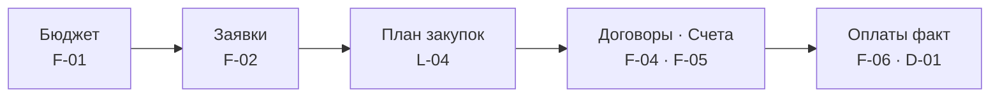
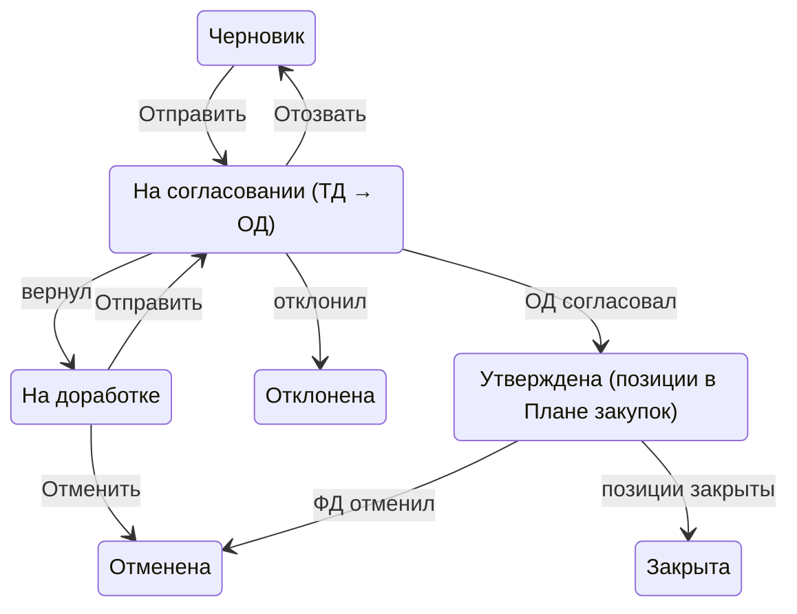
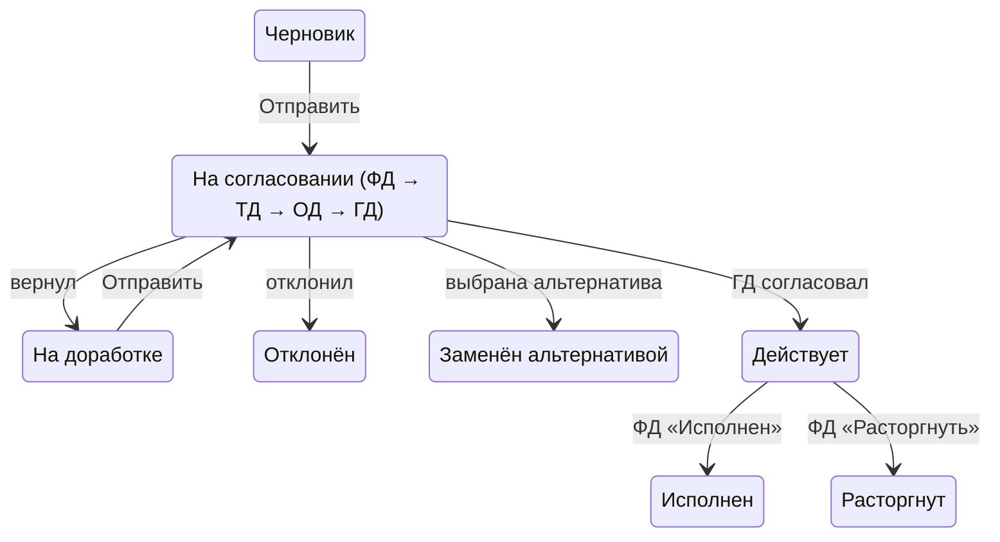
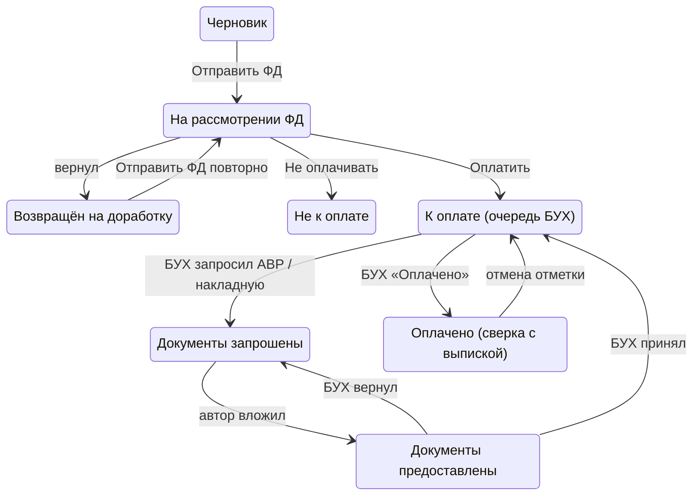
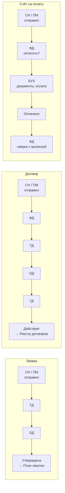

# ТЗ «СЭД HI-TECH» — Бюджет, закупки и оплаты по проектам (v1.0, 22.09.2026)

> Markdown-транскрипция PDF «ТЗ_Бюджет_закупки_оплаты_v1.0.pdf» (83 стр.) для быстрых ссылок из кода и документов.
> Источник правды — PDF заказчика; при расхождении верен PDF. Номера страниц PDF указаны в комментариях
> `<!-- PDF стр. … -->` под заголовками разделов. Ссылаться удобно так: «ТЗ §10.3 п.1», «ТЗ BR-040», «ТЗ CALC-002».
>
> Анализ встраивания в платформу — [docs/plans/2026-09-25-bpp-tz-gap-analysis.md](../plans/2026-09-25-bpp-tz-gap-analysis.md),
> открытые вопросы — [docs/plans/2026-09-25-bpp-open-questions.md](../plans/2026-09-25-bpp-open-questions.md).

## Содержание

- §00 Система на одной странице
- §01 Общие положения
- §02 Пользователи и роли
- §03 Бизнес-процесс
- §04 Объекты системы и связи
- §05 Структура интерфейса
- §06 Модуль «Бюджет проекта»
- §07 Модуль «Заявка на закупку»
- §08 Модуль «План закупок»
- §09 Модуль «Договор»
- §10 Модуль «Счёт на оплату»
- §11 Модуль «Оплаты факт» и дашборд
- §12 Альтернативы снабженца и KPI
- §13 Динамическая логика и валидации
- §14 Бизнес-правила
- §15 Статусы и жизненный цикл
- §16 Маршруты согласования
- §17 Права доступа
- §18 Справочники
- §19 Реестры и списки
- §20 Расчёты
- §21 Файлы и вложения
- §22 Уведомления
- §23 API
- §24 База данных
- §25 Интеграции и аудит
- §26 Ошибки и нестандартные ситуации
- §27 Нефункциональные требования
- §28 Сценарии и сквозные цепочки
- §29 Критерии приёмки
- §30 Матрица требований
- §31 Открытые вопросы
- Приложение · Источники

## Титульный лист

<!-- PDF стр. 1 -->

**ТЕХНИЧЕСКОЕ ЗАДАНИЕ · СЭД HI-TECH**

| Поле | Значение |
|---|---|
| Документ | **Техническое задание на разработку** |
| Версия | **1.0** |
| Дата | **22.09.2026** |
| Статус | **Для передачи в разработку** |
| Состав | **5 частей · 31 раздел · 31 требование · 40+ бизнес-правил · 21 критерий приёмки** |

**Обозначения статуса требований**

- **[П]** Подтверждено заказчиком
- **[Л]** Логически следует из процесса — реализуется, если заказчик не возразит
- **[У]** Требует уточнения — вариант по умолчанию указан в тексте, вопрос в разделе 31

# Кратко

## 00. Система на одной странице

<!-- PDF стр. 3 -->

> Веб-система, которая ведёт каждую закупку по проекту от лимита бюджета до подтверждённой банком оплаты: никто не может потратить больше лимита статьи, а каждый платёж сверяется с выпиской по системному номеру счёта.

**Цепочка модулей**

*Альтернативы снабженца и KPI (F-07) подключаются к договорам и счетам на этапе согласования.*

| Модуль | Кто работает | Результат | Ключевой контроль |
|---|---|---|---|
| Бюджет | ФД | Лимиты по статьям на проект | Лимит нельзя снизить ниже задействованного |
| Заявки | СН, ПМ → ТД → ОД | Утверждённые позиции | Только статьи своей группы; остаток проверяется при отправке |
| План закупок | СН, ПМ | Выбор позиций для закупки | Один документ — один проект и одна статья |
| Договоры | СН, ПМ → ФД → ТД → ОД → ГД | Реестр договоров | Обязателен, если счёт > 1000 МРП |
| Счета | СН, ПМ → ФД → БУХ | Оплата с номером СЧ-... | Решение ФД; АВР / накладная до оплаты |
| Оплаты факт | ФД | Статус сверки, дашборд | Полнота оплаты по номеру счёта и БИН |
| Альтернативы | СН → ФД / директора | Экономия, KPI снабженца | KPI засчитывается только по факту закупки |

**Пять правил, без которых система не работает**

1. Расход только в пределах лимита статьи: проверка при подаче заявки и повторно на Backend с блокировкой строки бюджета.
2. СН и ПМ видят и выбирают только статьи своей группы — ограничение действует и в интерфейсе, и в API.
3. Счёт без договора на сумму больше 1000 МРП (4 325 000 тг в 2026 году) отправить нельзя — система предлагает оформить договор.
4. После решения ответственного документ автоматически уходит следующему участнику цепочки; ручной передачи нет.
5. Оплата считается подтверждённой только по банковской выписке, где указан системный номер счёта.

# Часть I · Контекст

## 01. Общие положения

<!-- PDF стр. 4 -->

> Система ведёт сквозную цепочку «Бюджет проекта → Заявка на закупку → План закупок → Договор / Счёт на оплату → Решение ФД → Оплата бухгалтером → Сверка с банковской выпиской» и не даёт потратить деньги сверх лимита статьи бюджета по проекту.

### 1.1 Цель и назначение системы

1. Зафиксировать лимиты расходов по статьям бюджета на каждый проект. **[П]**
2. Разрешать закупки только в пределах лимита и только после согласования ТД и ОД. **[П]** (контроль лимита при подаче заявки — **[Л]**)
3. Принуждать оформлять договор, если сумма счёта без договора превышает 1000 МРП. **[П]**
4. Дать ФД единый реестр счетов для решения «оплатить / не оплачивать». **[П]**
5. Дать бухгалтеру очередь оплат с контролем закрывающих документов (АВР / накладная). **[П]**
6. Сверять факт оплаты с банковской выпиской по системному номеру счёта и показывать полноту оплаты на дашборде. **[П]**

### 1.2 Область автоматизации

| Входит | Не входит (до отдельного решения) |
|---|---|
| Бюджет проекта по статьям (лимиты) | Формирование платёжных поручений и отправка в банк — бухгалтер платит в банк-клиенте вручную **[П]** |
| Заявки на закупку и их согласование | Складской учёт поступивших ТМЦ |
| План закупок (реестр утверждённых позиций) | Бухгалтерские проводки, ЭСФ, интеграция с 1С **[У]** |
| Договоры и их согласование, реестр договоров | Тендерные процедуры, сравнение КП |
| Счета на оплату, решение ФД, отметка оплаты, закрывающие документы | Доходная часть проекта (поступления от заказчика) |
| Загрузка выписки («Оплаты факт»), сверка, дашборд | |
| Справочники: проекты, статьи, контрагенты, страны/НДС, МРП, валюты, ед. изм. | |

### 1.3 Условные обозначения статуса требований

| Метка | Значение |
|---|---|
| [П] | Подтверждено заказчиком в описании процесса |
| [Л] | Логически следует из процесса, предложено аналитиком — реализуется, если заказчик не возразит |
| [У] | Требует уточнения — вопрос в разделе 31, до ответа реализуется вариант «по умолчанию», указанный в тексте |

## 02. Пользователи и роли

<!-- PDF стр. 5 -->

> В системе восемь ролей. Один пользователь может совмещать роли — права суммируются, но согласовать собственный документ нельзя.

| Код | Роль | Что делает в системе | Статус |
|---|---|---|---|
| ФД | Финансовый директор | Вносит и утверждает лимиты бюджета; согласует договоры; принимает решение по каждому счёту «Оплатить / Не оплачивать»; загружает выписку в «Оплаты факт»; разбирает несопоставленные платежи | [П] |
| СН | Снабженец | Создаёт заявки только по статьям группы «Снабжение»; из своего Плана закупок формирует договоры и счета; вкладывает АВР/накладные | [П] |
| ПМ | Проектный менеджер | То же, что СН, но только по статьям группы «Проектное управление»; видит только свои проекты | [П] статьи, [Л] проекты |
| ТД | Технический директор | Согласует заявки и договоры | [П] |
| ОД | Операционный директор | Согласует заявки и договоры | [П] |
| ГД | Генеральный директор | Согласует договоры (последний этап) | [П], порядок этапов [У] |
| БУХ | Бухгалтер | Видит счета со статусом «К оплате»; запрашивает АВР/накладную; отмечает «Оплачено» | [П] |
| АДМ | Администратор системы | Пользователи, роли, справочники МРП/НДС/стран, настройки маршрутов; не участвует в согласованиях | [Л] |

Один пользователь может иметь несколько ролей (например, СН + ПМ). Права суммируются, но на согласовании пользователь не может согласовать документ, инициатором которого является сам (BR-061). **[Л]**

## 03. Бизнес-процесс

<!-- PDF стр. 6–7 -->

> Сквозной процесс: бюджет → заявка → согласование → план закупок → договор или счёт → решение ФД → оплата → сверка с выпиской.

### 3.1 Бизнес-процесс AS-IS

Описание текущего состояния заказчиком не предоставлено. Предполагается ручной процесс: заявки и счета передаются по почте/мессенджерам, лимиты ведутся в Excel, факт оплаты сверяется вручную по выписке. **[У]** — подтвердить, есть ли текущая учётная система, из которой нужно перенести данные (справочник контрагентов, действующие договоры).

### 3.2 Бизнес-процесс TO-BE

| 1 · Планирование | 2 · Потребность | 3 · Закупка | 4 · Оплата | 5 · Контроль |
|---|---|---|---|---|
| ФД | СН, ПМ → ТД → ОД | СН, ПМ → ФД, ТД, ОД, ГД | ФД → БУХ → автор | ФД |
| Вносит лимиты по статьям бюджета проекта и утверждает бюджет | Заявка по статье своей группы; проверка остатка; согласование | Выбор позиций; договор (обязателен, если счёт > 1000 МРП) или счёт без договора | ФД решает «оплатить / нет»; БУХ запрашивает АВР / накладную и оплачивает | Загрузка выписки, сверка по номеру счёта и сумме |
| **Остатки статей доступны для заявок** | **Позиции в Плане закупок, резерв бюджета** | **Договор в реестре или счёт на оплату** | **Платёж с номером СЧ-ГГГГ-NNNNNN** | **Статус сверки, дашборд, KPI снабжения** |

Цепочка читается сверху вниз; отказ на любом согласовании возвращает документ инициатору, отказ ФД по счёту закрывает счёт без оплаты.

| Шаг | Кто | Действие | Автоматически система | Статус |
|---|---|---|---|---|
| 1 | ФД | Создаёт бюджет проекта, вносит лимит по каждой статье, утверждает | Фиксирует версию бюджета; открывает статьи для заявок | [П] |
| 2 | СН / ПМ | Создаёт заявку: проект, статья (только своя группа), позиции | Считает сумму заявки; проверяет доступный остаток статьи (CALC-003) | [П], проверка [Л] |
| 3 | ТД, ОД | Согласуют / отклоняют / возвращают | Маршрут, уведомления; при утверждении — резерв бюджета | [П], резерв [Л] |
| 4 | СН / ПМ | В «Плане закупок» отмечают позиции и выбирают «Договор» или «Счёт без договора» | Показывает только позиции своих утверждённых заявок с неизрасходованным остатком | [П] |
| 5a | СН / ПМ | Оформляют договор (данные из заявки + реестра контрагентов) | Подставляет проект, статью; ставку НДС по стране контрагента | [П] |
| 5b | ФД, ТД, ОД, ГД | Согласуют договор | После всех согласований — в «Реестр договоров» | [П] |
| 6 | СН / ПМ | Создают счёт на оплату (без договора или по договору), вкладывают файл счёта | Присваивает системный номер; блокирует счёт без договора > 1000 МРП | [П] |
| 7 | ФД | В реестре счетов ставит «Оплатить» / «Не оплачивать» | Счёт появляется у БУХ в очереди «К оплате» | [П] |
| 8 | БУХ | При необходимости ставит флажок «Нужен АВР» / «Нужна накладная» | Уведомляет инициатора счёта; ждёт вложения | [П] |
| 9 | СН / ПМ | Вкладывает АВР / накладную | Документ виден в реестре счетов; уведомление БУХ | [П] |
| 10 | БУХ | Платит в банк-клиенте, указывая системный номер счёта в назначении платежа; нажимает «Оплачено» | Фиксирует дату, пользователя, сумму | [П] |
| 11 | ФД | Загружает выписку в «Оплаты факт» | Находит номер счёта в назначении платежа, сравнивает суммы, ставит статус сверки, строит дашборд | [П] |

## 04. Объекты системы и связи

<!-- PDF стр. 8–10 -->

> В системе 18 объектов; «План закупок» — не отдельный документ, а представление утверждённых позиций заявок с остатком, поэтому у него нет своего жизненного цикла.

### 4.1 Перечень объектов

| Объект | Назначение | Кто создаёт | Кто изменяет | Связи | Статусы |
|---|---|---|---|---|---|
| Проект | Объект учёта затрат | АДМ, ФД | АДМ, ФД | 1:1 Бюджет; 1:N Заявка, Договор, Счёт; N:M Пользователь (участники) | Активен / Закрыт / Архив |
| Статья бюджета | Классификатор расходов с группой доступа | ФД | ФД | N:1 Группа статей; 1:N Строка бюджета | Активна / Архив |
| Группа статей | «Снабжение» или «Проектное управление» — определяет, кто видит статью | АДМ | АДМ | 1:N Статья; N:M Роль | Активна / Архив |
| Бюджет проекта | Шапка лимитов по проекту, версии | ФД | ФД | N:1 Проект; 1:N Строка бюджета; 1:N Версия | Черновик → Утверждён → Закрыт |
| Строка бюджета | Лимит по одной статье в одном проекте | ФД | ФД | N:1 Бюджет; N:1 Статья | Наследует статус бюджета |
| Заявка на закупку | Потребность, подлежащая согласованию | СН, ПМ | Автор (в Черновике / На доработке) | N:1 Проект; N:1 Статья; 1:N Позиция заявки; 1:N Этап согласования | Черновик → На согласовании → Утверждена / На доработке / Отклонена / Отменена / Закрыта |
| Позиция заявки | Строка потребности; единица Плана закупок | СН, ПМ | Автор до отправки | N:1 Заявка; 1:N Позиция договора; 1:N Строка счёта | Открыта / Частично закрыта / Закрыта / Аннулирована |
| Контрагент | Поставщик / подрядчик | СН, ПМ, ФД, БУХ | ФД, БУХ | N:1 Страна; 1:N Договор; 1:N Счёт; 1:N Банковский счёт | Активен / Заблокирован / Архив |
| Договор | Обязательство с контрагентом | СН, ПМ | Автор (Черновик / На доработке) | N:1 Проект, Статья, Контрагент; 1:N Позиция договора; 1:N Счёт; 1:N Файл | Черновик → На согласовании → Действует / На доработке / Отклонён / Расторгнут / Исполнен |
| Позиция договора | Связь договора с позициями плана | Система (из Плана закупок) | Автор договора | N:1 Договор; N:1 Позиция заявки | — |
| Счёт на оплату | Требование к оплате | СН, ПМ | Автор (Черновик / Возвращён), ФД (решение), БУХ (оплата) | N:1 Проект, Статья, Контрагент; N:0..1 Договор; 1:N Строка счёта; 1:N Файл; 1:N Сопоставление платежа | см. раздел 15 |
| Строка счёта | Распределение суммы счёта по позициям плана | Автор счёта | Автор счёта | N:1 Счёт; N:1 Позиция заявки | — |
| Загрузка выписки | Файл банковской выписки и его разбор | ФД | Нет (только отмена целиком) | 1:N Строка выписки | Загружена → Сверена / Отменена |
| Строка выписки (платёж факт) | Одна операция списания | Система при разборе | ФД (ручное сопоставление) | N:1 Загрузка; N:M Счёт через Сопоставление | Сопоставлен / Не сопоставлен / Исключён |
| Этап согласования | Решение одного согласующего | Система | Согласующий (решение) | N:1 Заявка или Договор; N:1 Пользователь | Ожидает / Согласовано / Отклонено / Возвращено / Пропущено |
| Файл | Вложение с версиями | Любая роль с правом редактирования объекта | Нельзя изменять; только новая версия | N:1 объект-владелец; тип файла из справочника | Действующий / Заменён |
| Альтернативное предложение (АП) | Предложение СН другого поставщика по другой цене к договору или счёту без договора (раздел 12) | СН | Автор АП (Черновик); ФД (выбор) | N:1 Договор или Счёт (исходный); N:1 Контрагент; 1:N Строка АП; 1:0..1 новый Договор / Счёт; 1:0..1 Запись KPI | Черновик → Подано → Выбрано / Не выбрано / Отозвано / Аннулировано |
| Запись KPI снабженца | Снимок принятой альтернативы и экономии для KPI СН | Система при выборе АП | Система (статус); ФД (аннулирование) | 1:1 АП; N:1 Пользователь (СН) | Предварительный → Подтверждён / Аннулирован |

Пользователь, Роль, Страна, Ставка НДС, МРП, Валюта, Курс валют, Единица измерения, Тип договора — справочники, описаны в разделе 18.

### 4.2 Связи

| Связь | Тип | Обязательность | Владелец | Удаление родителя | Что наследуется |
|---|---|---|---|---|---|
| Проект — Бюджет проекта | 1:1 | Бюджет обязателен для подачи заявки | Проект | Запрещено при наличии бюджета; только архив проекта | — |
| Бюджет — Строка бюджета | 1:N | ≥1 строка для утверждения | Бюджет | Удаление бюджета только в Черновике, каскадно со строками | Проект |
| Статья — Строка бюджета | 1:N | Обязательна | Статья | Статья не удаляется, только архив; архив запрещён при лимите > 0 в активном бюджете | Группа статьи |
| Проект — Заявка | 1:N | Обязательна | Проект | Запрещено | — |
| Статья — Заявка | 1:N | Обязательна | Статья | Запрещено | — |
| Заявка — Позиция заявки | 1:N | ≥1 позиция | Заявка | Удаление заявки только в Черновике, каскадно; после отправки — только «Отменить» | Проект, статья, автор заявки |
| Позиция заявки — Позиция договора | 1:N | Необязательна | Договор | Удаление договора (только Черновик) освобождает позиции | Наименование, ед. изм., количество |
| Позиция заявки — Строка счёта | 1:N | Каждая строка счёта ссылается на позицию | Счёт | Удаление счёта (только Черновик) освобождает позиции | Наименование, системный номер позиции |
| Контрагент — Договор / Счёт | 1:N | Обязательна | Контрагент | Удаление контрагента запрещено при наличии документов; только блокировка / архив | Наименование, БИН/ИИН, страна → ставка НДС |
| Договор — Счёт | 1:N (счёт 0..1 договор) | Обязательна, если счёт «По договору» или сумма > 1000 МРП | Договор | Удаление договора запрещено при наличии счетов | Проект, статья, контрагент, валюта, НДС, тип договора |
| Счёт — Файл «Счёт» | 1:N версий | ≥1 действующий | Счёт | Каскад только в Черновике | — |
| Счёт — Строка выписки | N:M через «Сопоставление» | Необязательна | Загрузка выписки | Отмена загрузки удаляет сопоставления и пересчитывает статус сверки счёта | — |
| Проект — Пользователь | N:M | ПМ видит только проекты, где он участник | Проект | — | — |

Ключевое ограничение **[Л]**, **[У]**: все позиции одного договора и одного счёта принадлежат одному проекту и одной статье, потому что у договора и счёта одно поле «Проект» и одно поле «Статья». Позиции из разных заявок объединять можно, если совпадают проект, статья и группа статьи автора.

## 05. Структура интерфейса

<!-- PDF стр. 11 -->

> Интерфейс — одностраничное веб-приложение с левым меню; пункт меню показывается, только если у роли есть право хотя бы на просмотр раздела (права повторно проверяет Backend).

| № | Пункт меню | Экран-список | Экран-форма | Видят |
|---|---|---|---|---|
| 1 | Бюджеты | Реестр бюджетов (L-01) | F-01 Бюджет проекта | ФД, АДМ; ТД, ОД, ГД — просмотр [Л]; СН, ПМ — только колонки своей группы статей [Л] |
| 2 | Заявки на закупку | Реестр заявок (L-02) | F-02 Заявка на закупку | СН, ПМ (свои); ТД, ОД, ФД, ГД (все) |
| 3 | Мои согласования | Очередь согласований (L-03) | F-02 / F-04 в режиме согласования | ТД, ОД, ФД, ГД |
| 4 | План закупок | Реестр позиций (L-04) | Мастер «Сформировать закупку» (F-03) | СН, ПМ (свои); ФД — просмотр всех |
| 5 | Договоры | Реестр договоров (L-05) | F-04 Договор | СН, ПМ (свои), ФД, ТД, ОД, ГД, БУХ — просмотр действующих |
| 6 | Счета на оплату | Реестр счетов (L-06) | F-05 Счёт на оплату | СН, ПМ (свои), ФД, БУХ, ТД/ОД/ГД — просмотр |
| 7 | Оплаты факт | Реестр загрузок (L-07) | F-06 Загрузка выписки и сверка | ФД; БУХ — просмотр [Л] |
| 8 | Дашборд оплат | D-01 | — | ФД, ГД; ТД, ОД, БУХ — просмотр [Л] |
| 9 | Справочники | L-08…L-15 | F-07…F-12 | АДМ, ФД; СН, ПМ — создание контрагента [У] |
| 10 | Администрирование | Пользователи, роли, маршруты | F-13 | АДМ |
| 11 | Альтернативы | Лента «Закупки для альтернатив» (L-09) | F-07 Альтернативное предложение | СН; ФД — просмотр |
| 12 | Отчёты | R-01 «KPI снабжения» | Карточка записи KPI | ФД, ГД, ОД; СН — свои строки |

Общие элементы всех форм:

- Шапка формы: системный номер, статус (цветной бейдж), автор, дата создания, кнопки действий справа.
- Вкладки внизу формы: «Согласование» (где есть), «Файлы», «История изменений».
- Индикатор несохранённых изменений; при уходе со страницы с изменениями — диалог «Есть несохранённые изменения. Сохранить черновик / Уйти без сохранения / Отмена».
- Суммы отображаются с разделителем разрядов пробелом и двумя знаками после запятой, валюта рядом: «1 250 000,00 KZT».
- Даты — ДД.ММ.ГГГГ, дата-время — ДД.ММ.ГГГГ ЧЧ:ММ по времени Asia/Almaty (UTC+5). **[Л]**
- Любая кнопка, отправляющая запрос, блокируется до ответа сервера (защита от двойного нажатия, см. раздел 26.2).
- Режимы формы: «Создание», «Редактирование», «Просмотр», «Согласование». Режим определяет Backend по статусу и роли и возвращает список разрешённых действий `allowed_actions`; Frontend рисует только эти кнопки.

# Часть II · Функциональные модули

## 06. Модуль «Бюджет проекта»
<!-- PDF стр. 12–15 -->

> ФД открывает «Бюджеты», нажимает «Создать бюджет», выбирает проект и в табличной части вносит лимит по каждой статье; после «Утвердить» статьи становятся доступны для заявок, а изменение лимитов возможно только через «Корректировку» с обязательным комментарием.

| Поле | Значение |
|---|---|
| **Назначение** | Лимиты расходов по статьям бюджета на каждый проект |
| **Кто работает** | ФД ведёт и утверждает; СН и ПМ видят строки своих статей |
| **Вход** | Проект, статьи бюджета, суммы лимитов |
| **Результат** | Утверждённая версия бюджета; остатки по статьям для заявок |
| **Статусы** | Черновик → Утверждён → Закрыт |
| **Правила** | BR-001 … BR-004 |

### 6.1 Доступ

| Действие | Роли |
|---|---|
| Создание, редактирование, утверждение, корректировка, закрытие | ФД |
| Удаление | ФД — только статус «Черновик» |
| Просмотр всех строк | ФД, ГД, ТД, ОД, АДМ **[Л]** |
| Просмотр строк своей группы статей своих проектов | СН, ПМ **[Л]** |

### 6.2 Блоки формы

1. Блок 1 «Основная информация» — проект, валюта, версия, статус.
2. Блок 2 «Лимиты по статьям» — редактируемая таблица.
3. Блок 3 «Итоги» — суммы по бюджету.
4. Вкладки «Версии», «История изменений».

### 6.3 Поля. Блок 1

| Поле | Тип | Обяз. | Источник | Редактируемость | По умолчанию | Проверка | Зависимость |
|---|---|---|---|---|---|---|---|
| Номер бюджета | system field | — | Генерирует Backend: БДЖ-<код проекта> | Никогда | — | Уникален | — |
| Проект | autocomplete / reference | Да | Справочник «Проекты», статус «Активен» | Только в Черновике до первого сохранения | Пусто | Минимум 2 символа для поиска по коду и наименованию; у проекта нет другого бюджета (BR-001) | После выбора подставляет «Заказчик» и «Руководитель проекта» (только чтение) |
| Заказчик проекта | reference, read-only | — | Карточка проекта | Никогда | Из проекта | — | Проект |
| Валюта бюджета | select | Да | Справочник «Валюты» | Только Черновик | KZT | Только активные валюты | **[У]** мультивалютность; по умолчанию все бюджеты в KZT |
| Период действия с / по | date / date | Нет **[У]** | Ввод | Черновик, корректировка | Даты проекта | «по» ≥ «с» | Если бюджет ведётся по годам — см. вопрос В-03 |
| Версия | system field | — | Backend, целое с 1 | Никогда | 1 | — | +1 при каждой утверждённой корректировке |
| Статус | system field | — | Backend | Никогда | Черновик | — | — |
| Комментарий к корректировке | textarea, до 1000 символов | Да в режиме корректировки | Ввод | Только режим корректировки | Пусто | Не пусто, ≥10 символов | Скрыто вне режима корректировки |

### 6.4 Поля. Блок 2 «Лимиты по статьям»

| Поле | Тип | Обяз. | Источник | Редактируемость | По умолчанию | Проверка | Зависимость |
|---|---|---|---|---|---|---|---|
| Статья бюджета | select с поиском | Да | Справочник «Статьи», статус «Активна» | Черновик; в корректировке — только для новых строк | — | Статья не повторяется в бюджете (BR-002) | Подставляет «Группу» |
| Группа статьи | calculated | — | Статья | Никогда | — | — | Статья |
| Лимит | decimal(18,2) | Да | Ввод ФД | Черновик, корректировка | 0,00 | ≥ 0; в корректировке ≥ «Задействовано» (BR-004) | Пересчёт «Доступно» и итогов на лету |
| Задействовано | calculated (CALC-002) | — | Backend | Никогда | — | — | Показывается после первого утверждения |
| Оплачено факт | calculated (CALC-007) | — | Backend | Никогда | — | — | То же |
| Доступно | calculated (CALC-003) | — | Backend; Frontend пересчитывает при вводе лимита | Никогда | — | < 0 подсвечивается красным | Лимит |
| Комментарий строки | text, до 255 | Нет | Ввод | Черновик, корректировка | — | — | — |
| Действие «Удалить строку» | кнопка в строке | — | — | Только Черновик или новая строка корректировки | — | Нельзя удалить строку с «Задействовано» > 0 | — |

Блок 3 «Итоги» (calculated, read-only): Σ Лимит, Σ Задействовано, Σ Оплачено факт, Σ Доступно — по бюджету и отдельно по группам «Снабжение» / «Проектное управление».

### 6.5 Поведение полей (ЕСЛИ → ТО → ИНАЧЕ)

1. **ЕСЛИ** статус = «Черновик», **ТО** все поля Блоков 1–2 редактируемы, кроме системных; **ИНАЧЕ** форма только для чтения до нажатия «Корректировать».
2. **ЕСЛИ** ФД нажал «Корректировать», **ТО** открываются поля «Лимит» и «Комментарий к корректировке» (обязательный), доступно добавление новых строк; «Статья» в существующих строках остаётся нередактируемой.
3. **ЕСЛИ** в корректировке введённый лимит < «Задействовано» по строке, **ТО** поле подсвечивается, под ним текст «Лимит не может быть меньше задействованной суммы 3 400 000,00 KZT», кнопка «Утвердить корректировку» недоступна.
4. **ЕСЛИ** проект выбран и у него уже есть бюджет, **ТО** выбор отклоняется с сообщением «У проекта П-015 уже есть бюджет БДЖ-П-015. Откройте его и выполните корректировку.» и ссылкой на существующий бюджет.
5. **ЕСЛИ** статья переведена в архив после утверждения бюджета, **ТО** строка остаётся в бюджете, помечается значком «Архив», новые заявки по ней не создаются.

### 6.6 Кнопки

| Кнопка | Кто видит | Когда активна | Проверки | Результат |
|---|---|---|---|---|
| Сохранить | ФД | Черновик, есть изменения | Проект заполнен; нет дублей статей; лимиты ≥ 0 | Сохранение, статус не меняется |
| Утвердить | ФД | Черновик, ≥1 строка | Все проверки «Сохранить» + Σ лимитов > 0 | Статус «Утверждён», версия 1, строки доступны для заявок |
| Корректировать | ФД | Утверждён | — | Режим корректировки (черновик версии N+1; действующей остаётся версия N до утверждения) |
| Утвердить корректировку | ФД | Режим корректировки | Комментарий заполнен; каждый лимит ≥ «Задействовано» (Backend повторно) | Версия N+1 становится действующей; снимок версии N сохраняется во вкладке «Версии» |
| Отменить корректировку | ФД | Режим корректировки | — | Черновик версии удаляется, остаётся версия N |
| Закрыть бюджет | ФД | Утверждён, нет заявок «На согласовании» и счетов в статусах до «Оплачено» **[Л]** | Backend проверяет открытые документы | Статус «Закрыт»; новые заявки запрещены |
| Удалить | ФД | Черновик | — | Физическое удаление со строками (аудит сохраняет факт удаления) |
| Экспорт в Excel | Все, кто видит бюджет | Всегда | — | xlsx с видимыми строками и итогами |

## 07. Модуль «Заявка на закупку»
<!-- PDF стр. 16–21 -->

> СН или ПМ открывает «Заявки на закупку», нажимает «Создать заявку», выбирает проект и статью (список статей ограничен его группой), добавляет позиции; при нажатии «Отправить на согласование» Backend повторно проверяет остаток статьи и запускает маршрут ТД + ОД.

| Поле | Значение |
|---|---|
| **Назначение** | Потребность в закупке по проекту и статье бюджета |
| **Кто работает** | СН и ПМ создают; согласуют ТД → ОД |
| **Вход** | Проект, статья своей группы, позиции |
| **Результат** | Утверждённые позиции в Плане закупок автора; резерв бюджета |
| **Статусы** | Черновик → На согласовании → Утверждена / На доработке / Отклонена / Отменена / Закрыта |
| **Правила** | BR-010 … BR-014 |

### 7.1 Доступ

| Действие | Роли |
|---|---|
| Создание | СН (статьи группы «Снабжение»), ПМ (статьи группы «Проектное управление») **[П]** |
| Редактирование | Автор — статусы «Черновик», «На доработке» |
| Просмотр | Автор; ТД, ОД, ФД, ГД — все; СН/ПМ — чужие заявки не видят **[Л]** |
| Согласование / отклонение / возврат | ТД, ОД **[П]** |
| Отзыв с согласования | Автор, пока ни один согласующий не принял решение **[Л]** |
| Отмена | Автор — до утверждения; ФД — утверждённой заявки без счетов и договоров **[Л]** |
| Удаление | Автор — только «Черновик» |

### 7.2 Блоки

1. Блок 1 «Основная информация».
2. Блок 2 «Бюджет» — статья и остаток.
3. Блок 3 «Позиции» — табличная часть.
4. Блок 4 «Документы» — КП, ТЗ, спецификации.
5. Блок 5 «Согласование» — этапы и решения.
6. Блок 6 «Исполнение» — после утверждения: что уже включено в договоры и счета.
7. Вкладка «История изменений».

### 7.3 Поля. Блоки 1–2

| Поле | Тип | Обяз. | Источник | Редактируемость | По умолчанию | Проверка | Зависимость |
|---|---|---|---|---|---|---|---|
| Номер заявки | system field | — | Backend при первом сохранении: ЗЗ-ГГГГ-000001, сквозная нумерация в году | Никогда | — | Уникален (БД) | — |
| Дата создания | system field, datetime | — | Backend | Никогда | now() | — | — |
| Автор | system field | — | Текущий пользователь | Никогда | Текущий пользователь | — | — |
| Роль инициатора | radio | Да, если у пользователя обе роли СН и ПМ | Роли пользователя | Черновик | Единственная роль пользователя | Значение ∈ ролям пользователя (Backend) | Определяет список статей; смена роли очищает «Статью» |
| Проект | autocomplete / reference | Да | Проекты со статусом «Активен» и бюджетом «Утверждён»; для ПМ — только проекты, где он участник **[Л]**; для СН — все **[У]** | Черновик, На доработке | Пусто | Поиск от 2 символов по коду и наименованию, до 20 результатов | Очищает «Статью» и «Доступный остаток»; подгружает статьи бюджета проекта |
| Статья бюджета | select с поиском | Да | Строки утверждённого бюджета выбранного проекта, где группа статьи = группа роли инициатора **[П]** | Черновик, На доработке | Пусто | Статья активна; строка бюджета существует (Backend) | Недоступно, пока не выбран проект; после выбора — запрос остатка (GetBudgetBalance) |
| Вид закупки | radio: ТМЦ / Работы и услуги | Да **[Л]** | Справочник «Типы договора» | Черновик, На доработке | Пусто | — | Переходит в договор и счёт как значение по умолчанию; определяет тип закрывающего документа (накладная / АВР) |
| Лимит статьи | calculated, read-only | — | CALC-001 | Никогда | — | — | Статья |
| Доступный остаток статьи | calculated, read-only | — | CALC-003, на момент открытия/выбора | Никогда | — | — | Статья; обновляется кнопкой «Обновить» и перед отправкой |
| Остаток после заявки | calculated | — | Доступный остаток − Сумма заявки (если заявка ещё не в резерве) | Никогда | — | < 0 → красный | Позиции |
| Потребность к дате | date | Да | Ввод | Черновик, На доработке | Пусто | ≥ сегодня | Наследуется позициями как дата по умолчанию |
| Обоснование потребности | textarea, 10–2000 символов | Да | Ввод | Черновик, На доработке | Пусто | Длина | — |
| Сумма заявки | calculated, decimal(18,2) | — | Σ «Сумма» позиций | Никогда | 0,00 | > 0 для отправки | Позиции |
| Валюта | read-only | — | Валюта бюджета проекта | Никогда | KZT | — | **[У]** мультивалютность |
| Статус | system field | — | Backend | Никогда | Черновик | — | — |

### 7.4 Поля. Блок 3 «Позиции»

| Поле | Тип | Обяз. | Источник | Редактируемость | По умолчанию | Проверка | Зависимость |
|---|---|---|---|---|---|---|---|
| № п/п | system | — | Порядок строк | Никогда | 1, 2… | — | — |
| Системный номер позиции | system field | — | Backend: <номер заявки>-<№ п/п>, напр. ЗЗ-2026-000045-03 | Никогда | — | Уникален | Используется в Плане закупок, договоре, счёте **[П]** |
| Наименование | text, 3–500 | Да | Ввод; подсказки из ранее введённых наименований **[Л]** | Черновик, На доработке | — | Не пусто | — |
| Характеристики | textarea, до 2000 | Нет | Ввод | То же | — | — | — |
| Ед. изм. | select с поиском | Да | Справочник «Единицы измерения» | То же | шт | Активная ед. изм. | — |
| Количество | decimal(15,3) | Да | Ввод | То же | — | > 0 | Пересчёт «Суммы» |
| Цена ориентировочная | decimal(18,2) | Да | Ввод | То же | — | > 0 | Пересчёт «Суммы» |
| Сумма | calculated | — | Кол-во × Цена, округление до 0,01 (CALC-004) | Никогда | — | — | Кол-во, Цена |
| Дата потребности | date | Да | «Потребность к дате» из шапки | То же | Из шапки | ≥ сегодня | — |
| Действия строки | кнопки «Копировать», «Удалить» | — | — | Черновик, На доработке | — | ≥1 строка должна остаться для отправки | — |

Лимит: не более 200 позиций в заявке **[Л]**. Вставка позиций из буфера (Excel: Наименование / Ед. / Кол-во / Цена) — **[Л]**, Medium.

### 7.5 Поля. Блоки 4–6

| Поле | Тип | Обяз. | Правило |
|---|---|---|---|
| Документы заявки | file, множественный | Нет | Типы: КП, ТЗ, Спецификация, Прочее; см. раздел 21 |
| Этапы согласования | table, read-only | — | Колонки: Этап, Согласующий, Решение, Дата, Комментарий. Формирует Backend при отправке |
| Комментарий согласующего | textarea в диалоге решения | Да при «Отклонить» и «Вернуть на доработку»; нет при «Согласовать» | Мин. 10 символов |
| Исполнение по позициям | table, read-only, видно при статусе «Утверждена» и позже | — | Колонки: Позиция, Кол-во план, Кол-во в договорах, Кол-во в счетах, Сумма план, Сумма в счетах, Сумма оплачено факт, Остаток к закупке |

### 7.6 Поведение полей

1. **ЕСЛИ** у пользователя одна роль (СН или ПМ), **ТО** поле «Роль инициатора» скрыто и заполняется автоматически; **ИНАЧЕ** поле отображается и обязательно.
2. **ЕСЛИ** «Проект» не выбран, **ТО** «Статья бюджета» недоступна с подсказкой «Сначала выберите проект».
3. **ЕСЛИ** у выбранного проекта нет строк бюджета группы пользователя, **ТО** список статей пуст и выводится «По проекту П-015 нет утверждённых лимитов по вашим статьям. Обратитесь к финансовому директору.»
4. **ЕСЛИ** «Сумма заявки» > «Доступный остаток статьи», **ТО** над кнопками выводится «Сумма заявки превышает доступный остаток статьи на 1 250 000,00 KZT», кнопка «Отправить на согласование» недоступна, «Сохранить черновик» доступна.
5. **ЕСЛИ** статус ∈ {На согласовании, Утверждена, Отклонена, Отменена, Закрыта}, **ТО** все поля только для чтения.
6. **ЕСЛИ** статус = «На доработке», **ТО** поля редактируемы, а комментарий последнего возврата показывается жёлтой плашкой над Блоком 1.

### 7.7 Кнопки

| Кнопка | Кто видит | Когда активна | Проверки | Результат |
|---|---|---|---|---|
| Сохранить черновик | Автор | Черновик, На доработке | Frontend: формат полей. Обязательность не проверяется, кроме «Проекта» **[Л]** | Сохранение; присвоение номера при первом сохранении |
| Отправить на согласование | Автор | Черновик, На доработке; все обязательные поля; Сумма ≤ Остаток | Backend: все обязательные поля; права на проект и статью; бюджет «Утверждён»; остаток (с блокировкой строки бюджета, BR-011) | Статус «На согласовании»; сумма в резерве (CALC-002); этапы ТД и ОД; уведомления |
| Отозвать | Автор | На согласовании, ни одного решения | Backend: нет решений | Статус «Черновик», резерв снят, этапы аннулированы |
| Согласовать | ТД, ОД — текущий этап назначен на него | На согласовании, решение пользователя «Ожидает» | Backend: пользователь — согласующий этапа; не автор заявки | Этап «Согласовано»; если все этапы согласованы — «Утверждена», позиции в Плане закупок |
| Вернуть на доработку | ТД, ОД | То же | Комментарий ≥10 символов | Статус «На доработке», резерв снят **[Л]**, остальные этапы аннулированы |
| Отклонить | ТД, ОД | То же | Комментарий ≥10 символов | Статус «Отклонена» (финальный), резерв снят |
| Отменить заявку | Автор; ФД | Автор: Черновик, На доработке. ФД: Утверждена без позиций в договорах/счетах | Комментарий обязателен | Статус «Отменена», резерв снят, позиции исключены из Плана |
| Закрыть остаток | Автор, ФД | Утверждена, часть позиций уже в счетах | Комментарий | Невыбранные остатки позиций аннулируются, резерв уменьшается до фактически выставленных счетов; статус «Закрыта» |
| Копировать | Автор, любой СН/ПМ с доступом к проекту и статье | Любой статус | — | Новая заявка «Черновик» с теми же шапкой и позициями, без файлов и согласований |
| Удалить | Автор | Черновик | Диалог подтверждения | Удаление |
| Печать (PDF) | Все с правом просмотра | Всегда | — | PDF-форма заявки с листом согласования |

## 08. Модуль «План закупок»
<!-- PDF стр. 22–23 -->

> «План закупок» — реестр позиций утверждённых заявок текущего пользователя, у которых остаток к закупке > 0; пользователь отмечает позиции флажками и нажимает «Оформить договор» или «Оформить счёт».

| Параметр | Значение |
|---|---|
| Назначение | Реестр утверждённых позиций для оформления закупки |
| Кто работает | СН и ПМ — свои позиции; ФД — просмотр |
| Вход | Позиции утверждённых заявок с остатком |
| Результат | Договор или счёт на оплату |
| Статусы | Нет своих: представление позиций |
| Правила | BR-020, BR-021 |

### 8.1 Состав и доступ

- СН видит позиции заявок, где он автор и роль инициатора = СН; ПМ — где роль инициатора = ПМ. [П]
- ФД видит все позиции в режиме просмотра, без действий. [Л]
- Передача позиций другому исполнителю (например, при увольнении) — действие АДМ «Переназначить исполнителя позиций». [Л]

### 8.2 Колонки (по умолчанию отмечены *)

| Колонка | Тип | По умолчанию | Сортировка / фильтр |
|---|---|---|---|
| Флажок выбора | checkbox | * | — |
| Системный номер позиции | text, ссылка на заявку | * | Сорт., поиск |
| Проект | text | * | Фильтр multiselect |
| Статья | text | * | Фильтр multiselect |
| Наименование | text | * | Поиск (подстрока) |
| Ед. изм. | text | * | — |
| Кол-во план | decimal | * | — |
| Кол-во в договорах | decimal | | — |
| Кол-во в счетах | decimal | * | — |
| Остаток кол-во | calculated (CALC-005) | * | Фильтр «> 0» включён по умолчанию |
| Сумма план | decimal | * | Сорт. |
| Сумма в счетах | decimal | | — |
| Остаток суммы | calculated | * | Сорт. |
| Дата потребности | date | * | Сорт. (по умолчанию возр.), фильтр период; просроченные — красным |
| Вид закупки | text | | Фильтр |
| Договоры | ссылки | | Фильтр «Есть договор / Нет» |
| Номер заявки, дата утверждения | text / date | | Фильтр |

Пагинация 50 строк (варианты 25/50/100), экспорт в xlsx, сохранение пользовательского набора колонок и фильтров. [Л]

### 8.3 Правила выбора позиций

1. **ЕСЛИ** отмеченные позиции относятся к разным проектам или разным статьям, **ТО** кнопки «Оформить договор» и «Оформить счёт» недоступны, подсказка: «Для одного документа выберите позиции одного проекта и одной статьи».
2. **ЕСЛИ** у отмеченной позиции остаток = 0, **ТО** её флажок недоступен.
3. **ЕСЛИ** позиция уже включена в договор в статусе «На согласовании», **ТО** строка помечается значком «В договоре на согласовании» и может быть выбрана только для счёта по этому договору после его утверждения. [Л]

### 8.4 Мастер F-03

| Шаг | Что видит пользователь | Что делает система |
|---|---|---|
| 1 | Отметил позиции, нажал «Оформить договор» | Проверяет единство проекта и статьи (Backend); открывает F-04 с проектом, статьёй, видом закупки и позициями |
| 1' | Нажал «Оформить счёт» | Открывает F-05 с проектом, статьёй, позициями; поле «Основание оплаты» = «Без договора» по умолчанию |
| 2 | Корректирует количество по каждой позиции | Не даёт ввести больше «Остатка кол-во» |
| 3 | Сохраняет документ | Позиции закрепляются за документом (Позиция договора / Строка счёта) |

## 09. Модуль «Договор»
<!-- PDF стр. 24–28 -->

> СН или ПМ создаёт договор из Плана закупок: проект и статья подставляются из заявки, контрагент выбирается из реестра, прикладывается файл договора; после согласования ФД, ТД, ОД и ГД договор получает статус «Действует» и попадает в «Реестр договоров». [П]

| Параметр | Значение |
|---|---|
| Назначение | Обязательство с контрагентом по позициям плана |
| Кто работает | СН и ПМ оформляют; согласуют ФД → ТД → ОД → ГД |
| Вход | Позиции плана, контрагент из реестра, файл договора |
| Результат | Договор «Действует» в реестре договоров |
| Статусы | Черновик → На согласовании → Действует / Исполнен / Расторгнут |
| Правила | BR-030 … BR-036 |

### 9.1 Доступ

| Действие | Роли |
|---|---|
| Создание | СН, ПМ — только из своего Плана закупок [П] |
| Редактирование | Автор — «Черновик», «На доработке» |
| Согласование | ФД, ТД, ОД, ГД [П] |
| Просмотр | Автор; ФД, ТД, ОД, ГД, БУХ — все; СН/ПМ — договоры своих проектов и групп статей (нужны для счетов) [Л] |
| Расторжение / отметка «Исполнен» | ФД [Л] |
| Удаление | Автор — «Черновик» |

### 9.2 Поля

| Поле | Тип | Обяз. | Источник | Редактируемость | По умолчанию | Проверка | Зависимость |
|---|---|---|---|---|---|---|---|
| Системный номер договора | system field | — | Backend: ДГ-ГГГГ-000001 | Никогда | — | Уникален | Отличается от номера контрагента |
| Проект | reference, read-only | Да | Из позиций заявки [П] | Никогда | — | Совпадает у всех позиций | — |
| Статья бюджета | reference, read-only | Да | Из заявки [П] | Никогда | — | То же | — |
| Контрагент | autocomplete / reference | Да | Реестр контрагентов, статус «Активен» [П] | Черновик, На доработке | — | Поиск от 3 символов по наименованию или от 4 цифр БИН/ИИН | Подставляет БИН/ИИН, страну, ставку НДС |
| БИН / ИИН (рег. номер) | read-only | — | Карточка контрагента | Никогда | — | — | Контрагент |
| Страна контрагента | read-only | — | Карточка контрагента | Никогда | — | — | Определяет ставку НДС [П] |
| Наименование договора | text, 3–500 | Да [П] | Ввод | Черновик, На доработке | «Договор на <вид закупки> по проекту <код>» | — | — |
| Номер договора | text, 1–50 | Да [П] | Ввод (номер по документу) | То же | — | Уникальность пары «контрагент + номер + дата» (BR-032) | — |
| Дата договора | date | Да [П] | Ввод | То же | Сегодня | ≤ сегодня + 30 дней [У]; ≥ 01.01.2020 | Дата определяет ставку НДС и МРП на дату |
| Тип договора | radio: «Работы и услуги» / «ТМЦ» | Да [П] | Справочник | То же | Вид закупки заявки | — | Определяет закрывающий документ: АВР или накладная |
| Открытый договор | checkbox | — | Ввод | То же | Не отмечен | — | ЕСЛИ отмечен, ТО «Сумма договора» скрыта и очищается [П] |
| Сумма договора | decimal(18,2) | Да, если не открытый [П] | Ввод | То же | Σ плановых сумм позиций | > 0; превышение над планом позиций ≤ доступный остаток статьи (BR-034) | Пересчитывает НДС |
| Валюта | select | Да | Справочник валют | То же | KZT | — | [У] мультивалютность |
| С НДС | checkbox | — | Ввод [П] | То же | Отмечен, если контрагент — плательщик НДС | — | ЕСЛИ отмечен, ТО показываются «Ставка НДС» и «Сумма НДС» |
| Ставка НДС, % | calculated, read-only | Да, если «С НДС» | Справочник «Ставки НДС по странам» на дату договора [П] | Никогда (переопределение — только ФД при согласовании [У]) | — | Ставка существует для страны и даты, иначе ошибка | Страна, дата |
| Сумма НДС | calculated (CALC-008) | — | Сумма × Ставка / (100 + Ставка) | Никогда | — | — | Сумма, ставка |
| Сумма без НДС | calculated | — | Сумма − Сумма НДС | Никогда | — | — | — |
| Срок действия по | date | Нет [Л] | Ввод | То же | — | ≥ дата договора | После даты окончания новые счета по договору запрещены (BR-036) |
| Файл договора | file | Да [П] | Загрузка | То же; после утверждения — только новой версией через изменение договора | — | PDF, DOCX, JPG, PNG; до 20 МБ | — |
| Приложения | file, множественный | Нет | Загрузка | То же | — | То же | — |
| Позиции договора | table | ≥1 | Из Плана закупок | То же: количество (≤ остатка позиции), сумма по договору | Остаток позиции | Σ сумм позиций = Сумма договора, если договор не открытый (BR-033) | — |
| Исполнение (read-only) | table | — | Счета по договору | — | — | — | Колонки: Счёт, Дата, Сумма, Статус, Оплачено факт; итог «Остаток по договору» (CALC-009) |

Начальное заполнение справочника ставок НДС [У] — сверить с действующим законодательством до запуска: Казахстан 16% (с 01.01.2026), Россия 22% (с 01.01.2026), Кыргызстан 12%, Узбекистан 12%. Ставки хранятся с датой начала действия, поэтому договор 2025 года получит ставку 2025 года.

### 9.3 Поведение полей

1. **ЕСЛИ** выбран контрагент со статусом «Заблокирован», **ТО** выбор отклоняется: «Контрагент ТОО «Альфа» (БИН 123456789012) заблокирован финансовым директором. Выберите другого контрагента.»
2. **ЕСЛИ** «Открытый договор» отмечен, **ТО** «Сумма договора», «Сумма НДС», «Сумма без НДС» скрыты и очищены; в позициях суммы необязательны; **ИНАЧЕ** сумма обязательна.
3. **ЕСЛИ** «С НДС» не отмечен, **ТО** «Ставка НДС» и «Сумма НДС» скрыты, значение ставки = null.
4. **ЕСЛИ** для страны контрагента на дату договора нет ставки, **ТО** «Ставка НДС» подсвечена ошибкой «Для страны Кыргызстан на 15.09.2026 не задана ставка НДС. Обратитесь к администратору.», отправка недоступна.
5. **ЕСЛИ** Сумма договора > Σ плановых сумм позиций, **ТО** выводится предупреждение с величиной превышения и текущим доступным остатком статьи; **ЕСЛИ** превышение > остатка, **ТО** отправка недоступна.
6. **ЕСЛИ** статус ≠ «Черновик» / «На доработке», **ТО** форма только для чтения.

### 9.4 Кнопки

| Кнопка | Кто видит | Когда активна | Проверки | Результат |
|---|---|---|---|---|
| Сохранить черновик | Автор | Черновик, На доработке | Формат | Сохранение, номер |
| Отправить на согласование | Автор | Все обязательные поля, файл договора | Backend: контрагент активен; позиции не закрыты другими документами; BR-033, BR-034; ставка НДС найдена | «На согласовании», этапы ФД/ТД/ОД → ГД, резерв (CALC-002) |
| Согласовать / Вернуть / Отклонить | ФД, ТД, ОД, ГД на своём этапе | Этап ожидает его решения | Комментарий обязателен для «Вернуть» и «Отклонить» | См. раздел 16 |
| Отозвать | Автор | Нет ни одного решения | — | «Черновик» |
| Отметить «Исполнен» | ФД | Действует | Нет счетов в статусах до «Оплачено» | «Исполнен»; новые счета запрещены |
| Расторгнуть | ФД | Действует | Комментарий обязателен | «Расторгнут»; неоплаченные счета остаются, новые запрещены; резерв по неиспользованной части снимается |
| Создать счёт по договору | Автор, СН/ПМ проекта и группы статьи | Действует | — | Открывает F-05 с заполненным договором |
| Удалить | Автор | Черновик | — | Удаление, позиции освобождаются |

## 10. Модуль «Счёт на оплату»
<!-- PDF стр. 29–34 -->

> СН или ПМ создаёт счёт из Плана закупок (без договора) или из действующего договора; система присваивает системный номер, который бухгалтер указывает в назначении платежа, и не даёт сохранить к отправке счёт без договора на сумму больше 1000 МРП (в 2026 году 1000 × 4 325 = 4 325 000 тг, источник (ссылка в оригинале)). [П]

| Параметр | Значение |
|---|---|
| Назначение | Требование к оплате с системным номером СЧ-ГГГГ-NNNNNN |
| Кто работает | СН и ПМ оформляют; ФД решает; БУХ запрашивает документы и оплачивает |
| Вход | Позиции плана (без договора) или действующий договор |
| Результат | Оплата с номером счёта в назначении платежа |
| Статусы | Черновик → На рассмотрении ФД → К оплате → Оплачено |
| Правила | BR-040 … BR-052 |

### 10.1 Доступ

| Действие | Роли |
|---|---|
| Создание | СН, ПМ — из своего Плана закупок или из доступного договора [П] |
| Редактирование | Автор — «Черновик», «Возвращён на доработку» |
| Решение «Оплатить / Не оплачивать / Вернуть» | ФД [П] (возврат — [Л]) |
| Запрос АВР / накладной, «Принять документы», «Оплачено» | БУХ [П] |
| Вложение АВР / накладной | Автор счёта [П]; ФД — от имени автора при его отсутствии [Л] |
| Отмена | Автор — до решения ФД; ФД — до отметки «Оплачено» |
| Просмотр | Автор; ФД, БУХ — все; ТД, ОД, ГД — все [Л] |

### 10.2 Поля

| Поле | Тип | Обяз. | Источник | Редактируемость | По умолчанию | Проверка | Зависимость |
|---|---|---|---|---|---|---|---|
| Системный номер счёта | system field | — | Backend при первом сохранении: СЧ-ГГГГ-000001 [П] | Никогда | — | Уникален; формат фиксирован для поиска в выписке (BR-070) | Кнопка «Копировать номер» рядом |
| Основание оплаты | radio: «Без договора» / «По договору» | Да | Ввод | Черновик, Возвращён | «По договору», если открыт из договора; иначе «Без договора» | — | ЕСЛИ «По договору», ТО показывается «Договор» [П] |
| Договор | autocomplete / reference | Да, если «По договору» | Договоры «Действует» с тем же проектом и статьёй, доступные пользователю; поиск по номеру договора, системному номеру или наименованию от 2 символов [П] | Черновик, Возвращён | — | Договор действует, срок не истёк, остаток > 0 для закрытого договора | Подставляет контрагента, валюту, НДС, тип договора (read-only); показывает «Остаток по договору» |
| Проект | reference, read-only | Да | Из заявки [П] | Никогда | — | — | — |
| Статья бюджета | reference, read-only | Да | Из заявки [П] | Никогда | — | — | — |
| Контрагент | autocomplete / reference | Да | Реестр контрагентов [П]; при «По договору» — из договора | Черновик, Возвращён; при «По договору» — никогда | — | Статус «Активен» | Подставляет наименование, БИН/ИИН [П], страну, банковские реквизиты |
| БИН / ИИН | read-only | — | Карточка контрагента [П] | Никогда | — | — | Используется в сверке с выпиской (BR-073) |
| Номер счёта контрагента | text, до 50 | Да [Л] | Ввод с документа | Черновик, Возвращён | — | Уникальность «контрагент + номер + дата» (BR-045) | — |
| Дата счёта контрагента | date | Да [Л] | Ввод | То же | Сегодня | ≤ сегодня | Дата для МРП и НДС |
| Сумма счёта | decimal(18,2) | Да [П] | Ввод с документа | То же | Σ остатков выбранных позиций | > 0; = Σ строк; см. BR-040…BR-044 | Пересчёт НДС |
| Валюта | select / read-only | Да | KZT или из договора | То же | KZT | — | [У] |
| С НДС / Ставка / Сумма НДС | checkbox / calculated | Как в договоре | Из договора; без договора — по стране контрагента на дату счёта | «С НДС» — без договора редактируемо | По признаку НДС контрагента | Как в F-04 | — |
| Тип приобретения | radio: ТМЦ / Работы и услуги | Да | Из договора или «Вида закупки» заявки | Без договора — редактируемо | Из заявки | — | Определяет документ по умолчанию при запросе БУХ: ТМЦ → накладная, услуги → АВР |
| Срок оплаты | date | Нет [Л] | Ввод с документа | То же | Дата счёта + 5 раб. дней [У] | ≥ дата счёта | Сортировка очереди ФД/БУХ |
| Файл счёта | file | Да [П] | Загрузка | То же | — | PDF, JPG, PNG; до 10 МБ; ≥1 файл | — |
| Строки счёта | table | ≥1 | Позиции из Плана закупок (или позиции договора) | Черновик, Возвращён | — | Σ «Сумма строки» = «Сумма счёта» | — |
| — Системный номер позиции | read-only | — | Позиция заявки [П] | — | — | — | — |
| — Наименование | read-only | — | Позиция заявки [П] | — | — | — | — |
| — Количество | decimal(15,3) | Да | Ввод | Да | Остаток кол-во | > 0; ≤ остаток (BR-042) | — |
| — Сумма строки | decimal(18,2) | Да | Ввод | Да | Остаток суммы позиции | >0 | — |
| Комментарий инициатора | textarea, до 1000 | Нет | Ввод | То же | — | — | Виден ФД и БУХ |
| Решение ФД | system field | — | Действие ФД | Никогда | «Ожидает» | — | «Оплатить» / «Не оплачивать» / «Возвращён» + дата, комментарий |
| Плановая дата оплаты | date | Нет [Л] | ФД при решении «Оплатить» | ФД до «Оплачено» | Срок оплаты | ≥ сегодня | Очередь БУХ |
| Требуются документы | checkbox «АВР», checkbox «Накладная» | — | БУХ [П] | БУХ, статус «К оплате» | Не отмечены | ≥1 флажок для запроса | Уведомление автору счёта |
| Закрывающие документы | file, множественный, тип АВР / Накладная / Прочее | Да, если запрошены | Автор счёта [П] | Автор: «Документы запрошены»; далее только новая версия | — | Для каждого запрошенного типа ≥1 файл | Документ видно в реестре счетов [П] |
| Отметка оплаты | блок: дата оплаты (date), сумма оплаты (decimal), № платёжного поручения (text, нет) | Дата и сумма — да | БУХ [П] | БУХ до сверки с выпиской | Сегодня / Сумма счёта | Сумма ≤ сумма счёта − ранее отмеченные оплаты | — |
| Статус сверки с банком | system field | — | Сверка «Оплаты факт» [П] | Никогда | «Нет данных банка» | — | CALC-010 |
| Оплачено по банку | calculated | — | Σ сопоставленных строк выписки [П] | Никогда | 0,00 | — | — |

### 10.3 Поведение полей

1. **ЕСЛИ** «Основание» = «Без договора» **И** Сумма счёта в KZT > 1000 × МРП на дату счёта, **ТО** под суммой ошибка «Сумма счёта 5 100 000,00 тг превышает 1000 МРП (4 325 000,00 тг). Оплата без договора невозможна. Оформите договор.» и кнопка «Оформить договор по этим позициям»; «Отправить ФД» недоступна. [П]
2. **ЕСЛИ** «Основание» переключено с «По договору» на «Без договора», **ТО** «Договор» очищается, контрагент и НДС становятся редактируемыми; **ИНАЧЕ** контрагент, НДС и тип берутся из договора.
3. **ЕСЛИ** договор закрытый **И** (Σ счетов по договору в статусах, кроме «Не к оплате», «Отменён») + Сумма счёта > Сумма договора, **ТО** ошибка «Сумма счёта превышает остаток по договору ДГ-2026-000012 на 320 000,00 KZT».
4. **ЕСЛИ** сумма строки > остатка суммы позиции, **ТО** превышение покрывается доступным остатком статьи; **ЕСЛИ** превышение > доступного остатка, **ТО** ошибка BR-043.
5. **ЕСЛИ** статус ≥ «На рассмотрении ФД», **ТО** реквизиты счёта только для чтения; для БУХ доступен блок «Требуются документы» и «Отметка оплаты», для автора — «Закрывающие документы» после запроса.
6. **ЕСЛИ** «Тип приобретения» = ТМЦ, **ТО** в диалоге запроса БУХ по умолчанию отмечена «Накладная»; **ЕСЛИ** «Работы и услуги» — «АВР». БУХ может изменить.

### 10.4 Кнопки формы

| Кнопка | Кто видит | Когда активна | Проверки | Результат |
|---|---|---|---|---|
| Сохранить черновик | Автор | Черновик, Возвращён | Формат | Сохранение, системный номер |
| Отправить ФД | Автор | Все обязательные поля, файл счёта | Backend: BR-040…BR-046; контрагент активен; договор действует | «На рассмотрении ФД», задействование бюджета (CALC-002), уведомление ФД |
| Отменить счёт | Автор; ФД | Автор: до решения ФД. ФД: до «Оплачено» | Комментарий | «Отменён», позиции освобождаются |
| Оплатить | ФД | На рассмотрении ФД | Backend: бюджет не превышен на текущий момент | «К оплате», плановая дата оплаты, уведомление БУХ |
| Не оплачивать | ФД | На рассмотрении ФД | Комментарий ≥10 символов | «Не к оплате» (финальный), позиции освобождаются, уведомление автору |
| Вернуть на доработку | ФД | На рассмотрении ФД | Комментарий ≥10 символов | «Возвращён на доработку» [Л] |
| Запросить документы | БУХ | К оплате | ≥1 флажок АВР / Накладная; комментарий — нет | «Документы запрошены», уведомление автору [П] |
| Документы вложены | Автор | Документы запрошены | Для каждого запрошенного типа ≥1 файл | «Документы предоставлены», уведомление БУХ [П] |
| Принять документы | БУХ | Документы предоставлены | — | «К оплате (документы приняты)» — флаг docs_accepted = true |
| Вернуть документы | БУХ | Документы предоставлены | Комментарий обязателен | «Документы запрошены», уведомление автору |
| Оплачено | БУХ | К оплате (и документы приняты, если запрашивались) | Дата, сумма; сумма ≤ неоплаченного остатка | «Оплачено»; при частичной сумме — «Оплачено частично» [У] |
| Отменить отметку оплаты | БУХ, ФД | Оплачено, нет сопоставленных строк выписки | Комментарий | Возврат в «К оплате» |
| Копировать номер | Все | Номер присвоен | — | Системный номер в буфер обмена |

### 10.5 Реестр счетов L-06

Предустановленные вкладки: «Все», «На решение ФД» (ФД), «К оплате» (БУХ), «Ожидают документы», «Документы предоставлены» (БУХ), «Оплачено, банк не подтвердил», «Расхождения с банком».

| Колонка | По умолчанию | Сорт. / фильтр |
|---|---|---|
| Флажок (массовые операции) | ✓ | — |
| Системный номер | ✓ | Поиск |
| Дата счёта | ✓ | Сорт., период |
| Проект | ✓ | multiselect |
| Статья | ✓ | multiselect |
| Контрагент, БИН | ✓ | autocomplete |
| Основание / Договор | ✓ | «С договором / без» |
| Сумма счёта, валюта | ✓ | Сорт., диапазон |
| Срок оплаты / Плановая дата оплаты | ✓ | Сорт. (по умолчанию возр.), просрочка — красным |
| Статус | ✓ | multiselect |
| Решение ФД | ✓ | select |
| Документы: запрошены / вложены (иконки АВР, Накладная со ссылками) | ✓ | «Нужны документы» [П] |
| Отметка БУХ «Оплачено», дата | ✓ | select |
| Оплачено по банку | ✓ | — |
| Статус сверки | ✓ | multiselect [П] |
| Автор | | select |
| Заявка, позиции | | Поиск по номеру |

Массовые операции: ФД — «Оплатить отмеченные» (Backend проверяет каждый счёт отдельно и возвращает список успешных и отклонённых с причиной), «Не оплачивать отмеченные» (один комментарий на все); БУХ — «Экспорт очереди к оплате» (xlsx: номер, контрагент, БИН, IBAN, сумма, назначение платежа «Оплата по счёту № <номер контрагента> от <дата>, СЧ-2026-000123»). Итоговая строка по отфильтрованным: Σ сумм, Σ оплачено по банку. Пагинация 50, экспорт xlsx.

## 11. Модуль «Оплаты факт» и дашборд
<!-- PDF стр. 35–37 -->

> ФД загружает выписку из банк-клиента; система берёт только списания, находит в назначении платежа системный номер счёта, суммирует все платежи по счёту, сравнивает с суммой счёта и записывает статус сверки в реестр счетов и на дашборд. [П]

| | |
|---|---|
| **Назначение** | Подтверждение факта оплаты банковской выпиской |
| **Кто работает** | ФД загружает и сверяет; БУХ — просмотр |
| **Вход** | Выписка банк-клиента (1С, Excel, CSV) |
| **Результат** | Статус сверки в реестре счетов, дашборд |
| **Статусы** | Загружена → Сверена / Отменена |
| **Правила** | BR-070 … BR-075 |

### 11.1 Доступ

| Действие | Роли |
|---|---|
| Загрузка, ручное сопоставление, исключение строки, отмена загрузки | ФД [П] |
| Просмотр загрузок | ФД, БУХ [Л] |
| Настройка шаблонов разбора выписки | АДМ [Л] |

### 11.2 Поля формы загрузки

| Поле | Тип | Обяз. | Источник | Проверка | Поведение |
|---|---|---|---|---|---|
| Номер загрузки | system field | — | Backend: ВП-ГГГГ-0001 | Уникален | — |
| Банк / счёт организации | select | Да | Справочник «Банковские счета организации» [Л] | Активный счёт | Определяет шаблон разбора |
| Формат файла | select: 1С (1CClientBankExchange, .txt), Excel (.xlsx), CSV | Да | Шаблон банка | Расширение соответствует формату | [У] какие банки и форматы |
| Период выписки с / по | date / date | Да | Из файла, если есть; иначе ввод | «по» ≥ «с»; ≤ сегодня | Предупреждение, если период пересекается с прошлой загрузкой этого счёта (дубли отсекаются BR-075) |
| Файл выписки | file | Да | Загрузка | До 20 МБ; до 10 000 строк | — |
| Комментарий | textarea | Нет | Ввод | — | — |

После нажатия «Загрузить и сверить» открывается экран результатов с тремя вкладками.

| Вкладка | Колонки | Действия |
|---|---|---|
| Сопоставлены | Дата, № ПП, Получатель, БИН, Сумма, Назначение (с подсветкой найденного номера), Счёт (ссылка), Сумма счёта, Оплачено по банку всего, Статус сверки | «Отменить сопоставление» |
| Требуют проверки | То же + причина: «БИН получателя не совпадает с БИН контрагента счёта», «В назначении несколько номеров, сумма не делится однозначно», «Счёт в статусе, отличном от К оплате / Оплачено», «Валюта платежа ≠ валюте счёта» | «Подтвердить сопоставление» (комментарий обязателен), «Отменить» |
| Не сопоставлены | Дата, № ПП, Получатель, БИН, Сумма, Назначение | «Сопоставить вручную» (autocomplete счёта по номеру, контрагенту, сумме; система предлагает до 5 кандидатов с тем же БИН и близкой суммой), «Исключить — не относится к закупкам» (комментарий обязателен) |

Итог загрузки вверху: строк в файле, списаний, дублей пропущено, сопоставлено автоматически, требуют проверки, не сопоставлено, Σ сумм каждой группы.

### 11.3 Алгоритм сверки (Backend)

1. Разобрать файл по шаблону банка; некорректные строки вывести списком «Строка 17: не распознана дата „31.02.2026“» — остальные строки загружаются. [Л]
2. Взять только списания (дебет) со счёта организации.
3. Отбросить дубли по ключу «счёт организации + дата + № документа + сумма + БИН получателя» (BR-075).
4. Нормализовать назначение: верхний регистр, латинские C/X → кириллица С/Х, убрать пробелы и дефисы внутри шаблона; найти все совпадения с шаблоном СЧ-ГГГГ-NNNNNN (BR-070).
5. **ЕСЛИ** найден один номер И счёт существует, **ТО** сопоставить на всю сумму строки; **ЕСЛИ** БИН получателя ≠ БИН контрагента, **ТО** во вкладку «Требуют проверки».
6. **ЕСЛИ** найдено несколько номеров, **ТО** распределить сумму по неоплаченным остаткам счетов в порядке номеров; **ЕСЛИ** сумма платежа ≠ Σ остатков, **ТО** во вкладку «Требуют проверки». [У]
7. **ЕСЛИ** номер не найден, **ТО** «Не сопоставлен».
8. По каждому затронутому счёту пересчитать «Оплачено по банку» и «Статус сверки» (CALC-010), обновить реестр счетов и дашборд в той же транзакции.

### 11.4 Кнопки

| Кнопка | Кто | Когда активна | Проверки | Результат |
|---|---|---|---|---|
| Загрузить и сверить | ФД | Заполнены обязательные поля | Формат, размер, шаблон | Загрузка «Сверена», экран результатов |
| Сопоставить вручную | ФД | Строка «Не сопоставлена» | Счёт существует, не «Отменён», не «Не к оплате»; сумма распределения ≤ строки | Сопоставление с флагом manual = true |
| Исключить строку | ФД | Строка не сопоставлена | Комментарий ≥10 символов | Строка «Исключена», в дашборде «Прочие списания» |
| Отменить загрузку | ФД | Загрузка «Сверена» | Диалог подтверждения с числом затрагиваемых счетов | Все строки и сопоставления загрузки аннулируются (soft), статусы сверки счетов пересчитываются |
| Экспорт результата | ФД, БУХ | Всегда | — | xlsx всех трёх вкладок |

### 11.5 Дашборд D-01 «Оплаты»

Фильтры: период (по дате платежа), проект, статья, контрагент, автор счёта. Все показатели — ссылки на отфильтрованный реестр счетов.

| Показатель | Расчёт |
|---|---|
| Счета на решении ФД, шт / сумма | Статус «На рассмотрении ФД» |
| К оплате, шт / сумма | «К оплате», «Документы запрошены», «Документы предоставлены» |
| Из них ждут АВР / накладную | «Документы запрошены» |
| Отмечено БУХ «Оплачено», банк не подтвердил > 3 раб. дней [У] | Отметка есть, «Оплачено по банку» = 0 |
| Оплачено полностью по банку | Статус сверки «Полностью» |
| Оплачено частично, недоплата | Σ (Сумма счёта − Оплачено по банку) |
| Переплата | Σ (Оплачено по банку − Сумма счёта) |
| Платёж есть, отметки БУХ нет | Статус сверки ≠ «Нет данных банка», статус счёта ≠ «Оплачено» |
| Несопоставленные списания | Σ строк «Не сопоставлен» |

Графики: столбцы «Лимит / Задействовано / Оплачено факт» по статьям выбранного проекта; линия «Оплачено по банку» по неделям; таблица топ-10 контрагентов по оплатам. Обновление — при каждом открытии и после каждой загрузки выписки.

## 12. Альтернативы снабженца и KPI
<!-- PDF стр. 38–45 -->

> Пока договор или счёт без договора находится на согласовании, СН может приложить к нему альтернативного поставщика с другой ценой; если принимающий решение выбирает альтернативу, исходный документ закрывается, по альтернативе создаётся новый документ, а СН получает запись KPI. [П]

| | |
|---|---|
| **Назначение** | Альтернативный поставщик по другой цене и KPI снабженца |
| **Кто работает** | СН подаёт; счёт — выбирает ФД; договор — ФД, ТД, ОД, ГД |
| **Вход** | Договор или счёт без договора на согласовании |
| **Результат** | Новый документ по альтернативе; запись KPI |
| **Статусы** | Черновик → Подано → Выбрано / Не выбрано / Отозвано / Аннулировано |
| **Правила** | BR-090 … BR-096 |

### 12.1 Когда можно предложить альтернативу

| Условие | Правило | Статус |
|---|---|---|
| Вид исходного документа | Договор или счёт без договора; счёт по договору — нельзя | [П] |
| Автор исходного документа | ПМ или СН, в том числе сам СН, подающий альтернативу | [П] |
| Статус исходного документа | Договор — «На согласовании» до последнего решения; счёт — «На рассмотрении ФД» до решения ФД | [Л] |
| Свой документ | СН может предлагать альтернативу и к своему документу; KPI начисляется на общих основаниях, запись помечается признаком «К своему документу» | [П] |
| Количество альтернатив | До 3 на документ, от одного СН — одна | [Л] |
| Время ожидания альтернатив | Параметр системы, по умолчанию 0 часов: ФД и согласующие не обязаны ждать; при значении > 0 кнопка решения недоступна N рабочих часов после отправки | [У] |

### 12.2 Лента L-09 «Закупки для альтернатив»

СН видит все договоры «На согласовании» и счета без договора «На рассмотрении ФД», включая свои; при каждой отправке такого документа все СН получают уведомление «ПМ Иванов А. отправил счёт СЧ-2026-000140 на 2 800 000,00 KZT, ТОО „Альфа“. Можно предложить альтернативу». [Л]

| Колонка | По умолчанию | Фильтр |
|---|---|---|
| Документ (номер, вид) | ✓ | Вид |
| Автор | ✓ | select |
| Проект, статья | ✓ | multiselect |
| Контрагент | ✓ | autocomplete |
| Позиции (кратко) | ✓ | Поиск по наименованию |
| Сумма | ✓ | Диапазон |
| Отправлен (дата-время) | ✓ | Период |
| Альтернатив подано | ✓ | «Без альтернатив» |
| Моя альтернатива | ✓ | «Есть / нет» |

### 12.3 Форма F-07 «Альтернативное предложение»

Открывается кнопкой «Предложить альтернативу» из L-09 или из формы исходного документа.

| Поле | Тип | Обяз. | Источник | Редактируемость | По умолчанию | Проверка | Зависимость |
|---|---|---|---|---|---|---|---|
| Номер | system field | — | Backend: АП-ГГГГ-000001 | Никогда | — | Уникален | — |
| Исходный документ | reference, read-only | Да | Документ, из которого открыта форма | Никогда | — | Статус допускает предложение (BR-090) | — |
| Проект, статья | read-only | — | Исходный документ | Никогда | — | — | — |
| Исходный контрагент, исходная сумма | read-only | — | Исходный документ | Никогда | — | — | — |
| Альтернативный контрагент | autocomplete / reference | Да | Реестр контрагентов, «Активен» | Черновик | — | ≠ исходному контрагенту; нет другой альтернативы с этим контрагентом по документу (BR-091) | Подставляет БИН, страну, ставку НДС |
| Позиции | table | Да | Все позиции исходного документа | Черновик: только цена | — | Альтернатива подаётся на весь состав документа [У] | — |
| — Наименование, ед., кол-во | read-only | — | Исходный документ | Никогда | — | Количество = исходному, чтобы сравнение было сопоставимым [Л] | — |
| — Исходная цена | read-only | — | Исходный документ | Никогда | — | — | — |
| — Цена альтернативы | decimal(18,2) | Да | Ввод из КП | Черновик | — | >0 | Пересчёт суммы строки и отклонения |
| — Сумма, отклонение % | calculated | — | CALC-013 | Никогда | — | — | — |
| С НДС, ставка, сумма НДС | checkbox / calculated | Как в F-04 | Страна альтернативного контрагента | Как в F-04 | Признак НДС контрагента | Как в F-04 | Сравнение сумм ведётся с НДС [У] (В-05) |
| Сумма альтернативы | calculated | — | Σ строк | Никогда | — | — | — |
| Экономия, KZT и % | calculated (CALC-013) | — | Исходная сумма − сумма альтернативы | Никогда | — | < 0 выделяется оранжевым «Дороже на …» | — |
| Срок поставки / выполнения | date | Да | Ввод | Черновик | — | ≥ сегодня | Показывается рядом со сроком исходного документа |
| Условия оплаты | select: 100% предоплата / частичная предоплата / постоплата + textarea | Да | Ввод | Черновик | — | — | — |
| Обоснование | textarea, 10–2000 | Да | Ввод | Черновик | — | Если экономия < 0 — минимум 30 символов с причиной (сроки, качество, наличие) | — |
| Файл КП | file, PDF / JPG / PNG / DOCX, до 10 МБ | Да [Л] | Загрузка | Черновик | — | ≥1 файл | — |
| Статус | system field | — | Backend | Никогда | Черновик | — | — |

### 12.4 Выбор альтернативы

1. Кто решает. Счёт без договора — ФД в форме F-05 [Л]. Договор — ФД, ТД, ОД и ГД [П]: на своём этапе каждый выбирает «Согласовать исходный» или «Согласовать альтернативу АП-…», голоса предыдущих этапов видны. Альтернатива выбрана, если за неё проголосовали все четверо; если голоса разошлись, решающим является голос ГД на последнем этапе [Л]. АП, поданное после решения части согласующих, видят оставшиеся этапы; уже проголосовавшие получают уведомление.
2. Где решает. В F-05 / F-04 появляется блок «Альтернативы» — таблица сравнения: исходный поставщик и каждая альтернатива в колонках; строки: контрагент, страна, сумма, НДС, экономия, срок, условия оплаты, КП, автор предложения. Под таблицей кнопки «Выбрать» у каждой альтернативы.
3. **ЕСЛИ** выбор состоялся (счёт — ФД нажал «Выбрать», комментарий обязателен; договор — по правилу п. 1 после решения ГД), **ТО** в одной транзакции: исходный документ → статус «Заменён альтернативой» (финальный), его этапы согласования аннулируются, позиции освобождаются; выбранное АП → «Выбрано»; остальные АП → «Не выбрано»; создаётся запись KPI со статусом «Предварительный»; создаётся черновик нового документа.
4. Новый документ. Вид: договор, если исходный — договор или если сумма альтернативы > 1000 МРП (BR-040); иначе счёт без договора. Заполняется: проект, статья, альтернативный контрагент, позиции и цены из АП, КП во вложениях, поле «Основание: альтернатива АП-2026-000007». Автор — СН, подавший альтернативу [У]; автор исходного документа получает уведомление и право просмотра.
5. Новый документ проходит обычный маршрут (новый договор по альтернативе, уже выбранной ФД, ТД, ОД и ГД, проверяет только ФД на соответствие файла договора предложению; этапы ТД, ОД, ГД проставляются автоматически «Согласовано при выборе альтернативы» [Л]): СН прикладывает файл договора или счёта поставщика и отправляет; сумма нового документа может отличаться от АП не более чем на 5% без повторного выбора [У], разница пересчитывает экономию.
6. **ЕСЛИ** по счёту ФД нажал «Оплатить» без выбора альтернативы или договор утверждён ГД в исходном варианте, **ТО** все поданные АП → «Не выбрано» автоматически.
7. **ЕСЛИ** исходный документ отозван, отклонён, возвращён на доработку или отменён, **ТО** поданные АП → «Аннулировано»; при повторной отправке документа СН может подать АП заново.

### 12.5 Статусы

| Объект | Текущий | Действие | Следующий | Кто | Условие |
|---|---|---|---|---|---|
| АП | — | Создать | Черновик | СН | BR-090 |
| АП | Черновик | Подать | Подано | Автор АП | Обязательные поля, КП, исходный документ ещё без решения |
| АП | Подано | Отозвать | Отозвано | Автор АП | До решения по исходному документу |
| АП | Подано | Выбрать | Выбрано | Счёт — ФД; договор — итог голосования ФД, ТД, ОД, ГД | BR-093 |
| АП | Подано | Решение по исходному без выбора | Не выбрано | Система | — |
| АП | Подано | Исходный документ отозван / отклонён / возвращён | Аннулировано | Система | — |
| Счёт / договор | На рассмотрении ФД / На согласовании | Выбрана альтернатива | Заменён альтернативой | Счёт — ФД; договор — ФД, ТД, ОД, ГД | Финальный статус |
| KPI | Предварительный | Новый договор «Действует» или новый счёт «Оплачено» | Подтверждён | Система | [У] для счёта: по отметке БУХ или по сверке с выпиской |
| KPI | Предварительный / Подтверждён | Новый документ отменён, отклонён, «Не к оплате», договор расторгнут без оплат | Аннулирован | Система | — |
| KPI | Подтверждён | Аннулировать вручную | Аннулирован | ФД | Комментарий ≥ 10 символов, аудит |

### 12.6 Расчёт KPI снабженца

| ID | Показатель | Формула | Период |
|---|---|---|---|
| CALC-013 | Экономия по АП | Сумма исходного документа − сумма альтернативы (с НДС, KZT); % = экономия / исходная сумма × 100 | На момент выбора; пересчёт при изменении суммы нового документа до его утверждения |
| KPI-001 | Принятые альтернативы, шт | Количество записей KPI «Подтверждён» | По дате выбора альтернативы [Л] |
| KPI-002 | Экономия, KZT | Σ положительной экономии по записям «Подтверждён» | То же |
| KPI-003 | Удорожание, KZT | Σ отрицательной экономии (альтернатива дороже, выбрана по срокам или качеству) — показывается отдельно, в KPI-002 не вычитается [У] | То же |
| KPI-004 | Доля принятых, % | Подтверждённые / поданные (кроме «Аннулировано» и «Отозвано») × 100 | То же |

Запись KPI фиксирует снимок: СН, исходный документ, исходный контрагент и сумма, АП, новый документ, сумма, экономия, дата выбора, кто выбрал. После «Подтверждён» сумма экономии не меняется при последующих доп. соглашениях [У].

Отчёт R-01 «KPI снабжения» (пункт меню «Отчёты»): фильтры период, СН, проект, статья; колонки СН, подано, выбрано, подтверждено, доля, экономия, удорожание; клик по ячейке — список записей KPI с переходом в документы; экспорт xlsx. Доступ: ФД, ГД, ОД — все строки; СН — только свои [Л].

### 12.7 Кнопки

| Кнопка | Где | Кто видит | Когда активна | Проверки | Результат |
|---|---|---|---|---|---|
| Предложить альтернативу | L-09, F-04, F-05 | СН, включая автора документа | BR-090 | Лимит 3 АП, у СН ещё нет АП по документу | Открывает F-07 |
| Сохранить черновик | F-07 | Автор АП | Черновик | Формат | Сохранение |
| Подать | F-07 | Автор АП | Черновик, обязательные поля | Backend: BR-090…BR-092 | «Подано»; уведомление ФД и автору исходного документа |
| Отозвать | F-07 | Автор АП | Подано, нет решения | — | «Отозвано» |
| Выбрать альтернативу | F-04, F-05 блок «Альтернативы» | Счёт — ФД; договор — ФД, ТД, ОД, ГД на своём этапе | АП «Подано», исходный документ без решения ФД | Комментарий; BR-093, BR-094 | См. 12.4, п. 3–4 |
| Аннулировать KPI | R-01, карточка KPI | ФД | KPI не «Аннулирован» | Комментарий | «Аннулирован» |

### 12.8 Бизнес-правила

- **BR-090 · Окно предложения.** [Л] АП создаётся и подаётся только к договору «На согласовании» или счёту без договора «На рассмотрении ФД», пока по нему нет решения ФД.
- **BR-091 · Другой поставщик.** [Л] Контрагент АП ≠ контрагенту исходного документа и ≠ контрагентам других АП по этому документу; контрагент «Активен».
- **BR-092 · Альтернатива к своему документу.** [П] СН может подать АП и к документу, где он автор. KPI начисляется на общих основаниях; в записи KPI и отчёте R-01 такие случаи отмечаются признаком «К своему документу», чтобы руководство видело их отдельно.
- **BR-093 · Бюджет при выборе.** [Л] **ЕСЛИ** сумма альтернативы > исходной, **ТО** разница ≤ доступный остаток статьи на момент выбора; иначе «Альтернатива дороже исходного предложения на 300 000,00 KZT, свободного остатка статьи 120 000,00 KZT недостаточно».
- **BR-094 · Порог МРП при выборе.** [П] **ЕСЛИ** исходный документ — счёт без договора И сумма альтернативы > 1000 МРП, **ТО** новый документ создаётся как договор.
- **BR-095 · KPI только по факту.** [Л] KPI засчитывается («Подтверждён») только когда закупка у альтернативного поставщика реально состоялась: договор «Действует» или счёт «Оплачено».
- **BR-096 · Одна запись KPI на документ.** [Л] Исходный документ может быть заменён альтернативой только один раз; по новому документу альтернативы подаются по общим правилам, но KPI по цепочке замен начисляется каждому СН отдельно с экономией относительно предыдущего документа [У].

### 12.9 API, БД, приёмка

| Операция | Вход | Результат | Ошибки |
|---|---|---|---|
| GetAlternativeCandidates | filters, page | Лента L-09 | — |
| CreateAlternativeOffer / UpdateAlternativeOffer | source_type, source_id, counterparty_id, lines[{source_line_id, price}], delivery_date, payment_terms, justification, files, version | offer | 403, 409, 422 (BR-090…092) |
| SubmitAlternativeOffer / WithdrawAlternativeOffer | offer_id, version | status | 409, 422 |
| GetAlternativesComparison | source_type, source_id | Исходный документ + АП в сравнимом виде | 403 |
| SelectAlternativeOffer | offer_id, comment, version исходного документа | Статусы, id нового документа, kpi_record | 403, 409, 422 (BR-093) |
| GetBuyerKpiReport / AnnulKpiRecord | period, buyer, project / kpi_id, comment | Отчёт / статус | 403 |
| DecideApprovalStep (для договора с АП) | step_id, decision = approve_original / approve_offer / return / reject, offer_id (для approve_offer), comment | Голос этапа; следующий этап создаётся автоматически; после этапа ГД — итог выбора | 403, 409, 422 (BR-093) |

| Таблица | Основные поля | FK |
|---|---|---|
| alternative_offer | number, source_type (contract / invoice), source_id, author_id, counterparty_id, amount, with_vat, vat_rate, vat_amount, saving_amount, saving_pct, delivery_date, payment_terms, justification, status, decided_by, decided_at, decision_comment, result_doc_type, result_doc_id | user, counterparty |
| alternative_offer_line | offer_id, source_line_id, request_item_id, qty, source_price, price, amount | alternative_offer, purchase_request_item |
| kpi_record | buyer_id, offer_id, source_doc, source_counterparty_id, source_amount, result_doc, result_amount, saving_amount, selected_at, status, status_changed_at, annul_comment | user, alternative_offer |
| contract, invoice (доп. поля) | source_offer_id (создан из АП), replaced_by_offer_id (заменён АП); новое значение статуса «Заменён альтернативой» | alternative_offer |

Уникальность: (source_type, source_id, author_id) и (source_type, source_id, counterparty_id) в alternative_offer среди статусов, кроме «Отозвано» и «Аннулировано»; kpi_record.offer_id уникален.

- **AC-014** · **Дано:** ПМ отправил счёт без договора на 2 800 000 KZT. **Когда:** СН подаёт АП на 2 450 000 KZT с КП. **Тогда:** ФД видит блок «Альтернативы» с экономией 350 000 KZT (12,5%).
- **AC-015** · **Дано:** АП подано. **Когда:** ФД выбирает его. **Тогда:** исходный счёт «Заменён альтернативой», создан черновик счёта на альтернативного контрагента с автором-СН, запись KPI «Предварительный»; после отметки «Оплачено» по новому счёту — «Подтверждён», экономия 350 000 KZT в отчёте R-01.
- **AC-016** · **Дано:** исходный счёт без договора 3 900 000 тг, альтернатива 4 500 000 тг. **Когда:** ФД выбирает альтернативу. **Тогда:** создаётся черновик договора, а не счёта; разница 600 000 проверена по остатку статьи.
- **AC-017** · **Дано:** ФД нажал «Оплатить» исходный счёт. **Тогда:** все АП по нему «Не выбрано», KPI не создаётся.
- **AC-018** · **Дано:** СН — автор счёта без договора. **Когда:** он подаёт АП к своему счёту. **Тогда:** АП принимается; при выборе создаётся запись KPI с признаком «К своему документу».
- **AC-019** · **Дано:** новый счёт по альтернативе получил «Не к оплате». **Тогда:** запись KPI «Аннулирован» и не входит в KPI-001, KPI-002.

# Часть III · Правила и логика

## 13. Динамическая логика и валидации
<!-- PDF стр. 46–48 -->

> Каждая проверка, влияющая на деньги, выполняется на Backend независимо от Frontend; Frontend-проверки служат только подсказкой пользователю.

### 13.1 Сводная таблица зависимостей

| № | Условие | Действие системы | Результат |
|---|---|---|---|
| 1 | В заявке выбран проект | GetBudgetLines(project, группа роли) | Список статей своей группы |
| 2 | В заявке выбрана статья | GetBudgetBalance(project, article) | Показаны лимит и доступный остаток |
| 3 | Изменены кол-во / цена позиции | Пересчёт суммы позиции и заявки на Frontend | «Остаток после заявки», блокировка «Отправить» при < 0 |
| 4 | У пользователя роли СН и ПМ | Показать «Роль инициатора» | Смена роли очищает статью |
| 5 | Все этапы заявки «Согласовано» | Статус «Утверждена» | Позиции появляются в Плане закупок автора |
| 6 | В Плане отмечены позиции разных проектов/статей | Заблокировать кнопки формирования | Подсказка |
| 7 | В договоре выбран контрагент | Подставить БИН, страну; найти ставку НДС на дату договора | Ставка, сумма НДС |
| 8 | Изменена дата договора / счёта | Перезапросить ставку НДС и МРП на новую дату | Пересчёт НДС и порога 1000 МРП |
| 9 | «Открытый договор» отмечен | Скрыть и очистить сумму | Сумма не обязательна |
| 10 | Счёт: «Основание» = «По договору» | Показать «Договор», загрузить договоры проекта и статьи | Контрагент, НДС, тип из договора |
| 11 | Счёт без договора, сумма > 1000 МРП | Ошибка + кнопка «Оформить договор» | Отправка ФД недоступна |
| 12 | Счёт по закрытому договору, сумма > остатка договора | Ошибка с суммой превышения | Отправка недоступна |
| 13 | ФД нажал «Оплатить» | Счёт в очередь БУХ | Уведомление БУХ |
| 14 | БУХ отметил АВР / накладную | Статус «Документы запрошены» | Уведомление автору; «Оплачено» недоступна |
| 15 | Автор вложил все запрошенные документы | «Документы предоставлены» | Иконки документов в реестре, уведомление БУХ |
| 16 | Загружена выписка | Разбор, сопоставление, пересчёт статуса сверки | Реестр и дашборд обновлены |
| 17 | Контрагент заблокирован | Запретить новые договоры и счета; в реестре счетов «К оплате» показать предупреждение | ФД решает по существующим счетам |
| 18 | Бюджет в корректировке | Заявки продолжают проверяться по действующей версии | После утверждения — по новой |

### 13.2 Проверки на Frontend

| Проверка | Условие | Результат | Сообщение пользователю |
|---|---|---|---|
| Обязательное поле | Пусто при «Отправить» | Поле подсвечено, фокус на первое | «Заполните поле „Статья бюджета“» |
| Числовой формат | Не число / > 2 знаков после запятой | Ввод не принимается | «Введите сумму в формате 1 250 000,00» |
| Положительное число | ≤ 0 | Подсветка | «Количество должно быть больше нуля» |
| Дата | Раньше допустимой | Подсветка | «Дата потребности не может быть раньше сегодняшней» |
| Длина текста | Вне диапазона | Счётчик символов, подсветка | «Обоснование: минимум 10 символов, сейчас 4» |
| Файл | Недопустимый формат / размер | Файл не загружается | «Файл schet.exe не загружен: допустимы PDF, JPG, PNG до 10 МБ» |
| Остаток бюджета (предварительно) | Сумма > остатка | «Отправить» недоступна | «Сумма заявки превышает доступный остаток статьи на 1 250 000,00 KZT» |
| Порог 1000 МРП (предварительно) | См. BR-040 | «Отправить ФД» недоступна | См. BR-040 |

### 13.3 Проверки на Backend

| Проверка | Условие | Результат | Сообщение |
|---|---|---|---|
| Аутентификация | Нет / истёк токен | 401 | «Сессия истекла. Войдите снова — черновик сохранён локально.» |
| Право на действие | Действие ∉ allowed_actions для роли и статуса | 403 | «Нет прав на действие „Согласовать“ для заявки ЗЗ-2026-000045» |
| Доступ к проекту / статье | Проект или группа статьи вне прав пользователя | 403 | «Статья „Аренда техники“ недоступна для роли Снабженец» |
| Актуальность версии объекта | version в запросе ≠ version в БД | 409 | «Документ изменён пользователем Иванов А. в 14:32. Обновите страницу.» |
| Статусный переход | Переход не описан в разделе 15 | 409 | «Нельзя отправить заявку в статусе „Утверждена“» |
| Все обязательные поля и форматы | Повтор Frontend-правил | 422 со списком полей | Список полей |
| Бюджет | BR-011, BR-034, BR-043 | 422 | С суммой превышения |
| Порог МРП, договор, дубли | BR-040…BR-046 | 422 | См. BR |
| Идемпотентность | Повтор запроса с тем же Idempotency-Key | Вернуть результат первого запроса | — |
| Ссылочная целостность | Контрагент, договор, статья архивированы / заблокированы | 422 | «Договор ДГ-2026-000012 расторгнут 10.09.2026» |

### 13.4 Ограничения базы данных

| Ограничение | Таблица | Правило |
|---|---|---|
| UNIQUE | budget | (project_id) |
| UNIQUE | budget_line | (budget_version_id, article_id) |
| UNIQUE | purchase_request, contract, invoice | Системный номер (number) |
| UNIQUE | contract | (counterparty_id, ext_number, ext_date) WHERE status ≠ deleted |
| UNIQUE | invoice | (counterparty_id, ext_number, ext_date) WHERE status NOT IN (Отменён, Не к оплате) |
| UNIQUE | bank_statement_line | dedup_hash |
| UNIQUE | counterparty | (country_id, reg_number) |
| CHECK | budget_line | limit_amount ≥ 0 |
| CHECK | request_item, invoice_line | qty > 0, amount > 0 |
| CHECK | contract | is_open = true OR amount > 0 |
| CHECK | invoice | contract_id IS NOT NULL OR basis = 'NO_CONTRACT' |
| CHECK | vat_rate | rate BETWEEN 0 AND 100 |
| NOT NULL + FK | Все ссылки из раздела 4.2 | ON DELETE RESTRICT; каскад только request_item/invoice_line/contract_item при удалении черновика родителя |
| Optimistic lock | Все документы | Поле version, инкремент при каждом UPDATE |

## 14. Бизнес-правила
<!-- PDF стр. 49–51 -->

> Все правила пронумерованы и используются как ссылки в формах, API и критериях приёмки. Каждое правило проверяется на Backend.

- **BR-001 · Один бюджет на проект.** [Л] Условие: создание бюджета. Логика: у проекта не может быть второго бюджета. Результат: ошибка «У проекта П-015 уже есть бюджет».
- **BR-002 · Статья в бюджете один раз.** [Л] Результат: «Статья „Металлопрокат“ уже есть в бюджете, строка 4».
- **BR-003 · Заявки только по утверждённому бюджету.** [Л] Заявка не создаётся, если бюджет проекта «Черновик» или «Закрыт».
- **BR-004 · Лимит не ниже задействованного.** [Л] В корректировке новый лимит строки ≥ CALC-002. Результат при нарушении: «Лимит статьи „Металлопрокат“ не может быть меньше задействованной суммы 3 400 000,00 KZT».
- **BR-010 · Статьи по группам ролей.** [П] СН видит и выбирает только статьи группы «Снабжение», ПМ — «Проектное управление». Проверяется при выдаче списка и при сохранении.
- **BR-011 · Контроль остатка при подаче заявки.** [Л] Условие: «Отправить на согласование». Логика: в одной транзакции блокируется строка бюджета (SELECT … FOR UPDATE), пересчитывается CALC-003, сравнивается с суммой заявки. Результат: **ЕСЛИ** сумма > остатка — **ТО** отказ «Сумма заявки превышает доступный остаток статьи на X KZT», статус не меняется.
- **BR-012 · Резерв бюджета.** [Л] Заявка резервирует сумму со статуса «На согласовании»; резерв снимается при «Отклонена», «На доработке», «Отменена», «Отозвана»; при «Закрыта» уменьшается до суммы счетов.
- **BR-013 · Утверждение заявки.** [П] Заявка утверждена, только когда согласовали и ТД, и ОД. Отказ любого — «Отклонена».
- **BR-014 · Видимость проектов ПМ.** [Л] ПМ видит только проекты, где он включён в участники. [У] для СН.
- **BR-020 · Состав Плана закупок.** [П] Позиции утверждённых заявок пользователя с остатком > 0.
- **BR-021 · Один документ — один проект и одна статья.** [Л] Все позиции договора / счёта из одного проекта и одной статьи.
- **BR-030 · Контрагент активен.** [Л] Новые договоры и счета только с контрагентом «Активен».
- **BR-031 · Ставка НДС по стране.** [П] Ставка = ставка страны контрагента, действующая на дату договора (счёта). Нет ставки — отправка запрещена.
- **BR-032 · Уникальность договора.** [Л] Пара «контрагент + номер + дата» уникальна.
- **BR-033 · Сумма закрытого договора.** [Л] Σ сумм позиций = Сумма договора.
- **BR-034 · Превышение договора над планом.** [Л] (Сумма договора − Σ плановых сумм позиций) ≤ доступный остаток статьи.
- **BR-035 · Утверждение договора.** [П] Договор «Действует» только после согласования ФД, ТД, ОД и ГД.
- **BR-036 · Срок договора.** [Л] Дата счёта ≤ «Срок действия по», если он заполнен.
- **BR-040 · Порог 1000 МРП.** [П] Условие: счёт с основанием «Без договора». Логика: **ЕСЛИ** Сумма счёта в KZT (по курсу на дату счёта, если валюта ≠ KZT [У]) > 1000 × МРП, где МРП — значение справочника на дату счёта, — **ТО** отправка ФД запрещена: «Сумма счёта 5 100 000,00 тг превышает 1000 МРП (4 325 000,00 тг). Оплата без договора невозможна. Оформите договор.»
- **BR-041 · Остаток закрытого договора.** [Л] Σ счетов по договору (кроме «Отменён», «Не к оплате») ≤ Сумма договора.
- **BR-042 · Количество не больше остатка.** [Л] Количество в строке счёта / договора ≤ остаток кол-ва позиции (CALC-005) на момент сохранения.
- **BR-043 · Превышение счёта над позицией.** [Л] **ЕСЛИ** сумма строки счёта > остатка плановой суммы позиции, **ТО** разница ≤ доступный остаток статьи; иначе «Счёт превышает план по позиции ЗЗ-2026-000045-03 на 180 000,00 KZT, свободного остатка статьи 90 000,00 KZT недостаточно».
- **BR-044 · Сумма счёта = сумма строк.** [Л]
- **BR-045 · Дубль счёта.** [Л] Пара «контрагент + номер счёта + дата» не повторяется среди действующих счетов: «Счёт № 145 от 12.09.2026 ТОО „Альфа“ уже зарегистрирован: СЧ-2026-000118».
- **BR-046 · Договор для счёта.** [П] В счёт по договору выбирается только договор «Действует» с тем же проектом и статьёй.
- **BR-047 · Дробление счетов.** [У] По умолчанию: **ЕСЛИ** Σ счетов без договора одному контрагенту по одной заявке > 1000 МРП, **ТО** ФД видит в реестре предупреждающий значок «Возможное дробление»; запрета нет.
- **BR-050 · Оплата только после решения ФД.** [П] Бухгалтер видит действия только для счетов «К оплате».
- **BR-051 · Документы до оплаты.** [П] Если БУХ запросил АВР / накладную, «Оплачено» недоступна, пока документы не приняты.
- **BR-052 · Сумма отметки оплаты.** [Л] Σ отметок оплаты ≤ Сумма счёта.
- **BR-060 · Комментарий при отказе.** [Л] «Отклонить», «Вернуть», «Не оплачивать», «Отменить» — комментарий ≥10 символов.
- **BR-061 · Запрет самосогласования.** [Л] Пользователь не согласует документ, где он автор; этап автоматически переходит заместителю [У] или ГД.
- **BR-070 · Формат системного номера счёта.** [П] СЧ-ГГГГ-NNNNNN, 6 цифр, сквозной по году; номер не переиспользуется даже после удаления черновика.
- **BR-071 · Статус сверки.** [П] См. CALC-010.
- **BR-073 · Контроль получателя.** [Л] БИН получателя в выписке = БИН контрагента счёта; иначе ручная проверка ФД.
- **BR-075 · Дубли выписки.** [Л] Повторная загрузка той же операции не создаёт вторую строку и не удваивает оплату.
- **BR-080 · Удаление.** [Л] Физически удаляются только черновики; остальное — отмена, архив или блокировка (soft delete) с записью в аудит.

## 15. Статусы и жизненный цикл
<!-- PDF стр. 52–54 -->

> Любой переход статуса выполняется только Backend-операцией; переход, которого нет в таблицах ниже, возвращает 409.

### 15.1 Бюджет проекта

| Текущий статус | Действие | Следующий | Кто | Условие |
|---|---|---|---|---|
| — | Создать | Черновик | ФД | Проект без бюджета |
| Черновик | Утвердить | Утверждён (v1) | ФД | ≥1 строка, Σ > 0 |
| Утверждён | Корректировать → Утвердить корректировку | Утверждён (vN+1) | ФД | Комментарий; BR-004 |
| Утверждён | Закрыть | Закрыт | ФД | Нет открытых заявок и неоплаченных счетов |
| Закрыт | Открыть повторно | Утверждён | ФД | Комментарий [Л] |
| Черновик | Удалить | — | ФД | — |

### 15.2 Заявка на закупку

| Текущий | Действие | Следующий | Кто | Условие |
|---|---|---|---|---|
| — | Создать | Черновик | СН, ПМ | Бюджет проекта утверждён |
| Черновик / На доработке | Отправить | На согласовании | Автор | BR-011 |
| На согласовании | Отозвать | Черновик | Автор | Нет решений |
| На согласовании | Согласовать (последний) | Утверждена | ТД, ОД | Оба «Согласовано» |
| На согласовании | Вернуть | На доработке | ТД, ОД | Комментарий |
| На согласовании | Отклонить | Отклонена | ТД, ОД | Комментарий |
| Черновик / На доработке | Отменить | Отменена | Автор | Комментарий |
| Утверждена | Отменить | Отменена | ФД | Нет договоров и счетов по позициям |
| Утверждена | Все позиции закрыты счетами / «Закрыть остаток» | Закрыта | Система / автор, ФД | Остаток всех позиций = 0 или аннулирован |
| Черновик | Удалить | — | Автор | — |

Дочерние объекты: при «Отклонена» / «Отменена» позиции переходят в «Аннулирована»; при «На доработке» решения этапов сохраняются в истории, новый круг согласования начинается с нуля [Л].

### 15.3 Договор

| Текущий | Действие | Следующий | Кто | Условие |
|---|---|---|---|---|
| — | Создать из Плана | Черновик | СН, ПМ | Позиции с остатком |
| Черновик / На доработке | Отправить | На согласовании | Автор | Обязательные поля, файл |
| На согласовании | Все этапы согласованы | Действует | ФД, ТД, ОД, ГД | BR-035 |
| На согласовании | Вернуть | На доработке | Любой согласующий | Комментарий |
| На согласовании | Отклонить | Отклонён | Любой согласующий | Комментарий; позиции освобождаются |
| Действует | Отметить «Исполнен» | Исполнен | ФД | Нет неоплаченных счетов |
| Действует | Расторгнуть | Расторгнут | ФД | Комментарий |
| Действует | Изменить (доп. соглашение) | На согласовании (новая версия) | Автор | [У]; до ответа — версия с повторным согласованием; действующей остаётся предыдущая |
| Черновик | Удалить | — | Автор | — |

### 15.4 Счёт на оплату

Из любого статуса до «Оплачено» возможен переход в «Отменён» (автор — до решения ФД, ФД — до «Оплачено»). Статус сверки с банком — отдельное поле, меняется только сверкой (CALC-010) и не блокирует основной статус.

| Текущий | Действие | Следующий | Кто | Условие |
|---|---|---|---|---|
| Черновик / Возвращён | Отправить ФД | На рассмотрении ФД | Автор | BR-040…BR-046 |
| На рассмотрении ФД | Оплатить | К оплате | ФД | Бюджет не превышен |
| На рассмотрении ФД | Не оплачивать | Не к оплате | ФД | Комментарий |
| На рассмотрении ФД | Вернуть | Возвращён на доработку | ФД | Комментарий |
| К оплате | Запросить документы | Документы запрошены | БУХ | ≥1 тип документа |
| Документы запрошены | Документы вложены | Документы предоставлены | Автор | Файлы всех запрошенных типов |
| Документы предоставлены | Принять | К оплате (docs_accepted) | БУХ | — |
| Документы предоставлены | Вернуть документы | Документы запрошены | БУХ | Комментарий |
| К оплате | Оплачено | Оплачено | БУХ | BR-051, BR-052 |
| Оплачено | Отменить отметку | К оплате | БУХ, ФД | Нет сопоставленных строк выписки |

Дополнительный финальный статус счёта без договора и договора — «Заменён альтернативой»: устанавливается только операцией SelectAlternativeOffer из статусов «На рассмотрении ФД» / «На согласовании» (раздел 12.4).

### 15.5 Загрузка выписки

Загружена → (автосверка) → Сверена → Отменена (ФД). Отменённая загрузка не удаляется, её строки не участвуют в расчётах.

## 16. Маршруты согласования
<!-- PDF стр. 55–57 -->

> Каждый документ проходит свою цепочку ответственных; после решения система автоматически передаёт документ следующему участнику.

### 16.1 Этапы и правила маршрута

| Объект | Этап | Согласующий | Проверяет | Действия | Комментарий | Следующий этап (создаётся автоматически) |
|---|---|---|---|---|---|---|
| Заявка | 1 | ТД | Техническая обоснованность, характеристики, количество | Согласовать / Вернуть / Отклонить | Обязателен при Вернуть / Отклонить | Этап 2 — ОД |
| Заявка | 2 | ОД | Операционная необходимость, сроки, цена | То же | То же | «Утверждена», позиции в Плане закупок автора |
| Договор | 1 | ФД | Сумма, НДС, условия оплаты, бюджет | Согласовать исходный / Согласовать альтернативу АП-… / Вернуть / Отклонить | То же + при выборе альтернативы | Этап 2 — ТД |
| Договор | 2 | ТД | Технические условия, предмет | То же | То же | Этап 3 — ОД |
| Договор | 3 | ОД | Сроки, контрагент | То же | То же | Этап 4 — ГД |
| Договор | 4 | ГД | Итоговое решение, выбор варианта при расхождении голосов | То же | То же | «Действует», реестр договоров (или замена альтернативой, 12.4) |
| Счёт | 1 | ФД | Необходимость и очерёдность оплаты, выбор альтернативы | Оплатить / Не оплачивать / Вернуть / Выбрать альтернативу | Обязателен, кроме «Оплатить» | Очередь бухгалтера |
| Счёт | 2 | БУХ | Документы, оплата | Запросить документы / Принять / Оплачено | Обязателен при возврате документов | Сверка с выпиской (ФД) |

Правила маршрута:

1. Маршрут последовательный и автоматический [П]: после решения «Согласовано» система в той же транзакции закрывает текущий этап, создаёт следующий, назначает его на пользователя следующей роли и отправляет ему уведомление. Кнопки «Передать дальше» нет. Порядок этапов договора ФД → ТД → ОД → ГД подтверждён заказчиком [П].
2. Маршрут фиксируется при отправке: список этапов и ролей сохраняется в approval_step; исполнитель следующего этапа определяется в момент его создания по справочнику «Исполнители ролей» с учётом замещения. [Л]
3. Если на роль назначено несколько пользователей, этап видят все, засчитывается первое решение. [Л]
4. Возврат или отклонение на любом этапе прекращает маршрут; после исправления автор отправляет документ заново, и маршрут начинается с этапа 1. [Л]
5. Если на роль не назначен ни один активный пользователь, документ остаётся на этапе со статусом «Нет исполнителя», уведомляются АДМ и ГД. [Л]
6. Замещение: АДМ назначает заместителя на период (таблица substitution); новые этапы на это время назначаются заместителю, уже созданные — видны обоим. [У]
7. Срок решения на этапе — 2 рабочих дня; по истечении повторное уведомление исполнителю и копия ГД. [У]
8. Маршрут не зависит от суммы и типа закупки — единый для всех документов своего вида.

### 16.2 Автоматическая передача по цепочке

Каждое действие ответственного автоматически передаёт документ следующему ответственному; в каждой форме и реестре есть колонка «Сейчас у» — ФИО, роль и с какого времени документ ждёт решения. [П]

| № | Событие | Что система делает автоматически | Следующий ответственный |
|---|---|---|---|
| 1 | ФД утвердил бюджет | Открывает статьи для заявок | СН, ПМ (уведомление) |
| 2 | Автор отправил заявку | Резерв бюджета, этап 1 | ТД |
| 3 | ТД согласовал заявку | Этап 2 | ОД |
| 4 | ОД согласовал заявку | «Утверждена», позиции в Плане закупок | Автор заявки |
| 5 | Любой согласующий вернул / отклонил | Прекращает маршрут, снимает резерв | Автор |
| 6 | Автор отправил договор | Этап 1; всем СН — уведомление о возможности альтернативы | ФД |
| 7 | ФД согласовал договор | Этап 2 | ТД |
| 8 | ТД согласовал договор | Этап 3 | ОД |
| 9 | ОД согласовал договор | Этап 4 | ГД |
| 10 | ГД согласовал исходный вариант | «Действует», реестр договоров, договор доступен для счетов | Автор договора |
| 11 | Выбрана альтернатива (счёт или договор) | Исходный — «Заменён альтернативой», черновик нового документа, запись KPI | СН — автор альтернативы |
| 12 | Автор отправил счёт | «На рассмотрении ФД»; для счёта без договора всем СН — уведомление | ФД |
| 13 | ФД нажал «Оплатить» | Очередь «К оплате» | БУХ |
| 14 | БУХ запросил АВР / накладную | «Документы запрошены» | Автор счёта |
| 15 | Автор вложил документы | «Документы предоставлены» | БУХ |
| 16 | БУХ вернул документы | «Документы запрошены» | Автор счёта |
| 17 | БУХ принял документы | «К оплате», документы приняты | БУХ |
| 18 | БУХ нажал «Оплачено» | Ожидание подтверждения банком; автору — уведомление | ФД (сверка) |
| 19 | ФД загрузил выписку | Сверка, статусы, дашборд; расхождения — в список ФД и БУХ | ФД, БУХ |
| 20 | Новый договор / счёт по альтернативе «Действует» / «Оплачено» | KPI → «Подтверждён» | СН (уведомление) |

Технически: переход статуса, закрытие этапа, создание следующего этапа, пересчёт бюджета и запись аудита — одна транзакция; уведомления отправляются из очереди после фиксации транзакции (outbox), поэтому сбой почты не останавливает маршрут. [Л]

- **AC-020** · **Дано:** договор на этапе ТД. **Когда:** ТД нажал «Согласовать исходный». **Тогда:** без каких-либо действий пользователей создан этап ОД, в колонке «Сейчас у» — ОД, ОД получил уведомление; в аудите одна запись о решении ТД и одна о создании этапа.
- **AC-021** · **Дано:** ОД согласовал заявку. **Тогда:** в той же транзакции статус «Утверждена», позиции видны автору в Плане закупок, автор получил уведомление.

## 17. Права доступа
<!-- PDF стр. 58–59 -->

> Права проверяются в каждом API-запросе по трём уровням: роль → принадлежность объекта → статус. Скрытие кнопок во Frontend — только удобство.

| Функция | АДМ | ФД | СН | ПМ | ТД | ОД | ГД | БУХ |
|---|---|---|---|---|---|---|---|---|
| Бюджет: создание, изменение, утверждение | | ✓ | | | | | | |
| Бюджет: просмотр | ✓ | ✓ | Свои статьи | Свои статьи, свои проекты | ✓ | ✓ | ✓ | |
| Заявка: создание | | | Статьи «Снабжение» | Статьи «Проектное управление» | | | | |
| Заявка: просмотр | ✓ | ✓ | Свои | Свои | ✓ | ✓ | ✓ | |
| Заявка: согласование | | | | | ✓ | ✓ | | |
| План закупок | | Просмотр | Свой | Свой | | | | |
| Договор: создание | | | ✓ | ✓ | | | | |
| Договор: согласование | | ✓ | | | ✓ | ✓ | ✓ | |
| Договор: расторжение, «Исполнен» | | ✓ | | | | | | |
| Реестр договоров: просмотр | ✓ | ✓ | Свои проекты / статьи | Свои проекты / статьи | ✓ | ✓ | ✓ | ✓ |
| Счёт: создание | | | ✓ | ✓ | | | | |
| Счёт: решение об оплате | | ✓ | | | | | | |
| Счёт: запрос документов, «Оплачено» | | | | | | | | ✓ |
| Счёт: вложение АВР / накладной | | От имени автора | Свои счета | Свои счета | | | | |
| Оплаты факт: загрузка, сопоставление | | ✓ | | | | | | Просмотр |
| Дашборд | | ✓ | | | Просмотр | Просмотр | ✓ | Просмотр |
| Контрагенты: создание | | ✓ | ✓ [У] | ✓ [У] | | | | ✓ |
| Контрагенты: блокировка | | ✓ | | | | | | |
| Справочники МРП, НДС, страны, валюты | ✓ | ✓ | | | | | | |
| Пользователи, роли, замещения | ✓ | | | | | | | |
| Удаление | | Черновик бюджета | Свой черновик | Свой черновик | | | | |
| Альтернативное предложение: подача | | Просмотр | ✓, включая свои документы | Просмотр по своим документам | Просмотр | Просмотр | Просмотр | |
| Альтернативное предложение: выбор; аннулирование KPI | | ✓ | | | | | | |
| Отчёт «KPI снабжения» | | ✓ | Свои строки | | | ✓ | ✓ | |

Права проверяются в каждом API-запросе по трём уровням: роль → действие; объект → принадлежность (автор / участник проекта / группа статьи); статус → разрешённый переход. АДМ не видит финансовые документы, если ему не назначена иная роль. [Л]

# Часть IV · Данные и интеграция

## 18. Справочники
<!-- PDF стр. 60–61 -->

> Все справочники используют soft delete (архив): архивная запись не предлагается в новых документах, но остаётся в старых.

| Справочник | Поля | Источник | Администрирует | Создание / изменение / архив | Используют |
|---|---|---|---|---|---|
| Пользователи | ФИО, e-mail (логин, уникален), телефон, должность, роли (multiselect), активен, заместитель | Ручной ввод АДМ; SSO / AD — [У] | АДМ | Да / да / блокировка вместо удаления | Все |
| Роли | Код, наименование, группа статей (для СН, ПМ) | Фиксированный набор из раздела 2 | АДМ | Нет / наименование / нет | Права, маршруты |
| Проекты | Код (уникален), наименование, заказчик (контрагент), руководитель проекта, участники (N:M пользователи), дата начала, дата окончания, статус | Ручной ввод; из 1С — [У] | ФД, АДМ | Да / да / архив, если нет открытых документов | Бюджет, заявки, договоры, счета |
| Группы статей | Код, наименование («Снабжение», «Проектное управление»), роль-владелец | Фиксированный | АДМ | [У] нужны ли другие группы | Статьи, права |
| Статьи бюджета | Код (уникален), наименование, группа, родительская статья (иерархия — [У]), активна | Ручной ввод | ФД | Да / наименование / архив | Бюджет, заявки, договоры, счета |
| Контрагенты | Наименование, краткое наименование, страна, тип (ЮЛ / ИП / ФЛ / нерезидент), БИН/ИИН или рег. номер нерезидента, плательщик НДС (checkbox), свидетельство НДС (серия, номер), юр. адрес, контактное лицо, телефон, e-mail, статус (Активен / Заблокирован / Архив), причина блокировки | Ручной ввод [П — реестр контрагентов]; проверка БИН по госреестру — [У] | ФД, БУХ | Создание — ФД, БУХ, СН, ПМ [У]; изменение — ФД, БУХ; блокировка — ФД | Договоры, счета, сверка |
| Банковские счета контрагента | Контрагент, IBAN (KZ + 18 знаков), банк, БИК (8–11 знаков), валюта, основной | Ручной ввод | ФД, БУХ | Да / да / архив | Экспорт очереди оплат, сверка |
| Страны | Код ISO 3166-1 alpha-2, наименование | Предзаполнение | АДМ | Да / да / архив | Контрагенты, НДС |
| Ставки НДС по странам | Страна, ставка %, дата начала, дата окончания | Ручной ввод [П — «для каждой страны своя ставка»] | ФД, АДМ | Да / только будущие периоды / нет | Договоры, счета |
| МРП | Год, значение тг, дата начала | Ручной ввод; 2026 — 4 325 тг | ФД, АДМ | Да / да, если не использовано в отправленных счетах / нет | BR-040 |
| Валюты | Код ISO 4217, наименование, символ | Предзаполнение KZT, USD, EUR, RUB, CNY, KGS, UZS | АДМ | Да / да / архив | Бюджет, договоры, счета |
| Курсы валют | Валюта, дата, курс к KZT | Ежедневная загрузка курса НБРК — [У] | Система, ФД | Автоматически / ФД вручную на пропущенную дату | Пересчёт в KZT |
| Единицы измерения | Код (ОКЕИ / внутренний), наименование, краткое | Предзаполнение: шт, кг, т, м, м², м³, л, компл, усл., ч | АДМ | Да / да / архив | Позиции |
| Типы договора / вид закупки | «Работы и услуги» → АВР; «ТМЦ» → накладная | Фиксированный [П] | АДМ | Нет / наименование / нет | Заявки, договоры, счета |
| Типы файлов | Код, наименование, форматы, макс. размер, объект-владелец | Фиксированный (раздел 21) | АДМ | Нет / размеры / нет | Файлы |
| Банковские счета организации и шаблоны выписок | IBAN организации, банк, формат выписки, маппинг колонок | Ручной ввод | АДМ | Да / да / архив | Оплаты факт |

Проверка БИН/ИИН при вводе (Frontend и Backend): 12 цифр, контрольный разряд по алгоритму РК (веса 1…11, при остатке 10 — веса 3…11, 1, 2; остаток 10 во втором проходе — номер недействителен). Для нерезидентов — свободный рег. номер до 30 символов.

## 19. Реестры и списки
<!-- PDF стр. 62 -->

> Общие для всех реестров: пагинация 50 (25/50/100), серверная сортировка и фильтрация, быстрый поиск по номеру и наименованию, экспорт в xlsx текущей выборки (до 50 000 строк), сохранение пользовательских фильтров и набора колонок, клик по строке открывает форму. Строки, доступные пользователю, фильтрует Backend.

| Реестр | Колонки по умолчанию | Фильтры | Группировка | Массовые операции |
|---|---|---|---|---|
| L-01 Бюджеты | Проект, версия, статус, Σ лимит, Σ задействовано, Σ оплачено факт, Σ доступно, дата утверждения | Статус, проект | — | Экспорт |
| L-02 Заявки | Номер, дата, автор, роль, проект, статья, сумма, статус, текущий этап (кто ожидает), дата потребности | Статус, проект, статья, автор, период, «Ждёт моего решения» | По проекту, по статусу | Экспорт; ТД/ОД — «Согласовать отмеченные» (Backend проверяет каждую) [Л] |
| L-03 Мои согласования | Тип (заявка / договор), номер, автор, проект, сумма, дата поступления, срок решения | Тип, просрочено | — | — |
| L-04 План закупок | См. 8.2 | См. 8.2 | По проекту | Оформить договор / счёт |
| L-05 Договоры | Системный номер, номер и дата контрагента, контрагент, проект, статья, тип, открытый, сумма, НДС, выставлено счетов, оплачено факт, остаток, статус, срок действия | Статус, проект, статья, контрагент, тип, открытый, истекает в 30 дней | По контрагенту | Экспорт |
| L-06 Счета | См. 10.5 | См. 10.5 | По статусу, контрагенту | См. 10.5 |
| L-07 Загрузки выписок | Номер, банк, период, дата загрузки, кто, строк, сопоставлено, не сопоставлено, статус | Банк, период, статус | — | — |
| L-08 Контрагенты | Наименование, БИН, страна, НДС, статус, договоров, счетов | Страна, статус | — | Экспорт; ФД — блокировка |

## 20. Расчёты
<!-- PDF стр. 63–64 -->

| ID | Наименование | Формула | Когда / где | Ручная правка | Хранение | При изменении исходных |
|---|---|---|---|---|---|---|
| CALC-001 | Лимит статьи | Лимит строки действующей версии бюджета | Backend, при запросе | Только через корректировку | Хранится (budget_line) | Новая версия |
| CALC-002 | Задействовано по статье | Σ по позициям заявок статьи в статусах «На согласовании», «Утверждена», «Закрыта»: для открытой позиции MAX(плановая сумма; Σ сумм позиций договоров «На согласовании» и «Действует»; Σ строк счетов, кроме «Отменён» и «Не к оплате»); для закрытой или аннулированной — Σ строк счетов | Backend, при каждом изменении статуса заявки, договора, счёта | Нет | Материализованное поле budget_line.committed, пересчёт в той же транзакции + ночная сверка [Л] | Пересчёт |
| CALC-003 | Доступный остаток статьи | CALC-001 − CALC-002 | Backend; Frontend — предварительно | Нет | Не хранится | — |
| CALC-004 | Сумма позиции | ROUND(Кол-во × Цена, 2) | Frontend и Backend | Нет | Хранится | Пересчёт |
| CALC-005 | Остаток кол-во позиции | Для счёта: План − Σ кол-ва в действующих счетах. Для договора: План − Σ кол-ва в договорах (кроме «Отклонён», удалённых) − Σ кол-ва в счетах без договора | Backend | Нет | Не хранится | — |
| CALC-006 | Остаток суммы позиции | Плановая сумма − Σ строк действующих счетов (не < 0) | Backend | Нет | Не хранится | — |
| CALC-007 | Оплачено факт по статье / проекту | Σ сопоставленных сумм строк выписки по счетам статьи | Backend, после сверки | Нет | Не хранится (агрегат) | — |
| CALC-008 | Сумма НДС | ROUND(Сумма × Ставка / (100 + Ставка), 2) — сумма включает НДС [У] | Frontend и Backend | Нет | Хранится | Пересчёт при смене суммы, ставки, даты |
| CALC-009 | Остаток по договору | Сумма договора − Σ счетов по договору, кроме «Отменён» и «Не к оплате»; для открытого — не рассчитывается | Backend | Нет | Не хранится | — |
| CALC-010 | Статус сверки счёта | P = Σ сопоставленных сумм. P = 0 → «Нет данных банка»; 0 < P < Сумма → «Оплачен частично»; P = Сумма → «Оплачен полностью»; P > Сумма → «Переплата». Отдельный флаг «Нет отметки БУХ», если P > 0 и статус ≠ «Оплачено» | Backend, после загрузки / ручного сопоставления / отмены | Нет | Хранится (invoice.recon_status, paid_bank_amount) | Пересчёт |
| CALC-011 | Порог договора | 1000 × МРП на дату счёта | Backend; Frontend получает значение с сервера | Нет | Не хранится | Новый МРП применяется к счетам с датой ≥ даты начала |
| CALC-012 | Сумма в KZT | Сумма × курс НБРК на дату документа | Backend | ФД — курс на пропущенную дату | Хранится (amount_kzt) | [У] фиксировать курс при отправке |

## 21. Файлы и вложения
<!-- PDF стр. 65 -->

| Тип документа | Объект | Форматы | Макс. размер | Обяз. | Кол-во | Удаление / замена | Доступ |
|---|---|---|---|---|---|---|---|
| КП, ТЗ, спецификация, прочее | Заявка | PDF, DOCX, XLSX, JPG, PNG | 20 МБ | Нет | до 20 | Удаление — в Черновике / На доработке; далее только новая версия | Все с правом просмотра заявки |
| Договор | Договор | PDF, DOCX, JPG, PNG | 20 МБ | Да | 1 действующий + версии | Замена новой версией до «Действует» | Все с правом просмотра договора |
| Приложения, доп. соглашения | Договор | То же | 20 МБ | Нет | до 30 | То же | То же |
| Счёт на оплату | Счёт | PDF, JPG, PNG | 10 МБ | Да | до 5 | До «На рассмотрении ФД» — удаление; далее — нет | Автор, ФД, БУХ, ТД, ОД, ГД |
| АВР | Счёт | PDF, JPG, PNG | 10 МБ | Да, если запрошен | до 10 | Автор — до «Документы предоставлены»; после возврата БУХ — новая версия | Автор, ФД, БУХ |
| Накладная | Счёт | То же | 10 МБ | Да, если запрошена | до 10 | То же | То же |
| Выписка банка | Загрузка | TXT (1С), XLSX, CSV | 20 МБ | Да | 1 | Нет (отмена загрузки целиком) | ФД, БУХ |

Хранение: объектное хранилище S3-совместимое (или файловое хранилище сервера — [У]), в БД — метаданные: имя, тип, размер, SHA-256, версия, кто и когда загрузил, признак «Заменён». Выдача файлов только через Backend по временной ссылке после проверки прав. Антивирусная проверка при загрузке [Л]. Файлы не удаляются физически после отправки документа.

## 22. Уведомления
<!-- PDF стр. 66 -->

> Канал по умолчанию — в системе (колокольчик) и e-mail; Telegram — [У].

| Событие | Кому | Текст (шаблон) |
|---|---|---|
| Заявка отправлена | ТД, ОД | «Заявка ЗЗ-2026-000045 на 2 400 000,00 KZT по проекту П-015 ждёт вашего согласования» |
| Заявка утверждена / возвращена / отклонена | Автор | «Заявка ЗЗ-2026-000045 утверждена. Позиции доступны в Плане закупок» / с комментарием |
| Договор отправлен / этап 2 | ФД, ТД, ОД / ГД | «Договор ДГ-2026-000012 с ТОО „Альфа“ ждёт согласования» |
| Договор «Действует» / возвращён / отклонён | Автор | С комментарием |
| Счёт отправлен ФД | ФД | Сводка раз в день в 09:00 + мгновенно для срока оплаты ≤ 2 дней [Л] |
| Решение ФД | Автор; БУХ — при «Оплатить» | «Счёт СЧ-2026-000123 одобрен к оплате» |
| Запрошены АВР / накладная | Автор счёта | «Бухгалтер запросил АВР по счёту СЧ-2026-000123. Вложите документ» |
| Документы вложены / возвращены | БУХ / автор | — |
| Отмечено «Оплачено» | Автор | «Счёт СЧ-2026-000123 оплачен 18.09.2026» |
| Сверка: частично / переплата / расхождение БИН / нет отметки БУХ | ФД, БУХ | Сводка по итогам загрузки |
| Срок согласования истёк | Согласующий, ГД | [У] |
| Остаток статьи < 10% лимита | ФД | [Л] |

## 23. API
<!-- PDF стр. 67–68 -->

> Архитектура не зафиксирована, поэтому API описан логическими операциями; при REST каждая операция — отдельный endpoint, все изменяющие операции принимают Idempotency-Key и version объекта.

| Операция | Назначение | Вход | Результат | Ошибки |
|---|---|---|---|---|
| GetCurrentUser | Профиль, роли, группы статей | — | user, roles[], article_groups[] | 401 |
| SearchProjects | Поиск проектов для формы | query, purpose (budget / request) | [{id, code, name, customer}] с учётом прав | 401 |
| CreateBudget / UpdateBudget | Черновик бюджета | project_id, currency, lines[{article_id, limit, comment}], version | budget, allowed_actions | 403, 409, 422 (BR-001, BR-002) |
| ApproveBudget | Утвердить | budget_id, version | budget v1 | 409, 422 |
| StartBudgetCorrection / ApproveBudgetCorrection / CancelBudgetCorrection | Корректировка | budget_id, lines[], comment, version | Новая версия | 422 (BR-004) |
| GetBudgetLines | Статьи проекта для заявки | project_id, role | [{article_id, name, limit, committed, available}] | 403 |
| GetBudgetBalance | Остаток статьи | project_id, article_id, exclude_request_id? | {limit, committed, available, as_of} | 403, 404 |
| CreatePurchaseRequest / UpdatePurchaseRequest | Черновик заявки | header, items[], version | request, number, allowed_actions | 403, 409, 422 |
| SubmitPurchaseRequest | Отправить | request_id, version | status, approval_steps[] | 409, 422 (BR-011) |
| WithdrawRequest / CancelRequest / CloseRequestRemainder | Отзыв, отмена, закрытие остатка | request_id, comment, version | status | 409, 422 |
| DecideApprovalStep | Решение по заявке / договору | step_id, decision (approve / return / reject), comment | step, object status | 403 (BR-061), 409, 422 (BR-060) |
| GetMyApprovals | Очередь согласований | filters, page | items[], total | — |
| GetProcurementPlan | План закупок | filters, page, sort | items[] с остатками (CALC-005, 006) | — |
| ValidatePlanSelection | Проверка выбора | item_ids[], target (contract / invoice) | ok / ошибки BR-021 | 422 |
| SearchCounterparties / CreateCounterparty / BlockCounterparty | Контрагенты | query / данные / id, reason | counterparty | 422 (БИН, дубль) |
| GetVatRate | Ставка НДС | country_id, date | {rate} | 404 |
| GetMrpThreshold | Порог 1000 МРП | date | {mrp, threshold} | 404 |
| CreateContract / UpdateContract / SubmitContract | Договор | header, items[{request_item_id, qty, amount}], files, version | contract | 409, 422 (BR-030…034) |
| TerminateContract / CompleteContract | Расторжение / исполнение | contract_id, comment | status | 409, 422 |
| SearchContracts | Договоры для счёта | project_id, article_id, query | [{id, number, ext_number, name, counterparty, remaining}] | — |
| CreateInvoice / UpdateInvoice / SubmitInvoice | Счёт | header, lines[{request_item_id, qty, amount}], files, version | invoice, number | 409, 422 (BR-040…046) |
| DecideInvoice | Решение ФД | invoice_id(s), decision (pay / reject / return), planned_date, comment | Результат по каждому счёту | 403, 409, 422 |
| RequestClosingDocs | Запрос АВР / накладной | invoice_id, doc_types[], comment | status | 403, 409 |
| SubmitClosingDocs | Автор вложил | invoice_id, file_ids[] | status | 422 |
| AcceptClosingDocs / ReturnClosingDocs | Решение БУХ | invoice_id, comment | status | 409 |
| MarkInvoicePaid / UnmarkInvoicePaid | Отметка оплаты | invoice_id, pay_date, amount, pp_number? | status | 409, 422 (BR-051, BR-052) |
| ExportPaymentQueue | Очередь БУХ в xlsx | filters | file | — |
| UploadFile / DownloadFile | Файлы | owner_type, owner_id, file_type, file | file_id / временная ссылка | 413, 415, 403 |
| ImportBankStatement | Загрузка и сверка | bank_account_id, format, period, file | Итоги, строки по вкладкам | 422 (формат, строки с ошибками) |
| MatchStatementLine / UnmatchStatementLine / ExcludeStatementLine | Ручная сверка | line_id, allocations[{invoice_id, amount}], comment | Статусы сверки счетов | 409, 422 |
| CancelBankImport | Отмена загрузки | import_id, comment | Пересчёт | 409 |
| GetPaymentDashboard | Дашборд | period, project, article, counterparty | KPI, series | — |
| GetAuditLog | История объекта | object_type, object_id | events[] | 403 |

Общий формат ошибки: {code, message, fields: [{field, message}], details}; message — готовый текст для пользователя (раздел 26.1).

## 24. База данных
<!-- PDF стр. 69–71 -->

> Общие поля всех документных таблиц: id (UUID, PK), created_at, created_by (FK user), updated_at, updated_by, version (int), is_deleted (bool, для справочников — archived_at).

| Таблица | Назначение | Основные поля | FK | Уникальность |
|---|---|---|---|---|
| app_user | Пользователи | email, full_name, position, is_active | — | email |
| role, user_role | Роли и назначения | role.code; user_role(user_id, role_id) | user, role | (user_id, role_id) |
| substitution | Замещения | user_id, deputy_id, date_from, date_to | user ×2 | — |
| project | Проекты | code, name, customer_id, manager_id, date_from, date_to, status | counterparty, user | code |
| project_member | Участники | project_id, user_id | project, user | (project_id, user_id) |
| article_group | Группы статей | code, name, role_id | role | code |
| budget_article | Статьи | code, name, group_id, parent_id | article_group, self | code |
| budget | Бюджет | number, project_id, currency_id, status, current_version_id | project, currency | project_id |
| budget_version | Версии | budget_id, version_no, status (draft / active / archived), comment, approved_at, approved_by | budget, user | (budget_id, version_no) |
| budget_line | Лимиты | budget_version_id, article_id, limit_amount, committed_amount, comment | budget_version, budget_article | (budget_version_id, article_id) |
| purchase_request | Заявки | number, author_id, initiator_role, project_id, article_id, purchase_type, need_date, justification, total_amount, currency_id, status | user, project, budget_article | number |
| purchase_request_item | Позиции | request_id, line_no, sys_number, name, specs, uom_id, qty, price, amount, need_date, status | purchase_request, uom | sys_number; (request_id, line_no) |
| approval_step | Этапы | object_type, object_id, round_no, stage_no, role_code, approver_id, decision, decided_at, comment | user | (object_type, object_id, round_no, role_code) |
| counterparty | Контрагенты | name, short_name, country_id, kind, reg_number, is_vat_payer, vat_cert, address, contacts, status, block_reason | country | (country_id, reg_number) |
| counterparty_bank_account | Реквизиты | counterparty_id, iban, bank_name, bic, currency_id, is_main | counterparty, currency | iban |
| country, vat_rate | Страны, ставки | vat_rate(country_id, rate, date_from, date_to) | country | (country_id, date_from) |
| mrp_value | МРП | year, value, date_from | — | year |
| currency, exchange_rate | Валюты, курсы | exchange_rate(currency_id, rate_date, rate) | currency | (currency_id, rate_date) |
| uom | Ед. изм. | code, name, short_name | — | code |
| contract | Договоры | number, ext_number, ext_date, name, project_id, article_id, counterparty_id, contract_type, is_open, amount, currency_id, with_vat, vat_rate, vat_amount, valid_to, status, author_id, parent_contract_id (версия) | project, budget_article, counterparty, currency, self | number; (counterparty_id, ext_number, ext_date) |
| contract_item | Позиции договора | contract_id, request_item_id, qty, amount | contract, purchase_request_item | (contract_id, request_item_id) |
| invoice | Счета | number, basis, contract_id, project_id, article_id, counterparty_id, ext_number, ext_date, amount, currency_id, amount_kzt, with_vat, vat_rate, vat_amount, purchase_type, due_date, status, fd_decision, fd_comment, fd_decided_at, planned_pay_date, docs_required (json: avr, waybill), docs_accepted, recon_status, paid_bank_amount, author_id | contract, project, budget_article, counterparty, currency | number |
| invoice_line | Строки счёта | invoice_id, request_item_id, qty, amount | invoice, purchase_request_item | (invoice_id, request_item_id) |
| invoice_payment_mark | Отметки БУХ | invoice_id, pay_date, amount, pp_number, marked_by, cancelled_at | invoice, user | — |
| bank_import | Загрузки | number, bank_account_id, format, period_from, period_to, file_id, status, stats (json) | org_bank_account, file | number |
| bank_statement_line | Строки выписки | import_id, op_date, doc_number, amount, currency_id, payee_name, payee_bin, payee_iban, purpose, direction, dedup_hash, match_status, exclude_comment | bank_import | dedup_hash |
| payment_match | Сопоставления | line_id, invoice_id, amount, is_manual, confirmed_by, cancelled_at | bank_statement_line, invoice | (line_id, invoice_id) |
| file_object | Файлы | owner_type, owner_id, file_type, name, size, sha256, storage_key, version_no, replaced_by_id | self | storage_key |
| notification | Уведомления | user_id, event, object_type, object_id, text, read_at | user | — |
| number_sequence | Нумерация | prefix, year, last_value | — | (prefix, year) |
| audit_log | Аудит | ts, user_id, object_type, object_id, action, field, old_value, new_value, comment, ip, user_agent | user | — (append-only) |

Номера выдаются из number_sequence в транзакции с блокировкой строки; пропуски номеров допустимы, повторы — нет.

## 25. Интеграции и аудит
<!-- PDF стр. 72 -->

### 25.1 Интеграции

| Интеграция | Направление | Статус | Суть |
|---|---|---|---|
| Выписка банк-клиента | Файл → система | [П] | Ручная загрузка ФД; прямой API банка — [У] |
| Курсы НБРК | НБРК → система | [У] | Ежедневно, если мультивалютность нужна |
| 1С (контрагенты, проекты, оплаты) | Двусторонняя | [У] | Не входит в объём до решения |
| E-mail (SMTP) | Система → пользователь | [Л] | Уведомления |
| SSO / Active Directory | — | [У] | Вход по корпоративной учётной записи |

### 25.2 Аудит изменений

- Пишется каждая операция изменения: кто, когда (UTC, отображение Asia/Almaty), объект, действие, поле, старое и новое значение, комментарий, IP и user-agent.
- Отдельно фиксируются: смена статуса, решения согласующих, решения ФД, отметки БУХ, загрузка / замена / скачивание файлов, ручные сопоставления и исключения строк выписки, изменения справочников НДС и МРП, изменения прав пользователей.
- audit_log — только INSERT: у прикладной учётной записи БД нет прав UPDATE / DELETE на таблицу; в UI — вкладка «История изменений» без кнопок редактирования.
- Хранение аудита — не менее 5 лет [У].

# Часть V · Качество и приёмка

## 26. Ошибки и нестандартные ситуации
<!-- PDF стр. 73–74 -->

> Каждое сообщение об ошибке говорит, что произошло, почему и что делать; слово «Ошибка» без пояснения запрещено.

### 26.1 Каталог сообщений

| Код | Ситуация | Сообщение |
|---|---|---|
| E-REQ-01 | Не заполнено обязательное поле | «Не удалось отправить заявку. Не заполнено поле „Статья бюджета“. Выберите статью и повторите отправку.» |
| E-BUD-01 | Превышение остатка | «Сумма заявки 3 650 000,00 KZT превышает доступный остаток статьи „Металлопрокат“ (2 400 000,00 KZT) на 1 250 000,00 KZT. Уменьшите сумму или обратитесь к финансовому директору за корректировкой лимита.» |
| E-BUD-02 | Бюджет не утверждён | «По проекту П-015 нет утверждённого бюджета. Создать заявку можно после утверждения бюджета финансовым директором.» |
| E-INV-01 | Порог 1000 МРП | «Сумма счёта 5 100 000,00 тг превышает 1000 МРП (4 325 000,00 тг). Оплата без договора невозможна. Оформите договор.» |
| E-INV-02 | Остаток договора | «Сумма счёта превышает остаток по договору ДГ-2026-000012 на 320 000,00 KZT. Уменьшите сумму или оформите дополнительное соглашение.» |
| E-INV-03 | Дубль счёта | «Счёт № 145 от 12.09.2026 ТОО „Альфа“ уже зарегистрирован как СЧ-2026-000118. Откройте существующий счёт.» |
| E-INV-04 | Не вложены документы | «Нельзя отметить оплату: запрошен АВР, документ не принят. Дождитесь вложения или примите документ.» |
| E-CTR-01 | Контрагент заблокирован | «Контрагент ТОО „Альфа“ заблокирован 10.09.2026: „нет оригиналов документов“. Выберите другого контрагента или обратитесь к финансовому директору.» |
| E-VAT-01 | Нет ставки НДС | «Для страны Кыргызстан на 15.09.2026 не задана ставка НДС. Обратитесь к администратору справочников.» |
| E-ACC-01 | Нет прав | «У вас нет прав на согласование заявки ЗЗ-2026-000045. Если это ошибка, обратитесь к администратору.» |
| E-CON-01 | Изменено другим пользователем | «Документ изменён пользователем Иванов А. в 14:32. Ваши изменения не сохранены. Обновите страницу и внесите их повторно.» (с кнопкой «Показать различия» [Л]) |
| E-SYS-01 | Сервер недоступен | «Сервер не отвечает. Изменения не потеряны — черновик сохранён в браузере. Повторите через минуту.» |
| E-IMP-01 | Неверный формат выписки | «Файл не распознан как выписка формата 1С: нет строки „1CClientBankExchange“. Выберите другой формат или файл.» |

### 26.2 Нестандартные ситуации (edge cases)

| Ситуация | Поведение системы |
|---|---|
| Пользователь закрыл форму с несохранёнными изменениями | Диалог браузера; каждые 30 с черновик формы сохраняется в localStorage и предлагается к восстановлению при повторном открытии [Л] |
| Двойное нажатие «Отправить» / «Оплатить» | Кнопка блокируется до ответа; Backend по Idempotency-Key возвращает результат первого запроса; второй переход статуса невозможен (optimistic lock) |
| Документ изменён другим пользователем | 409 E-CON-01, данные не перезаписываются |
| Бюджет уменьшен после открытия формы заявки | Frontend показывает старый остаток; при отправке Backend пересчитывает остаток и возвращает E-BUD-01 с актуальными цифрами |
| Две заявки одновременно исчерпывают остаток | Блокировка строки бюджета (FOR UPDATE): первая проходит, вторая получает E-BUD-01 |
| Счёт отправлен, пока ФД одобряет другой счёт той же статьи | Проверка бюджета при «Оплатить» повторяется в транзакции |
| Договор расторгнут / истёк после создания счёта-черновика | При отправке E-INV-02 / «Договор расторгнут 10.09.2026» |
| Контрагент заблокирован при счёте «К оплате» | Счёт не блокируется; в реестре значок и предупреждение для ФД и БУХ; ФД решает |
| Статья или проект в архиве | Не предлагаются в новых документах; в существующих отображаются с меткой «Архив» |
| Позиция уже выбрана другим документом параллельно | При сохранении Backend пересчитывает CALC-005, возвращает «Остаток позиции ЗЗ-2026-000045-03 изменился: доступно 2 шт вместо 5» |
| Согласующий уволен / потерял роль во время этапа | Этап остаётся на нём до переназначения АДМ; уведомление АДМ и ГД; запрет решения, если роль снята (403) |
| Пользователь потерял права на проект | Следующий запрос — 403; открытая форма переходит в режим «только чтение» после ответа сервера |
| Истекла сессия | 401; редирект на вход с возвратом на ту же форму; данные формы восстанавливаются из localStorage |
| API вернул 5xx | Сообщение E-SYS-01, повтор запроса только по действию пользователя (для изменяющих — с тем же Idempotency-Key) |
| Выписка загружена повторно | Дубли отбрасываются (BR-075), итог «Пропущено дублей: 124» |
| В назначении платежа номер с опечаткой | Строка в «Не сопоставлены»; система предлагает кандидатов по БИН и сумме |
| Один платёж на несколько счетов | Распределение по BR / 11.3, п. 6 |
| Несколько платежей на один счёт | Суммируются, статус «Оплачен частично» до полной суммы |
| БУХ отметил «Оплачено», но платежа в выписке нет | Через 3 раб. дня [У] попадает в KPI «Банк не подтвердил» |
| Платёж в выписке есть, отметки БУХ нет | Флаг «Нет отметки БУХ», отображается ФД и БУХ |
| Возврат платежа от поставщика (поступление) | Поступления не сверяются в текущем объёме [У]; ФД может вручную отменить сопоставление |
| Изменился МРП с 1 января | Порог берётся по дате счёта; черновики с датой прошлого года сохраняют старый порог |
| Удаление заявки, по позициям которой есть счета | Невозможно: заявка не в статусе «Черновик» |

## 27. Нефункциональные требования
<!-- PDF стр. 75 -->

| Категория | Требование |
|---|---|
| Производительность | Открытие формы ≤ 2 с; поиск autocomplete ≤ 500 мс; реестр 50 строк ≤ 2 с при 100 000 документов; загрузка выписки 5 000 строк со сверкой ≤ 60 с (асинхронно с прогрессом) |
| Нагрузка | До 100 пользователей, 20 одновременно [У] |
| Безопасность | HTTPS (TLS 1.2+); пароли — bcrypt / argon2; блокировка после 5 неудачных входов на 15 мин; сессия — 8 ч, неактивность 60 мин; защита от CSRF, XSS, SQL-инъекций; OWASP ASVS L2 [Л] |
| Разграничение доступа | Проверка прав на Backend в каждом запросе (роль, принадлежность, статус); фильтрация строк реестров на сервере |
| Журналирование | Технические логи запросов с correlation-id, без персональных и финансовых данных в открытом виде; хранение 90 дней |
| Резервное копирование | БД — полная копия ежедневно + журнал транзакций; RPO ≤ 1 ч, RTO ≤ 4 ч; файлы — ежедневно; хранение 30 дней; проверка восстановления раз в квартал |
| Масштабируемость | Stateless Backend, горизонтальное масштабирование; файлы вне сервера приложений |
| Отказоустойчивость | Все переходы статусов — в одной транзакции с пересчётом CALC-002; при сбое — откат целиком |
| Адаптивность | Desktop от 1366×768 — основной; согласование (кнопки решения, просмотр файлов) — на смартфоне от 375 px [Л] |
| Браузеры | Chrome, Edge, Firefox, Safari — две последние версии |
| Язык | Интерфейс на русском; казахский — [У] |
| Ограничения API | 100 запросов/мин на пользователя; размер запроса ≤ 25 МБ; пагинация ≤ 100 строк |
| Размещение данных | Серверы в Казахстане [У] |

## 28. Сценарии и сквозные цепочки
<!-- PDF стр. 76 -->

### 28.1 Цепочки Frontend ↔ Backend ↔ БД

Выбор статьи в заявке: пользователь выбирает статью → Frontend отправляет GetBudgetBalance(project_id, article_id) → Backend проверяет роль и группу статьи → читает действующую budget_line и committed_amount → считает CALC-003 → возвращает {limit, committed, available} → Frontend показывает остаток и пересчитывает «Остаток после заявки».

Отправка заявки: «Отправить» → SubmitPurchaseRequest(id, version, Idempotency-Key) → Backend: права, статус, обязательные поля → транзакция: SELECT budget_line FOR UPDATE → CALC-003 → сравнение → UPDATE purchase_request (status, version+1) → UPDATE budget_line.committed → INSERT approval_step ×2 → INSERT audit_log → COMMIT → уведомления ТД и ОД → Frontend получает статус и этапы.

Счёт без договора: «Отправить ФД» → SubmitInvoice → Backend: basis = NO_CONTRACT → mrp_value на ext_date → amount_kzt > 1000 × МРП? → да: 422 E-INV-01 → нет: BR-042…045, бюджет → статус «На рассмотрении ФД» → уведомление ФД.

Выбор договора в счёте: ввод «ДГ-12» → SearchContracts(project_id, article_id, query) → Backend: договоры «Действует», права → CALC-009 → список → пользователь выбирает → Frontend подставляет контрагента, НДС, тип, остаток.

Сверка выписки: ФД загружает файл → ImportBankStatement → Backend сохраняет файл, разбирает, отбрасывает дубли → ищет номера СЧ-… → INSERT bank_statement_line, payment_match → пересчитывает invoice.paid_bank_amount, recon_status → COMMIT → возвращает итоги и три списка → Frontend показывает вкладки; реестр счетов и дашборд читают обновлённые поля.

### 28.2 Пользовательские сценарии

- **SC-001. Утверждение бюджета.** 1) ФД открывает «Бюджеты», нажимает «Создать бюджет». 2) Выбирает проект П-015. 3) Добавляет строки статей и лимиты. 4) Система пересчитывает итоги. 5) ФД нажимает «Утвердить». 6) Backend проверяет BR-001, BR-002, фиксирует версию 1. 7) Статьи доступны для заявок.
- **SC-002. Создание и согласование заявки.** 1) СН открывает «Заявки», нажимает «Создать заявку». 2) Выбирает проект — система загружает статьи группы «Снабжение». 3) Выбирает статью — система показывает остаток. 4) Добавляет позиции — система считает сумму. 5) Нажимает «Отправить». 6) Backend проверяет остаток с блокировкой, резервирует, создаёт этапы ТД и ОД. 7) ТД и ОД согласуют. 8) Статус «Утверждена», позиции в Плане закупок СН.
- **SC-003. Договор из Плана закупок.** 1) ПМ отмечает позиции одного проекта и статьи, нажимает «Оформить договор». 2) Система открывает F-04 с проектом, статьёй, позициями. 3) ПМ выбирает контрагента — подставляются БИН, страна, ставка НДС. 4) Вводит номер, дату, наименование, тип, сумму, прикладывает файл. 5) Отправляет. 6) ФД, ТД, ОД согласуют, затем ГД. 7) Договор «Действует», в реестре договоров.
- **SC-004. Счёт без договора.** 1) СН отмечает позиции, нажимает «Оформить счёт». 2) Основание «Без договора». 3) Выбирает контрагента, вводит номер, дату, сумму, прикладывает файл. 4) Сумма > 4 325 000 тг — система блокирует отправку и предлагает договор. 5) Сумма ≤ порога — отправка ФД, системный номер СЧ-2026-000123.
- **SC-005. Решение ФД и оплата.** 1) ФД открывает вкладку «На решение ФД», отмечает счета, нажимает «Оплатить». 2) Счета появляются у БУХ во вкладке «К оплате». 3) БУХ по услуге ставит флажок «АВР» и нажимает «Запросить документы». 4) Автор вкладывает АВР. 5) БУХ принимает, платит в банк-клиенте с назначением «…СЧ-2026-000123», нажимает «Оплачено».
- **SC-006. Сверка оплат.** 1) ФД выгружает выписку из банк-клиента. 2) Открывает «Оплаты факт», выбирает банк, формат, период, файл. 3) Система сверяет. 4) ФД разбирает «Требуют проверки» и «Не сопоставлены». 5) Реестр счетов показывает статус сверки, дашборд — итоги.

## 29. Критерии приёмки
<!-- PDF стр. 77 -->

> Формат Дано / Когда / Тогда. Критерии AC-014…AC-019 — в разделе 12, AC-020 и AC-021 — в разделе 16.2.

- **AC-001** · **Дано:** у проекта П-015 утверждён бюджет, по статье «Металлопрокат» доступно 2 400 000 KZT; пользователь — СН. **Когда:** СН отправляет заявку на 3 650 000 KZT. **Тогда:** кнопка «Отправить» недоступна на Frontend, а прямой вызов API возвращает 422 E-BUD-01 с суммой превышения 1 250 000 KZT; статус остаётся «Черновик».
- **AC-002** · **Дано:** у пользователя только роль СН. **Когда:** он открывает список статей заявки. **Тогда:** в списке нет ни одной статьи группы «Проектное управление», и API отклоняет сохранение заявки с такой статьёй (403).
- **AC-003** · **Дано:** заявка «На согласовании». **Когда:** ТД согласовал, ОД ещё нет. **Тогда:** статус не меняется, позиции не видны в Плане. Когда ОД согласовал — статус «Утверждена», позиции видны автору в Плане закупок.
- **AC-004** · **Дано:** две заявки на 2 000 000 KZT при остатке 3 000 000 KZT. **Когда:** обе отправлены одновременно. **Тогда:** одна переходит «На согласовании», вторая получает E-BUD-01; задействовано = 2 000 000 KZT.
- **AC-005** · **Дано:** МРП 2026 = 4 325 тг. **Когда:** создаётся счёт без договора на 4 325 000,00 тг. **Тогда:** отправка разрешена. Когда: на 4 325 000,01 тг — отправка запрещена с E-INV-01.
- **AC-006** · **Дано:** контрагент из Кыргызстана, ставка 12% на дату договора. **Когда:** отмечен «С НДС», сумма 1 120 000. **Тогда:** ставка 12%, НДС 120 000,00, без НДС 1 000 000,00; изменить ставку вручную СН не может.
- **AC-007** · **Дано:** договор утверждён ФД, ТД, ОД, но не ГД. **Тогда:** договор не виден в поиске счёта «По договору» и не в статусе «Действует».
- **AC-008** · **Дано:** закрытый договор на 10 000 000, счета на 9 700 000. **Когда:** создаётся счёт на 500 000. **Тогда:** E-INV-02 с превышением 200 000.
- **AC-009** · **Дано:** счёт «К оплате», БУХ запросил АВР. **Тогда:** «Оплачено» недоступна до принятия АВР; API MarkInvoicePaid возвращает 409 E-INV-04.
- **AC-010** · **Дано:** счёт СЧ-2026-000123 на 1 000 000. **Когда:** в выписке два списания по 400 000 и 600 000 с номером в назначении. **Тогда:** после первого — «Оплачен частично», после второго — «Оплачен полностью»; повторная загрузка той же выписки не меняет сумму.
- **AC-011** · **Дано:** платёж с номером счёта, но БИН получателя отличается. **Тогда:** строка в «Требуют проверки», статус сверки счёта не меняется до подтверждения ФД.
- **AC-012** · **Дано:** любое изменение документа. **Тогда:** в «Истории изменений» появляется запись с пользователем, временем, старым и новым значением; удалить или изменить запись нельзя ни через UI, ни через API.
- **AC-013** · **Дано:** пользователь дважды быстро нажал «Оплатить». **Тогда:** создано одно решение, одна запись аудита, одно уведомление.

## 30. Матрица требований
<!-- PDF стр. 78–80 -->

> Critical — без требования процесс не работает или деньги уходят без контроля; High — нужен к запуску; Medium — можно во второй итерации.

| ID | Требование | Тип | Приоритет | Frontend | Backend | БД | AC |
|---|---|---|---|---|---|---|---|
| REQ-001 | ФД создаёт и утверждает бюджет проекта с лимитами по статьям (F-01) | Функциональное | Critical | F-01, L-01 | CreateBudget, ApproveBudget | budget, budget_version, budget_line | — |
| REQ-002 | Корректировка бюджета версиями, лимит ≥ задействованного | Бизнес-правило | High | Режим корректировки | BR-004 | budget_version | — |
| REQ-003 | СН / ПМ видят только статьи своей группы | Безопасность | Critical | Фильтр статей | BR-010, проверка на каждом запросе | article_group, role | AC-002 |
| REQ-004 | Заявка с позициями и контролем остатка статьи | Функциональное | Critical | F-02 | SubmitPurchaseRequest, BR-011 | purchase_request, _item | AC-001, AC-004 |
| REQ-005 | Согласование заявки ТД и ОД | Функциональное | Critical | Блок «Согласование», L-03 | DecideApprovalStep, BR-013 | approval_step | AC-003 |
| REQ-006 | Резерв и задействование бюджета | Данные | Critical | Показ остатков | CALC-002, CALC-003 | budget_line.committed_amount | AC-004 |
| REQ-007 | План закупок из утверждённых позиций с остатками | Функциональное | Critical | L-04, F-03 | GetProcurementPlan, BR-020, BR-021 | — (представление) | — |
| REQ-008 | Договор из плана: проект и статья из заявки, контрагент из реестра, НДС по стране | Функциональное | Critical | F-04 | CreateContract, BR-030…BR-034, GetVatRate | contract, contract_item, vat_rate | AC-006 |
| REQ-009 | Согласование договора ФД, ТД, ОД, ГД; реестр договоров | Функциональное | Critical | F-04, L-05 | BR-035 | approval_step | AC-007 |
| REQ-010 | Счёт без договора / по договору с поиском договора | Функциональное | Critical | F-05 | CreateInvoice, SearchContracts, BR-046 | invoice, invoice_line | AC-008 |
| REQ-011 | Запрет счёта без договора > 1000 МРП | Бизнес-правило | Critical | Блокировка отправки | BR-040, GetMrpThreshold | mrp_value | AC-005 |
| REQ-012 | Системный номер счёта СЧ-ГГГГ-NNNNNN | Данные | Critical | Кнопка «Копировать номер» | BR-070, number_sequence | invoice.number UNIQUE | — |
| REQ-013 | Решение ФД «Оплатить / Не оплачивать», массово | Функциональное | Critical | L-06 вкладка ФД | DecideInvoice | invoice.fd_* | — |
| REQ-014 | Очередь БУХ, запрос АВР / накладной, вложение автором | Функциональное | Critical | L-06, F-05 | RequestClosingDocs, SubmitClosingDocs, BR-051 | invoice.docs_*, file_object | AC-009 |
| REQ-015 | Отметка «Оплачено» бухгалтером | Функциональное | Critical | F-05 | MarkInvoicePaid, BR-052 | invoice_payment_mark | — |
| REQ-016 | Загрузка выписки и автосверка по номеру счёта | Интеграция | Critical | F-06 | ImportBankStatement, 11.3 | bank_import, bank_statement_line, payment_match | AC-010, AC-011 |
| REQ-017 | Статус сверки в реестре счетов | Отчётность | High | Колонка, фильтр | CALC-010 | invoice.recon_status | AC-010 |
| REQ-018 | Дашборд оплат | Отчётность | High | D-01 | GetPaymentDashboard | — | — |
| REQ-019 | Справочник контрагентов с проверкой БИН и блокировкой | Данные | High | L-08, F-карточка | BR-030 | counterparty | — |
| REQ-020 | Справочники НДС по странам и МРП с датами действия | Данные | Critical | F-справочники | GetVatRate, GetMrpThreshold | vat_rate, mrp_value | AC-005, AC-006 |
| REQ-021 | Матрица прав на Backend (роль, объект, статус) | Безопасность | Critical | allowed_actions | Middleware прав | user_role, project_member | AC-002 |
| REQ-022 | Неизменяемый аудит | Безопасность | High | Вкладка «История» | audit_log INSERT-only | audit_log | AC-012 |
| REQ-023 | Защита от двойных действий и конкурентных изменений | Функциональное | High | Блокировка кнопок | Idempotency-Key, optimistic lock | version | AC-013 |
| REQ-024 | Файлы с версиями и контролем доступа | Функциональное | High | Блок «Файлы» | UploadFile, DownloadFile | file_object | — |
| REQ-025 | Уведомления в системе и по e-mail | Функциональное | Medium | Колокольчик | Сервис уведомлений | notification | — |
| REQ-026 | Экспорт реестров и очереди оплат в xlsx | Отчётность | Medium | Кнопка «Экспорт» | Export* | — | — |
| REQ-027 | Ручное сопоставление и исключение строк выписки | Функциональное | High | F-06 вкладки | MatchStatementLine, ExcludeStatementLine | payment_match | AC-011 |
| REQ-028 | СН подаёт альтернативное предложение к договору или счёту без договора | Функциональное | High | L-09, F-07 | CreateAlternativeOffer, SubmitAlternativeOffer, BR-090…BR-092 | alternative_offer, alternative_offer_line | AC-014, AC-018 |
| REQ-029 | ФД сравнивает и выбирает альтернативу; исходный документ заменяется новым | Бизнес-правило | High | Блок «Альтернативы» в F-04, F-05 | SelectAlternativeOffer, BR-093, BR-094 | contract / invoice: source_offer_id, replaced_by_offer_id | AC-015, AC-016, AC-017 |
| REQ-030 | KPI снабженца по принятым альтернативам и экономии, отчёт R-01 | Отчётность | High | R-01 | CALC-013, KPI-001…004, BR-095, GetBuyerKpiReport | kpi_record | AC-015, AC-019 |
| REQ-031 | Последовательный автоматический маршрут: после решения ответственного документ сам переходит к следующему, колонка «Сейчас у» | Функциональное | Critical | Колонка «Сейчас у» во всех формах и реестрах | Раздел 16.2, DecideApprovalStep, outbox уведомлений | approval_step, substitution, notification | AC-020, AC-021 |

## 31. Открытые вопросы
<!-- PDF стр. 81–82 -->

> До получения ответов разработка идёт по варианту «по умолчанию», указанному в скобках.

| № | Вопрос | Что зависит | По умолчанию |
|---|---|---|---|
| В-01 | Система ведёт одну организацию или несколько юрлиц группы? Если несколько — бюджет, договоры, счета и банковские счета разделяются по организации | Модель данных (поле organization_id везде), права, нумерация | Одна организация |
| В-02 | Статьи закреплены за ролью целиком (все СН видят все статьи «Снабжения») или за конкретными пользователями? | Модель прав, справочник статей | За ролью |
| В-03 | СН видит все проекты или только назначенные? ПМ — только свои? | Фильтрация, project_member | СН — все, ПМ — свои |
| В-04 | Бюджет задаётся на весь срок проекта или с разбивкой по периодам (год / квартал / месяц), и контролируется ли остаток по периоду? | Структура budget_line, CALC-002 | Весь срок проекта |
| В-05 | Лимиты и суммы контроля — с НДС или без НДС? | Все расчёты бюджета, CALC-008 | С НДС (сумма к оплате) |
| В-06 | Нужны ли договоры и счета в иностранной валюте? По курсу на какую дату считать резерв бюджета и порог 1000 МРП? | Курсы, amount_kzt, BR-040 | Только KZT |
| В-07 | Лимит проверяется при подаче заявки (предложено) или только при счёте? Резервирует ли заявка бюджет? | BR-011, BR-012, CALC-002 | Проверка и резерв при подаче |
| В-08 | Согласование заявки ТД и ОД — параллельно или последовательно? Договор: ФД, ТД, ОД параллельно и ГД последним? | Маршрут | Решено: последовательно и автоматически; заявка ТД → ОД, договор ФД → ТД → ОД → ГД |
| В-09 | Зависит ли маршрут от суммы (например, мелкие договоры без ГД) или от типа закупки? | Настраиваемые маршруты | Единый маршрут |
| В-10 | Может ли ФД одобрить частичную оплату или несколько траншей по одному счёту (предоплата / постоплата)? | Статусы счёта, BR-052 | Только полная сумма, частичные отметки БУХ допустимы |
| В-11 | АВР / накладная запрашиваются только до оплаты или также после (закрытие предоплаты)? | Статусы после «Оплачено» | Только до оплаты |
| В-12 | Кто вправе создавать контрагентов; нужна ли проверка ФД / БУХ перед первым договором? | Статусы контрагента, права | Создают ФД, БУХ, СН, ПМ; блокирует ФД |
| В-13 | Из каких банков и в каком формате выгружается выписка (1С txt, Excel конкретного банка)? Нужен ли прямой API банка? | Парсеры, шаблоны | 1С txt + Excel с настройкой колонок |
| В-14 | Несколько счетов без договора одному контрагенту в сумме > 1000 МРП — запрещать или предупреждать? | BR-047 | Предупреждать ФД |
| В-15 | Как оформляются изменения действующего договора (доп. соглашение с повторным согласованием всеми четырьмя)? | Версионирование договора | Новая версия с полным согласованием |
| В-16 | Нужны ли замещения согласующих и срок на решение с эскалацией? | substitution, уведомления | Замещение через АДМ, срок 2 раб. дня |
| В-17 | Нужна ли интеграция с 1С (контрагенты, проекты, оплаты) и в каком направлении? | Интеграционный слой | Нет |
| В-18 | Где размещается система (облако в РК, свой сервер) и нужен ли вход через корпоративные учётные записи? | Инфраструктура, аутентификация | Сервер в РК, логин / пароль |
| В-19 | Кто выбирает альтернативу по договору: ФД, любой из согласующих или ГД? И может ли СН предлагать альтернативу к документу, который создал сам? | Права, BR-092, маршрут договора | Решено: по договору — ФД, ТД, ОД, ГД; к своему документу — можно |
| В-20 | KPI — это факт перехода на альтернативного поставщика (штуки) или экономия в тенге? Засчитывать ли выбранную альтернативу, если она дороже исходной? | KPI-001…KPI-003, отчёт R-01 | Считаем оба показателя; удорожание показываем отдельно и не вычитаем |
| В-21 | Когда KPI засчитан: в момент выбора, при утверждении нового договора / счёта или после фактической оплаты по выписке? | Статусы kpi_record, BR-095 | Договор «Действует» или счёт «Оплачено» |
| В-22 | Можно ли предлагать альтернативу на часть позиций документа и должны ли согласующие ждать альтернатив какое-то время перед решением? | Разделение документа, таймер ожидания | Только на весь документ; ожидание 0 часов |
| В-23 | Кто оформляет новый документ по выбранной альтернативе — СН, предложивший её, или исходный автор (ПМ)? | Автор нового документа, План закупок, права | СН, предложивший альтернативу |

## Приложение · Источники
<!-- PDF стр. 83 -->

- МРП и МЗП на 2026 год — mybuh.kz (ссылка в оригинале): МРП 2026 = 4 325 тг (Закон № 239-VIII от 08.12.2025).
